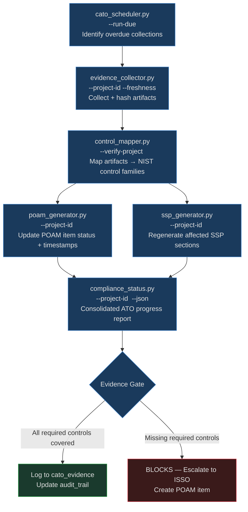

# Goal: Compliance Evidence Agent

**Standards:** NIST SP 800-53 Rev. 5, NIST SP 800-137, NIST SP 800-37 Rev. 2 (RMF Step 6), DoD Instruction 8510.01 (cATO)

## Purpose

Automate continuous ATO evidence maintenance: collect compliance artifacts on a
scheduled cadence, map each artifact to its NIST 800-53 control family, refresh
open POAM items with current remediation status, regenerate affected SSP sections,
and produce a consolidated progress report — all by composing existing compliance
tools with no new Python required.

---

## When to Use

- cATO cadence fires (daily/weekly per `args/workflow_templates/cato_continuous.yaml`)
- New compliance artifact created by any pipeline stage (SSP, STIG, SBOM, CSSP, etc.)
- POAM milestone date approaching or overdue — need freshness update
- Assessor requests a point-in-time evidence snapshot
- Pre-authorization review: ISSO/AO needs consolidated progress report
- Post-deployment: verify all controls retain evidence after infrastructure change

---

## Prerequisites

- [ ] `data/icdev.db` initialized — tables `cato_evidence`, `project_controls`, `poam_items`, `ssp_documents` exist
- [ ] `args/workflow_templates/cato_continuous.yaml` — collection frequencies configured per control family
- [ ] `context/compliance/nist_800_53.json` — NIST 800-53 control catalog present
- [ ] At least one project registered in `ato_systems` table (required by `evidence_collector.py`)
- [ ] `context/compliance/ssp_template.md` and `context/compliance/poam_template.md` present

---

## Scope

Covers evidence collection → control mapping → POAM update → SSP refresh → progress
report generation.

Out of scope: initial ATO artifact creation (handled by `goals/compliance_workflow.md`),
FedRAMP/CMMC deep assessments (handled by `goals/ato_acceleration.md`), STIG scanning
(handled by `goals/security_scan.md`).

### Workflow Architecture



---

## Workflow

### Step 1 — Identify Due Collections

```bash
# List all evidence collections due now (reads cato_continuous.yaml cadences)
python tools/compliance/cato_scheduler.py --status --json

# Execute all overdue collections in one pass
python tools/compliance/cato_scheduler.py --run-due --json
```

`cato_scheduler.py` queries the `cato_evidence` table for the last collection
timestamp per control family and compares against the `automation_frequency` in
`args/workflow_templates/cato_continuous.yaml`. Returns a list of
`{control_family, last_collected, next_due, overdue: true/false}` records.

### Step 2 — Collect Evidence

```bash
# Collect all framework evidence for a project (NIST, FedRAMP, CMMC, etc.)
python tools/compliance/evidence_collector.py --project-id <project_id> --json

# Check evidence freshness (staleness report per control family)
python tools/compliance/evidence_collector.py --project-id <project_id> --freshness --json

# Scope to a single framework
python tools/compliance/evidence_collector.py --project-id <project_id> --framework nist_800_53 --json
```

The collector hashes each artifact and writes records to `cato_evidence` with
`collected_at` timestamps. It reads both file-system artifacts
(`data/compliance/<project_id>/`) and DB tables (`ssp_documents`, `stig_findings`,
`sbom_records`, etc.) per the `FRAMEWORK_EVIDENCE_MAP` in `evidence_collector.py`.

### Step 3 — Map Artifacts to NIST Controls

```bash
# Verify all required control families have evidence coverage
python tools/compliance/control_mapper.py --verify-project <project_id> --json

# Generate full control implementation matrix (exportable for assessors)
python tools/compliance/control_mapper.py --project-id <project_id> --matrix --json
```

`control_mapper.py` reads `context/compliance/nist_800_53.json` and cross-references
`project_controls` rows. Any required control family without a `status=implemented`
row surfaces as a gap in the matrix. The 8 required families for cATO are:
`AC`, `AU`, `CM`, `IA`, `SA`, `SC`, `RA`, `CA`.

Gap example — add a missing control mapping:

```bash
python tools/compliance/control_mapper.py \
  --project-id <project_id> \
  --control-id AU-2 \
  --status implemented \
  --implementation "Audit events written to CloudWatch Logs and forwarded to SIEM" \
  --json
```

### Step 4 — Update POAM Status

```bash
# Refresh all open POAM items with current remediation status
python tools/compliance/poam_generator.py --project-id <project_id> --json
```

`poam_generator.py` pulls open items from `poam_items` where
`status IN ('open','in_progress')`, checks `stig_findings` and `failure_log`
for closure evidence, and updates `remediation_status` and `scheduled_completion`
accordingly. Items with evidence of closure are transitioned to `status=closed`.

Remediation SLA windows (from `poam_generator.py`):

| Severity | Window |
|----------|--------|
| CRITICAL / CAT I | 15 days |
| HIGH / CAT II | 30 days |
| MODERATE | 90 days |
| LOW / CAT III | 180 days |

### Step 5 — Refresh SSP Sections

```bash
# Regenerate SSP for the project (updates only sections backed by new evidence)
python tools/compliance/ssp_generator.py --project-id <project_id> --json
```

`ssp_generator.py` fills `{{variables}}` from `ato_systems` and
`project_controls` table rows, then re-renders the affected control sections
using `context/compliance/ssp_template.md`. The updated SSP is written to
`data/compliance/<project_id>/ssp_<date>.md` and a new record is inserted
into `ssp_documents` with `version` incremented.

### Step 6 — Generate Progress Report

```bash
# Consolidated ATO readiness report (8-component summary)
python tools/compliance/compliance_status.py --project-id <project_id> --json
```

Output structure:

```json
{
  "project_id": "<id>",
  "overall_status": "in_progress|ready|blocked",
  "ato_readiness_pct": 87,
  "components": {
    "ssp": {"status": "current", "last_updated": "ISO-8601"},
    "poam": {"open_items": 3, "overdue_items": 0},
    "stig": {"findings": 12, "cat1_open": 0},
    "sbom": {"components": 48, "high_cves": 1},
    "control_coverage": {"required": 8, "implemented": 8, "gaps": 0},
    "cssp": {"status": "assessed", "score": 0.91},
    "sbd": {"status": "assessed"},
    "ivv": {"status": "certified"}
  },
  "blocking_issues": [],
  "generated_at": "ISO-8601 UTC"
}
```

---

## Cron Schedule Configuration

Evidence collection frequency is governed by `args/workflow_templates/cato_continuous.yaml`.
Example cadences per control family:

| Control Family | Recommended Frequency | Rationale |
|----------------|-----------------------|-----------|
| AU (Audit) | Daily | Continuous audit log evidence |
| CM (Config Mgmt) | Daily | SBOM + config drift detection |
| IA (Identity) | Weekly | Access review artifacts |
| AC (Access Control) | Weekly | Entitlement review evidence |
| SC (Comms Protection) | Weekly | TLS cert + encryption evidence |
| CA (Assessment) | Monthly | Assessment report refresh |
| SA (Sys Acquisition) | Monthly | Dependency + SBOM review |
| RA (Risk Assessment) | Monthly | Threat model + vuln scan results |

For cron-based invocation outside Claude Code, use `tools/airgap/hook_compat.py`:

```bash
# /etc/cron.d/icdev-compliance — daily evidence collection at 02:30
30 2 * * * icdev-user cd /opt/icdev && \
  python tools/compliance/cato_scheduler.py --run-due --json \
  >> /var/log/icdev/compliance-evidence.log 2>&1
```

---

## Tools Used

| Tool | Purpose |
|------|---------|
| `tools/compliance/cato_scheduler.py` | Identify overdue collections; execute due runs |
| `tools/compliance/evidence_collector.py` | Collect + hash artifacts from FS and DB |
| `tools/compliance/control_mapper.py` | Map artifacts to NIST 800-53 control families |
| `tools/compliance/poam_generator.py` | Refresh POAM item status and closure evidence |
| `tools/compliance/ssp_generator.py` | Regenerate SSP sections backed by new evidence |
| `tools/compliance/compliance_status.py` | Consolidated 8-component ATO progress report |

## Args

- `args/workflow_templates/cato_continuous.yaml` — per-family collection frequencies, alert thresholds
- `args/security_gates.yaml` — blocking thresholds (CAT I findings, overdue POAM items)

## Context

- `context/compliance/nist_800_53.json` — NIST 800-53 control catalog (required by control_mapper)
- `context/compliance/ssp_template.md` — SSP narrative template
- `context/compliance/poam_template.md` — POAM item template

---

## Quality Gates

| Gate | Threshold | Blocks? |
|------|-----------|---------|
| Required control families with evidence gap | Any | YES |
| Open POAM items overdue (CAT I / CRITICAL) | Any | YES |
| Open POAM items overdue (CAT II / HIGH) | > 0 | YES |
| Evidence staleness (required family > cadence × 2) | Any | Warn |
| SSP last updated | > 90 days | Warn |
| ATO readiness percentage | < 80% | Warn |

---

## Security Gates

- Any CAT I STIG finding open beyond SLA → **blocks deploy**
- Required control family with zero evidence → **blocks** (escalate to ISSO)
- POAM item overdue by > 30 days → **blocks** (escalate to AO)
- Evidence hash mismatch on previously collected artifact → **blocks** (integrity alert)

---

## Edge Cases

- Project has no `ato_systems` row → `evidence_collector.py` returns `{"error": "project not found"}`; register the system first via `compliance_workflow.md` Step 0
- `cato_continuous.yaml` missing a control family → scheduler skips that family silently; add an explicit entry to suppress the skip
- POAM item has no `stig_findings` closure row → remains `in_progress`; do not auto-close without evidence
- SSP template variable not resolvable from DB → `ssp_generator.py` leaves `{{variable}}` literal; review `ato_systems` row completeness

---

## Success Criteria

- All required NIST 800-53 control families have evidence collected within their configured cadence
- Zero open POAM items overdue for CAT I/II findings
- SSP reflects current control implementations (last updated within 90 days)
- ATO readiness report shows ≥ 80% overall readiness
- Evidence hashes in `cato_evidence` match on-disk artifacts (no integrity alerts)

---

## FORGE Layer Mapping

| Phase | FORGE Layer |
|-------|-------------|
| Collection frequency per control family | Args (`args/workflow_templates/cato_continuous.yaml`) |
| Evidence artifact discovery (FS + DB) | Tools (`evidence_collector.py`) |
| NIST control catalog | Context (`context/compliance/nist_800_53.json`) |
| Control gap detection logic | Tools (`control_mapper.py`) |
| POAM status update rules | Tools (`poam_generator.py`) |
| SSP narrative template | Context (`context/compliance/ssp_template.md`) |
| Progress report aggregation | Tools (`compliance_status.py`) |
| Scheduling and cron cadence | Tools (`cato_scheduler.py`) |

---

## Related Files

- **Goal:** `goals/compliance_workflow.md` — Initial ATO artifact generation (run before this goal)
- **Goal:** `goals/ato_acceleration.md` — Multi-framework deep assessment (FedRAMP, CMMC, eMASS)
- **Goal:** `goals/security_scan.md` — STIG scanning that feeds POAM items
- **Goal:** `goals/monitoring.md` — Runtime monitoring that feeds cATO evidence
- **Pattern:** `icdev/tools/innovation/register_external_patterns.py` — id='compliance-evidence'

---

## Changelog
