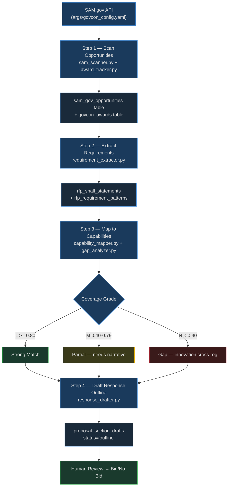

# CUI // SP-CTI
# Goal: Procurement Intel Agent — SAM.gov Capture-to-Outline Workflow

**Standards:** FAR Part 15, DFARS 252.204-7012, NIST SP 800-171

## Purpose

Automate the front-end capture pipeline: discover relevant solicitations on SAM.gov,
extract structured requirements, score them against existing ICDEV™ capabilities, and
produce a response outline — all by composing existing `tools/govcon/` tools with no
new Python required.

---

## When to Use

- A new solicitation or RFI appears in a watched NAICS category
- Capture team needs a rapid capability-gap snapshot before bid/no-bid decision
- Recurring weekly scan to maintain a live opportunity funnel
- Pre-proposal kickoff: generate section outline before writing begins

---

## Prerequisites

- [ ] `args/govcon_config.yaml` — `sam_gov.api_key` set and NAICS codes configured
- [ ] `context/govcon/icdev_capability_catalog.json` — capability catalog populated
- [ ] `tools/govcon/sam_scanner.py` — `sam_gov_opportunities` table seeded at least once
- [ ] `data/icdev.db` — `sam_gov_opportunities`, `rfp_shall_statements`,
  `rfp_requirement_patterns`, `proposal_section_drafts` tables exist

---

## Scope

Covers opportunity discovery → requirement extraction → capability mapping → response
outline generation.

Out of scope: full proposal authoring (handled by `goals/govcon_intelligence.md`),
post-award delivery (handled by `goals/cpmp_workflow.md`), compliance matrix
auto-population (use `tools/govcon/compliance_populator.py` directly).

### Workflow Architecture



### Coverage Grade Decision Matrix

| Grade | Threshold | Meaning | Response Strategy |
|-------|-----------|---------|------------------|
| L | >= 0.80 | Strong match | Lead with capability evidence + references |
| M | 0.40–0.79 | Partial match | Add narrative bridge + partner teaming option |
| N | < 0.40 | Gap | Cross-register to Innovation Engine; consider no-bid or partner fill |

---

## Workflow

### Step 1 — Scan SAM.gov Opportunities

```bash
# Scan new solicitations and pre-solicitations (reads args/govcon_config.yaml)
python tools/govcon/sam_scanner.py --scan --json

# Scan award notices for competitive intelligence
python tools/govcon/award_tracker.py --scan-awards --json

# List opportunities pending review
python tools/govcon/sam_scanner.py --list --status new --json
```

`sam_scanner.py` filters by NAICS codes in `args/govcon_config.yaml` (`sam_gov.naics_codes`)
and persists to `sam_gov_opportunities`. `award_tracker.py` writes to `govcon_awards`.
Rate limit: 10 req/sec, 10K/day (D370).

### Step 2 — Extract Requirements

```bash
# Extract shall/must/will statements from an opportunity
python tools/govcon/requirement_extractor.py --opportunity-id <opp_id> --json

# Extract from all new opportunities in batch
python tools/govcon/requirement_extractor.py --extract-all --status new --json
```

`requirement_extractor.py` uses deterministic regex (D362 — air-gap safe) to extract
"shall/must/will" statements and domain-classifies each into one of 9 categories:
`devsecops`, `ai_ml`, `ato_rmf`, `cloud`, `security`, `compliance`, `agile`, `data`,
`management`. Clusters by keyword fingerprint overlap (D364). Writes to
`rfp_shall_statements` and `rfp_requirement_patterns`.

### Step 3 — Map to Capabilities

```bash
# Map all extracted requirements for an opportunity to the capability catalog
python tools/govcon/capability_mapper.py --opportunity-id <opp_id> --json

# Identify gaps (N-grade requirements)
python tools/govcon/gap_analyzer.py --opportunity-id <opp_id> --json

# Side-by-side competitor profile for competitive context
python tools/govcon/competitor_profiler.py --opportunity-id <opp_id> --json
```

`capability_mapper.py` reads `context/govcon/icdev_capability_catalog.json` and computes
keyword-overlap coverage scores. Results stored in `rfp_requirement_patterns` with
`coverage_grade` (L/M/N). `gap_analyzer.py` surfaces N-grade items and cross-registers
high-priority gaps to the Innovation Engine (D361).

### Step 4 — Draft Response Outline

```bash
# Generate a structured response outline for the opportunity
python tools/govcon/response_drafter.py --opportunity-id <opp_id> --outline-only --json

# Include win themes if available
python tools/govcon/response_drafter.py --opportunity-id <opp_id> --outline-only \
    --win-themes --json
```

`response_drafter.py` with `--outline-only` produces section headings with one-sentence
win themes per section, keyed to the L/M/N coverage grades. Two-tier LLM: qwen3 drafts
compact outline, Claude reviews and polishes (D365). Result written to
`proposal_section_drafts` with `status='outline'`. Human review determines bid/no-bid.

---

## Tools Used

| Tool | Purpose |
|------|---------|
| `tools/govcon/sam_scanner.py` | SAM.gov Opportunities API scan; stores to `sam_gov_opportunities` |
| `tools/govcon/award_tracker.py` | Award notice scan for competitive intel; stores to `govcon_awards` |
| `tools/govcon/requirement_extractor.py` | Deterministic regex extraction of shall statements + domain classification |
| `tools/govcon/capability_mapper.py` | Keyword-overlap coverage scoring against capability catalog |
| `tools/govcon/gap_analyzer.py` | Surface N-grade gaps; cross-register to Innovation Engine |
| `tools/govcon/competitor_profiler.py` | Vendor profiling from award data for competitive context |
| `tools/govcon/response_drafter.py` | Two-tier LLM outline generation; stores draft to `proposal_section_drafts` |

## Args

- `args/govcon_config.yaml` — SAM.gov API key, NAICS codes, extraction rules, LLM tiers, scheduling

## Context

- `context/govcon/icdev_capability_catalog.json` — Declarative capability catalog (~30 entries with domain tags)

---

## Quality Gates

| Gate | Threshold | Blocks? |
|------|-----------|---------|
| Opportunities scanned | >= 1 new opportunity found | Warn only |
| Extraction coverage | >= 80% of description parsed into shall statements | Warn |
| Capability mapping completed | All statements graded L/M/N | YES |
| Response outline generated | At least one section per solicitation section | YES |
| N-grade gaps cross-registered | All N-grade gaps submitted to Innovation Engine | Warn |

---

## Edge Cases

- SAM.gov API unavailable → `sam_scanner.py` falls back to cached `sam_gov_opportunities`; log warning
- Opportunity has no shall statements → `requirement_extractor.py` returns empty list; skip mapping step, log to audit trail
- All requirements graded N → Flag as high-risk; generate innovation cross-registration records; recommend no-bid or partner teaming
- Capability catalog out of date → Run `python tools/govcon/capability_enricher.py --refresh --json` to refresh catalog entries

---

## Success Criteria

- All new solicitations in watched NAICS codes scanned and stored
- >= 80% of requirement statements classified into a domain category
- Every statement graded L/M/N against the capability catalog
- Response outline generated and saved as `proposal_section_drafts` with `status='outline'`
- All N-grade gaps registered as `innovation_signals` in the Innovation Engine

---

## FORGE Layer Mapping

| Phase | FORGE Layer |
|-------|-------------|
| SAM.gov API key, NAICS codes, scan interval | Args (`args/govcon_config.yaml`) |
| Opportunity ingestion + award scanning | Tools (`sam_scanner.py`, `award_tracker.py`) |
| Shall statement extraction + domain classification | Tools (`requirement_extractor.py`) |
| Coverage scoring + gap detection | Tools (`capability_mapper.py`, `gap_analyzer.py`) |
| Competitive context | Tools (`competitor_profiler.py`) |
| Orchestration — sequencing steps, handling empty results | Orchestration (AI reads grades, decides outline depth) |
| Capability catalog entries + domain taxonomy | Context (`context/govcon/icdev_capability_catalog.json`) |
| Outline section template | Hard Prompts (`hardprompts/` — response outline template) |

---

## Related Files

- **Goal:** `goals/govcon_intelligence.md` — Full capture-to-delivery flywheel (Phase 59)
- **Goal:** `goals/cpmp_workflow.md` — Post-award delivery lifecycle
- **Goal:** `goals/requirements_intake.md` — Structured requirements intake workflow
- **Pattern:** `aisg_patterns` — id='procurement-intel' (this pattern)

---

## Changelog

- 2026-05-02 — Initial template created (aisg-b1-04)
