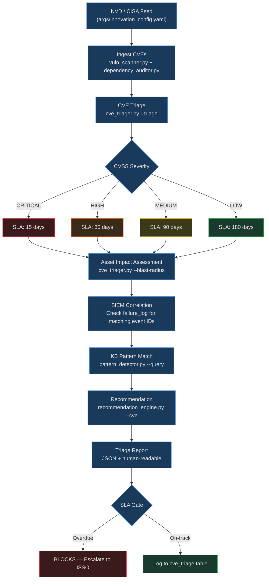

# Goal: Threat Triage Agent

**Standards:** NIST SP 800-40 Rev. 4, NIST SP 800-161 §3.2, CISA KEV Catalog, CVSSv3.1

## Purpose

Automate the full CVE triage lifecycle: ingest NVD and CISA advisory feeds, correlate
findings against SIEM events and asset inventory, classify each vulnerability by CVSS
severity and asset impact, compute SLA deadlines, trace upstream/downstream blast radius
through the dependency graph, and emit a structured triage report — all by composing
existing security and knowledge tools with no new Python required.

---

## When to Use

- New CVEs published to NVD or CISA advisory feeds (run every 4 hours per innovation_config.yaml)
- SIEM alerts reference a CVE ID that needs contextual triage
- Supply chain dependency graph update triggers blast radius re-analysis
- SLA compliance check needed across all open CVE tickets
- Pre-deployment security gate requires triage report sign-off
- NIST 800-161 SCRM vendor assessment surfaces a new vulnerability

---

## Prerequisites

- [ ] `args/innovation_config.yaml` — `cve_databases` block configured (NVD API key, CISA URL)
- [ ] `args/supply_chain_config.yaml` — CVE SLA windows (CRITICAL: 15d, HIGH: 30d, MEDIUM: 90d)
- [ ] `tools/supply_chain/dependency_graph.py` — dependency graph populated via `--add-dep`
- [ ] `tools/knowledge/pattern_detector.py` — KB pattern baseline established
- [ ] `data/icdev.db` — `cve_triage`, `failure_log`, `knowledge_patterns` tables exist

---

## Scope

Covers CVE ingestion → SIEM correlation → severity + asset classification → SLA enforcement
→ blast radius analysis → triage report generation.

Out of scope: active exploitation (handled by `goals/security_scan.md`), ISA lifecycle
(handled by `goals/boundary_supply_chain.md`), container patching (handled by
`goals/maintenance_audit.md`).

### Workflow Architecture



### Severity + Asset Impact Classification Matrix

| CVSS Score | Severity | Asset Tier | Effective Risk | SLA Window |
|------------|----------|------------|----------------|------------|
| 9.0–10.0 | CRITICAL | Any | CRITICAL | 15 days |
| 7.0–8.9 | HIGH | Internet-facing | CRITICAL | 15 days |
| 7.0–8.9 | HIGH | Internal | HIGH | 30 days |
| 4.0–6.9 | MEDIUM | Any | MEDIUM | 90 days |
| 0.1–3.9 | LOW | Any | LOW | 180 days |

---

## Workflow

### Step 1 — Ingest CVE Feeds

```bash
# Pull latest CVEs from NVD and CISA (reads args/innovation_config.yaml)
python tools/security/vuln_scanner.py --project-path . --gate
python tools/security/dependency_auditor.py --audit-all --json
```

NVD API endpoint and CISA advisory URL are configured in
`args/innovation_config.yaml` under `cve_databases` and `nist_advisories`.
The scanner persists findings to the `failure_log` table with `scan_type=cve`.

### Step 2 — Triage Each CVE

```bash
# Triage a single CVE — auto-computes SLA deadline + blast radius
python tools/supply_chain/cve_triager.py --triage CVE-YYYY-NNNNN

# Bulk SLA compliance check across all open CVEs
python tools/supply_chain/cve_triager.py --sla-check --json

# Propagate impact through dependency graph
python tools/supply_chain/cve_triager.py --propagate CVE-YYYY-NNNNN --json
```

### Step 3 — Correlate with SIEM Events

Query `failure_log` for events referencing the same CVE ID or affected package:

```sql
SELECT id, event_type, severity, details, created_at
FROM failure_log
WHERE details LIKE '%CVE-YYYY-NNNNN%'
   OR details LIKE '%<affected_package>%'
ORDER BY created_at DESC
LIMIT 50;
```

Cross-reference with asset inventory (`ato_systems` table) to determine
asset tier (internet-facing vs. internal) and adjust effective risk.

### Step 4 — KB Pattern Matching

```bash
# Check knowledge base for known patterns matching this CVE class
python tools/knowledge/pattern_detector.py --query "CVE <cve_id> <package>" --json

# Get remediation recommendation
python tools/knowledge/recommendation_engine.py --event-id <failure_log_id> --json
```

`pattern_detector.py` uses BM25 + string similarity against `knowledge_patterns` table.
If a matching `security` or `compliance` pattern exists, its `remediation` field is
included in the triage report.

### Step 5 — Produce Triage Report

The triage report is a JSON document written to `data/triage_reports/` with the
following structure:

```json
{
  "cve_id": "CVE-YYYY-NNNNN",
  "cvss_score": 9.1,
  "severity": "CRITICAL",
  "asset_tier": "internet-facing",
  "effective_risk": "CRITICAL",
  "sla_deadline": "YYYY-MM-DD",
  "sla_status": "on-track|overdue",
  "blast_radius": {
    "upstream": ["pkg-a", "pkg-b"],
    "downstream": ["svc-x", "svc-y"],
    "affected_count": 4
  },
  "siem_events": [...],
  "kb_pattern": "pattern_signature or null",
  "remediation": "upgrade to version X.Y.Z",
  "generated_at": "ISO-8601 UTC"
}
```

---

## Tools Used

| Tool | Purpose |
|------|---------|
| `tools/security/vuln_scanner.py` | Orchestrate all scans; persist CVEs to failure_log |
| `tools/security/dependency_auditor.py` | Audit pip/npm/cargo deps against NVD/OSV |
| `tools/supply_chain/cve_triager.py` | Severity triage, SLA computation, blast radius BFS |
| `tools/supply_chain/dependency_graph.py` | Upstream/downstream dependency graph queries |
| `tools/knowledge/pattern_detector.py` | KB pattern matching against known CVE classes |
| `tools/knowledge/recommendation_engine.py` | Pattern-based remediation recommendation |

## Args

- `args/innovation_config.yaml` — `cve_databases` (NVD API, CISA feeds, scan interval)
- `args/supply_chain_config.yaml` — CVE SLA windows, blast radius decay factor
- `args/security_gates.yaml` — Blocking thresholds (critical/high vuln counts)

## Context

- `context/supply_chain/scrm_risk_matrix.json` — SCRM risk scoring matrix
- `context/supply_chain/nist_800_161_controls.json` — NIST 800-161 CVE control mapping

---

## Quality Gates

| Gate | Threshold | Blocks? |
|------|-----------|---------|
| Critical CVE SLA overdue | Any | YES |
| High CVE SLA overdue | Any | YES |
| Blast radius unresolved (CRITICAL) | > 0 unpatched downstream | YES |
| Triage report missing for CRITICAL CVE | Any | YES |
| KB pattern match confidence | < 0.3 → escalate, don't auto-remediate | Warn |

---

## Security Gates

- Critical CVE with no triage record → **blocks deploy**
- SLA overdue on any CRITICAL/HIGH CVE → **blocks deploy**
- Section 889 vendor CVE unmitigated → **blocks** (escalate to ISSO)
- Blast radius > 10 downstream services → **requires ISSO sign-off**

---

## Edge Cases

- CVE affects transitive dependency → `cve_triager.py --propagate` traces with decay factor
- Duplicate CVE across multiple dependency paths → deduplicate by CVE ID, use worst-case blast radius
- CISA KEV (Known Exploited Vulnerability) → override SLA to 15 days regardless of CVSS score
- NVD API unavailable → fall back to `tools/security/osv_scanner.py` for OSV database

---

## Success Criteria

- All CVEs from last 4-hour feed window triaged and classified
- Zero CRITICAL/HIGH CVEs with overdue SLA
- Triage report generated for every CRITICAL CVE within 24 hours of publication
- Blast radius computed for all HIGH+ CVEs
- KB pattern match attempted for every finding

---

## FORGE Layer Mapping

| Phase | FORGE Layer |
|-------|-------------|
| Feed configuration (NVD/CISA URLs, scan interval) | Args (`args/innovation_config.yaml`) |
| CVE ingestion + dependency audit | Tools (`vuln_scanner.py`, `dependency_auditor.py`) |
| Triage classification + blast radius | Tools (`cve_triager.py`, `dependency_graph.py`) |
| SIEM correlation logic | Orchestration (AI queries failure_log, maps to assets) |
| KB pattern matching | Tools (`pattern_detector.py`) |
| Report generation template | Hard Prompts (`hardprompts/` — triage report template) |
| CVSS → effective risk rules | Context (`context/supply_chain/scrm_risk_matrix.json`) |

---

## Related Files

- **Goal:** `goals/boundary_supply_chain.md` — Full CVE triage + ISA lifecycle (RICOAS Phase 2)
- **Goal:** `goals/maintenance_audit.md` — Feeds patched CVEs back to maintenance workflow
- **Goal:** `goals/security_scan.md` — Active exploit scanning (complements feed-based triage)
- **Goal:** `goals/compliance_workflow.md` — Triage findings drive POAM entries
- **Pattern:** `icdev/tools/innovation/register_external_patterns.py` — id='threat-triage'

---

## Changelog
