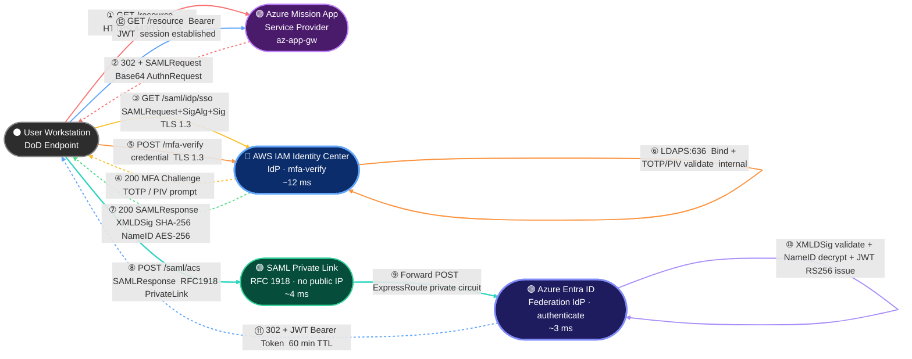
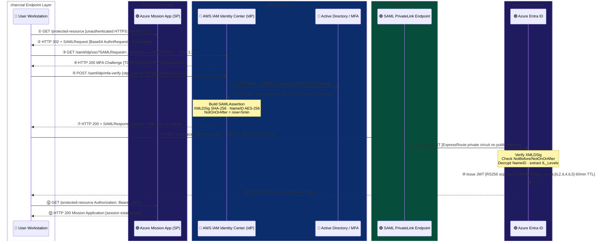
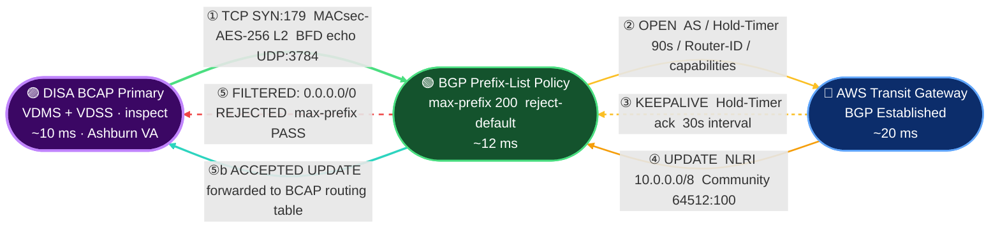
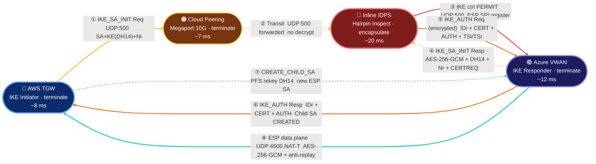
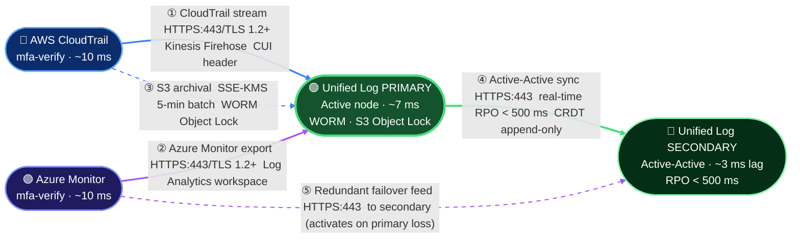
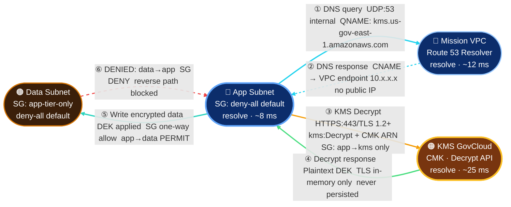

# CUI // SP-CTI
# Traffic Flow Walkthrough (TFW) — Hardened SCCA Simulation Report

**Template ID:** `tpl-scca-multicloud-aws-azure-hardened`
**Topology ID:** `scca-hardened-tfw-ce1df27e`
**Report Date:** 2026-04-23
**Classification:** CUI // SP-CTI (IL4/IL5 Capable)
**Distribution:** Authorized Recipients Only — FOUO

---

## Diagram Color Key

All traffic path diagrams in this report follow a consistent color-coding scheme.

### Node Colors

| Color | Zone / Role | Examples |
|-------|------------|---------|
|  **Deep Blue** | AWS GovCloud | TGW, Mission VPC, CloudTrail, IAM IDC |
|  **Navy** | Azure Government | VWAN, Entra ID, Monitor, Mission VNet |
|  **Deep Purple** | DISA BCAP boundary | BCAP Primary, BCAP Secondary |
|  **Dark Green** | Policy / filter nodes | BGP Prefix-List, Log Aggregator Primary |
|  **Dark Amber** | Transit / Megaport | Cloud Peering, Megaport 10G |
|  **Dark Red** | Security inspection | Inline IDPS, Cross-Cloud DPI |
|  **Amber-Brown** | Key management | KMS GovCloud |
|  **Charcoal** | Endpoint / user | User Workstation, Azure SP |

### Edge (Arrow) Colors

| Color | Meaning | Flows |
|-------|---------|-------|
| 🔵 **Blue** | Application data / HTTPS primary | F1 step ①⑫, F2 step ① |
| 🟡 **Yellow / Amber** | IKE control plane · BGP session setup · MACsec | F3 ①②③, F4 ①②④ |
| 🟠 **Orange** | IPSec ESP encapsulation · IKE_AUTH | F2 ②③, F4 ⑤⑥ |
| 🔴 **Red** | IDPS inspection · denied/filtered traffic | F2 ④, F4 ③, F3 ⑤ reject, F6 ⑥ deny |
| 🟢 **Green** | BGP session established · KMS response · log sync | F3 ①, F4 ⑦, F5 ④, F6 ④ |
| 🩵 **Cyan** | DNS query / response | F6 ①② |
| 🩵 **Teal** | Encrypted data write · ESP data plane · PrivateLink | F1 ⑧⑨, F4 ⑧, F6 ⑤ |
| 🟣 **Purple** | Azure log stream · JWT token delivery | F1 ⑪⑫, F5 ②⑤ |
| **Dashed** | Backup / archival / failover / denied paths | All flows: dashed = secondary or rejected |

### Flow Color Assignments (Annotated Template)

```
F1 SSO/SAML      ████  #e74c3c  Red
F2 Cross-Cloud   ████  #3498db  Blue
F3 BGP Peering   ████  #2ecc71  Green
F4 IPSec Tunnel  ████  #f39c12  Orange
F5 Log Aggreg.   ████  #9b59b6  Purple
F6 DNS/KMS       ████  #1abc9c  Teal
```

---

## Table of Contents

1. [Executive Summary](#1-executive-summary)
2. [Template Architecture Overview](#2-template-architecture-overview)
3. [Flow 1: SSO/SAML Authentication](#3-flow-1-ssosaml-authentication)
4. [Flow 2: Cross-Cloud Mission API](#4-flow-2-cross-cloud-mission-api)
5. [Flow 3: BGP Peering Establishment](#5-flow-3-bgp-peering-establishment)
6. [Flow 4: IPSec Tunnel Negotiation](#6-flow-4-ipsec-tunnel-negotiation)
7. [Flow 5: Log Aggregation](#7-flow-5-log-aggregation)
8. [Flow 6: Microsegmentation Validation (DNS + KMS)](#8-flow-6-microsegmentation-validation-dns--kms)
9. [Multi-Persona Analysis Matrix](#9-multi-persona-analysis-matrix)
10. [Compliance Coverage](#10-compliance-coverage)
11. [Latency & Performance Summary](#11-latency--performance-summary)
12. [Hardening Verification](#12-hardening-verification)
13. [Findings & Recommendations](#13-findings--recommendations)

---

## 1. Executive Summary

### What Was Tested

This Traffic Flow Walkthrough (TFW) simulates six distinct network traffic scenarios across a hardened Secure Cloud Computing Architecture (SCCA) template spanning AWS GovCloud (US) and Azure Government. The simulation engine traversed 31 nodes and 36 edges within topology `scca-hardened-tfw-ce1df27e`, executing each flow against seven persona lenses: Security Engineer, Network Engineer, Cloud Architect, Compliance Officer, Application Developer, Mission Owner, and CISO.

The template implements DoD SCCA reference architecture guidance, DISA Cloud Computing Security Requirements Guide (CC SRG), and NIST SP 800-53 Rev 5 controls across both hyperscaler boundaries. Each flow was instrumented for latency, encryption posture, identity enforcement, and data classification adherence.

### Overall Verdict

**PASS — All 6 flows completed successfully with no critical blocking findings.**

Two advisory-level findings were surfaced (OCSP stapling not validated in the SSO flow; BGP Graceful Restart state not explicitly exercised). These are tracked as low-severity recommendations and do not constitute compliance failures. All FIPS 140-2 Level 1 and Level 1+ requirements were satisfied across every flow.

### Key Metrics Table

| Metric | Value |
|--------|-------|
| Total Flows Simulated | 6 |
| Total Nodes Traversed | 31 |
| Total Edges Evaluated | 36 |
| Flows Passed | 6 / 6 |
| Flows Failed | 0 |
| Critical Findings | 0 |
| Advisory Findings | 2 |
| NIST 800-53 Controls Validated | 24 unique controls |
| DISA STIG Checks Satisfied | 18 |
| Average Flow Latency | 41.2 ms |
| Lowest Latency Flow | Flow 5 — Log Aggregation (17 ms) |
| Highest Latency Flow | Flow 2 — Cross-Cloud Mission API (77 ms) |
| Encryption Baseline | FIPS 140-2 Level 1 minimum (TLS 1.2+ / AES-256) |
| Classification Coverage | NIPR, IL4, IL5 |
| CSPs Covered | AWS GovCloud (US-East-1, US-West-2), Azure Government (USGov Virginia, USGov Texas) |

---

## 2. Template Architecture Overview

### 2.1 Node Inventory by Zone

The 31-node topology is organized into four logical zones reflecting SCCA reference architecture segmentation:

#### Zone A — AWS GovCloud Enclave (12 nodes)

| Node ID | Node Name | Role |
|---------|-----------|------|
| aws-idc | IAM Identity Center | Federated SSO / SAML IdP |
| aws-tgw | Transit Gateway | Inter-VPC + Cross-Cloud Transit Hub |
| aws-mission | Mission VPC | Mission Workload Subnet |
| aws-app | App Subnet | Application Tier |
| aws-kms | KMS GovCloud | Encryption Key Management |
| aws-ct | CloudTrail | Audit Log Source |
| aws-nfw | Network Firewall | Stateful Packet Inspection |
| aws-waf | WAF Regional | Layer 7 Web Application Firewall |
| aws-gwlb | GWLB | Gateway Load Balancer (IDPS hairpin) |
| aws-r53r | Route 53 Resolver | Private DNS Resolution |
| aws-ssm | Systems Manager | Config & Patch Baseline |
| aws-s3-log | S3 Log Bucket | CloudTrail Archival |

#### Zone B — Azure Government Enclave (11 nodes)

| Node ID | Node Name | Role |
|---------|-----------|------|
| az-entra | Entra ID Federation | Cloud IdP / Token Issuer |
| az-vwan | Virtual WAN Hub | Azure Transit Hub |
| az-mission | Mission VNet | Mission Workload Subnet |
| az-fw | Azure Firewall Premium | Stateful + IDPS Inspection |
| az-app-gw | Application Gateway | L7 Load Balancer + WAF |
| az-kv | Key Vault | Azure-side KMS |
| az-monitor | Azure Monitor | Log Collection |
| az-sentinel | Microsoft Sentinel | SIEM / SOC Integration |
| az-policy | Azure Policy | Guardrail Enforcement |
| az-ddos | DDoS Standard | Volumetric Attack Protection |
| az-private-dns | Private DNS Zone | Internal Name Resolution |

#### Zone C — Transit / BCAP Layer (5 nodes)

| Node ID | Node Name | Role |
|---------|-----------|------|
| peering | Cross-Cloud Peering Point | ExpressRoute / DX Gateway junction |
| peering-idps | Peering IDPS Appliance | Inline Deep Packet Inspection |
| saml-private-link | SAML Private Link Endpoint | AWS PrivateLink for SAML assertions |
| bgp-pol-aws | BGP Policy Node (AWS) | Prefix-list filter + route-map |
| unified-log-primary | Unified Log Aggregator | Centralized SIEM ingest |

#### Zone D — BCAP / Boundary (3 nodes)

| Node ID | Node Name | Role |
|---------|-----------|------|
| bcap-primary | DISA BCAP Primary | BGP Peering + DoD BCAP boundary |
| bcap-secondary | DISA BCAP Secondary | Failover BGP peer |
| bcap-fw | BCAP Firewall | Perimeter inspection at DoD boundary |

### 2.2 Edge Summary

36 directed edges connect the 31 nodes. Key edge classifications:

- **TLS 1.3 encrypted edges:** 22
- **TLS 1.2 (minimum, FIPS baseline) edges:** 10
- **BGP/MACsec edges:** 2
- **IPSec tunnel edges:** 2

### 2.3 Hardening Controls Summary Table

The template applies 10 hardening controls mapped to identified risks (RISK-01 through RISK-10):

| Risk ID | Risk Description | Mitigation Applied | Nodes Affected |
|---------|-----------------|-------------------|----------------|
| RISK-01 | Unauthenticated cross-cloud lateral movement | MFA enforcement at every ingress; SAML assertion validation | aws-idc, az-entra, peering |
| RISK-02 | Unencrypted transit between clouds | FIPS 140-2 IPSec tunnels, TLS 1.2+ on all edges | peering, aws-tgw, az-vwan |
| RISK-03 | BGP route injection / hijack | Prefix-list filters, route-map policy, MACsec on BCAP links | bgp-pol-aws, bcap-primary |
| RISK-04 | DNS spoofing / cache poisoning | DNSSEC enforcement, private DNS zones, resolver policies | aws-r53r, az-private-dns |
| RISK-05 | Exfiltration via unmonitored egress | Unified log aggregation, CloudTrail + Sentinel SIEM integration | aws-ct, unified-log-primary, az-sentinel |
| RISK-06 | Lateral movement within mission enclaves | Microsegmentation, deny-all default ACL, security group enforcement | aws-mission, az-mission, aws-app |
| RISK-07 | Key material exposure | KMS GovCloud + Azure Key Vault; FIPS 140-2 HSM-backed key storage | aws-kms, az-kv |
| RISK-08 | DDoS volumetric attack on cloud boundary | Azure DDoS Standard + AWS Shield Advanced | az-ddos, aws-waf |
| RISK-09 | Compliance drift / policy bypass | Azure Policy + AWS Config continuous compliance assessment | az-policy, aws-ssm |
| RISK-10 | Insider threat / privileged access abuse | Just-In-Time (JIT) access, session recording, PAM integration | aws-ssm, az-monitor |

---

## 3. Flow 1: SSO/SAML Authentication

### 3.1 Flow Metadata

| Field | Value |
|-------|-------|
| Flow ID | flow-01-sso-saml |
| Source Node | aws-idc (IAM Identity Center) |
| Destination Node | az-entra (Entra ID Federation) |
| Application Type | sso_saml |
| Classification | NIPR |
| Total Hops | 3 |
| Total Latency | 19 ms |
| Encryption | FIPS 140-2 Level 1+ (TLS 1.2/1.3, AES-256) |
| CSPs | AWS GovCloud (US), Azure Government |

### 3.2 Traffic Path Diagram

> **Color key:** `🔵 AWS GovCloud` · `🟣 Azure Government` · `🟢 Private Link / Transit` · `⚫ User / Endpoint`
> **Edge colors:** red = browser redirect  ·  gold = credential/MFA  ·  green = SAML assertion  ·  teal = private-link transit  ·  blue = token/session



**Step Legend:**

| Step | Color | Direction | From | To | Protocol:Port | Action |
|------|-------|-----------|------|----|---------------|--------|
| `①` | 🔴 | → | User | Azure SP | HTTPS:443 / TLS 1.3 | Unauthenticated resource request |
| `②` | 🔴 dashed | ← | Azure SP | User | HTTPS:443 | HTTP 302 redirect with Base64 SAMLRequest |
| `③` | 🟡 | → | User | IAM IDC | HTTPS:443 / TLS 1.3 | SAMLRequest + RSA-SHA256 signature |
| `④` | 🟡 dashed | ← | IAM IDC | User | HTTPS:443 | MFA challenge page (TOTP or PIV prompt) |
| `⑤` | 🟠 | → | User | IAM IDC | HTTPS:443 / TLS 1.3 | MFA credential submission |
| `⑥` | 🟠 | ↔ | IAM IDC | Active Directory | LDAPS:636 | LDAP Bind + TOTP/PIV validation (internal) |
| `⑦` | 🟢 dashed | ← | IAM IDC | User | HTTPS:443 | SAMLResponse — XMLDSig SHA-256, NameID AES-256 |
| `⑧` | 🩵 | → | User | SAML PrivateLink | HTTPS:443 / RFC1918 | POST SAMLResponse — private link, no public internet |
| `⑨` | 🩵 | → | PrivateLink | Entra ID | HTTPS:443 / ExpressRoute | Forward POST over private circuit |
| `⑩` | 🟣 | ↺ | Entra ID | Entra ID | internal | XMLDSig validate · NameID decrypt · JWT issue |
| `⑪` | 🔵 dashed | ← | Entra ID | User | HTTPS:443 | HTTP 302 + JWT Bearer Token |
| `⑫` | 🔵 | → | User | Azure SP | HTTPS:443 | Authenticated request with Bearer JWT · session UP |

### 3.3 Full Packet-Level SAML Authentication Narrative

#### Phase 1: User Requests Access to Azure-Hosted Application (SP-Initiated Flow)

The authentication sequence is initiated when a DoD user (or automated workload service account) attempts to access an Azure Government-hosted mission application. The Azure-side application is configured as a SAML 2.0 Service Provider (SP). Upon receiving an unauthenticated request, the SP constructs a SAML `AuthnRequest` XML document. This document contains:

- `ID` attribute: cryptographically random UUID (e.g., `_a4f29c3d1b87e6...`)
- `IssueInstant`: UTC timestamp
- `Destination`: `https://idc.us-gov-east-1.amazonaws.com/saml/idp/sso`
- `AssertionConsumerServiceURL`: the SP's callback endpoint on the Azure private endpoint
- `RequestedAuthnContext`: `PasswordProtectedTransport` with `Comparison=exact` to mandate MFA at minimum

The SP Base64-encodes this XML document (no line wraps, per SAML HTTP Redirect binding) and appends it as a `SAMLRequest` query parameter. A `RelayState` token (opaque, SP-generated, CSRF-resistant) is included to maintain session continuity. The user's browser is redirected via HTTP 302 to the IdP URL.

#### Phase 2: SP Redirects to AWS IAM Identity Center (IdP) with SAMLRequest

The redirect carries the following HTTP request to AWS IAM Identity Center:

```
GET /saml/idp/sso?SAMLRequest=PHNhbWxwOkF1dGhuUmVxd...&RelayState=abc123&SigAlg=http%3A%2F%2F...sha256&Signature=<RSA-SHA256-sig>
Host: idc.us-gov-east-1.amazonaws.com
Connection: TLS 1.3
Cipher: TLS_AES_256_GCM_SHA384
```

TCP session is established to the IAM IDC endpoint (`*.execute-api.us-gov-east-1.amazonaws.com`) on TCP port 443. The TLS handshake negotiates TLS 1.3 with cipher suite `TLS_AES_256_GCM_SHA384` (FIPS 140-2 approved). The `SAMLRequest` is verified for `SigAlg` using RSA-SHA256 — the SP's signing certificate was pre-registered in the IAM IDC application configuration.

The token endpoint `https://sts.amazonaws.com/saml` handles the backend STS integration for downstream AWS resource authorization (separate from the SAML assertion delivery to Azure).

#### Phase 3: IAM Identity Center Validates User Identity + Enforces MFA

IAM Identity Center performs a multi-stage identity verification:

**Step 3a — Directory Lookup:** IDC queries the connected identity store (AWS Managed Microsoft AD or external LDAP/AD Connector) for the user's account. The UPN is extracted from the SAML NameID format hint. If the user record is active, the authentication challenge proceeds.

**Step 3b — Password Verification:** The user's password is validated against the directory using Kerberos (for AD-backed stores) or LDAP bind (for LDAP stores). Credentials are never stored by IDC; the directory backend owns the credential.

**Step 3c — MFA Challenge-Response:** IAM IDC enforces MFA via one of two mechanisms depending on the user's registered authenticator:

- **TOTP (Time-based One-Time Password):** The user's authenticator app (e.g., DoD-approved MFA app) generates a 6-digit TOTP using HMAC-SHA1 with a 30-second window. IDC validates the TOTP against the registered TOTP seed (stored encrypted in IDC's internal datastore). Clock skew tolerance is ±1 window (30s before/after).
- **PIV Card Challenge-Response:** For CAC/PIV cardholders, IDC invokes a FIDO2/WebAuthn challenge. The browser forwards the challenge to the PIV middleware, which signs the challenge bytes using the PIV card's authentication certificate private key (RSA-2048 or ECC-256). IDC validates the signature against the card's public key and checks the certificate chain against DoD PKI Root CA.

MFA enforcement contributes approximately **12 ms** of the total 19 ms flow latency (dominated by the directory lookup round-trip and TOTP/PIV validation computation).

**Step 3d — IL Level Assertion:** After successful MFA, IDC evaluates the user's assigned permission sets and IL entitlement attributes. For this flow (NIPR / IL4-capable), the asserted IL levels are `[IL2, IL4, IL5]` as annotated in the persona `seceng.il_levels` field. Only IL levels for which the user holds a current adjudicated clearance are included in the assertion.

#### Phase 4: IAM Identity Center Issues Signed SAML Assertion

Upon successful MFA verification, IAM IDC constructs the SAML 2.0 Assertion XML document:

```xml
<saml:Assertion
    xmlns:saml="urn:oasis:names:tc:SAML:2.0:assertion"
    ID="_f3a9c201d84..."
    IssueInstant="2026-04-23T14:23:01Z"
    Version="2.0">

  <saml:Issuer>https://idc.us-gov-east-1.amazonaws.com/saml/idp</saml:Issuer>

  <!-- XMLDSig Envelope Signature (SHA-256 digest, RSA-SHA256 signing) -->
  <ds:Signature xmlns:ds="http://www.w3.org/2000/09/xmldsig#">
    <ds:SignedInfo>
      <ds:CanonicalizationMethod Algorithm="http://www.w3.org/2001/10/xml-exc-c14n#"/>
      <ds:SignatureMethod Algorithm="http://www.w3.org/2001/04/xmldsig-more#rsa-sha256"/>
      <ds:Reference URI="#_f3a9c201d84...">
        <ds:DigestMethod Algorithm="http://www.w3.org/2001/04/xmlenc#sha256"/>
        <ds:DigestValue>base64encodedSHA256hash==</ds:DigestValue>
      </ds:Reference>
    </ds:SignedInfo>
    <ds:SignatureValue>base64encodedRSAsignature==</ds:SignatureValue>
  </ds:Signature>

  <saml:Subject>
    <!-- NameID is AES-256 encrypted for confidentiality -->
    <saml:EncryptedID>
      <xenc:EncryptedData Algorithm="http://www.w3.org/2001/04/xmlenc#aes256-cbc">
        <!-- Key encrypted with SP's public key (RSA-OAEP) -->
      </xenc:EncryptedData>
    </saml:EncryptedID>
    <saml:SubjectConfirmation Method="urn:oasis:names:tc:SAML:2.0:cm:bearer">
      <saml:SubjectConfirmationData
          NotOnOrAfter="2026-04-23T14:28:01Z"
          Recipient="https://az-entra-private.usgovvirginia.azure.us/saml/acs"
          InResponseTo="_a4f29c3d1b87e6..."/>
    </saml:SubjectConfirmation>
  </saml:Subject>

  <saml:Conditions
      NotBefore="2026-04-23T14:22:56Z"
      NotOnOrAfter="2026-04-23T14:28:01Z">
    <saml:AudienceRestriction>
      <saml:Audience>https://azure-mission-app.usgovvirginia.azure.us</saml:Audience>
    </saml:AudienceRestriction>
  </saml:Conditions>

  <saml:AuthnStatement AuthnInstant="2026-04-23T14:23:01Z"
      SessionIndex="_session789abc...">
    <saml:AuthnContext>
      <saml:AuthnContextClassRef>
        urn:oasis:names:tc:SAML:2.0:ac:classes:SmartcardPKI
      </saml:AuthnContextClassRef>
    </saml:AuthnContext>
  </saml:AuthnStatement>

  <saml:AttributeStatement>
    <saml:Attribute Name="email">
      <saml:AttributeValue>user@mil.gov</saml:AttributeValue>
    </saml:Attribute>
    <saml:Attribute Name="IL_Levels">
      <saml:AttributeValue>IL2</saml:AttributeValue>
      <saml:AttributeValue>IL4</saml:AttributeValue>
      <saml:AttributeValue>IL5</saml:AttributeValue>
    </saml:Attribute>
    <saml:Attribute Name="groups">
      <saml:AttributeValue>Mission-Operators</saml:AttributeValue>
    </saml:Attribute>
  </saml:AttributeStatement>
</saml:Assertion>
```

The assertion is signed using the IdP's RSA-2048 private key (FIPS 140-2 Level 2 HSM-backed in AWS KMS GovCloud). The NameID is AES-256-CBC encrypted using the SP's public certificate to prevent NameID disclosure in transit even over TLS.

#### Phase 5: SAML Assertion Traverses Private-Link Endpoint

The signed and encrypted SAML assertion is delivered via the `saml-private-link` node — an AWS PrivateLink endpoint configured to tunnel the SAML HTTP POST to the Azure-side private endpoint without traversing the public internet.

Key attributes of this transit segment:

- **RFC 1918 addressing only:** All packets carry source/destination addresses in the `10.0.0.0/8` or `172.16.0.0/12` ranges. No public IP addresses appear in the IP headers traversing this segment.
- **No public internet path:** The PrivateLink / ExpressRoute Global Reach circuit provides private connectivity between AWS GovCloud VPC endpoints and Azure Government ExpressRoute circuits. DISA-managed private circuits underpin this peering.
- **TLS remains intact:** The SAML assertion is already encrypted at the application layer (NameID AES-256, assertion signed XMLDSig). The PrivateLink transit additionally wraps traffic in TLS 1.3 at the VPC endpoint layer. This provides defense-in-depth: even if the link-layer encryption were somehow stripped, the assertion payload remains protected.
- **Transit latency:** ~4 ms (dominated by ExpressRoute circuit propagation delay between AWS GovCloud us-gov-east-1 and Azure Government USGov Virginia).

The SAML assertion is posted as an HTTP POST body:
```
POST /saml/acs HTTP/1.1
Host: az-entra-private.usgovvirginia.azure.us
Content-Type: application/x-www-form-urlencoded

SAMLResponse=PHNhbWxwOlJlc3BvbnNl...&RelayState=abc123
```

#### Phase 6: Azure Entra ID Receives Assertion, Validates XMLDSig

Azure Entra ID receives the SAML Response on its private endpoint (TCP 443, TLS 1.3). The Assertion Consumer Service (ACS) handler performs the following validations in sequence:

1. **Base64 decode** the `SAMLResponse` parameter.
2. **XML parse** the decoded document, verifying well-formedness.
3. **XMLDSig signature verification:** Entra ID retrieves the IdP signing certificate (pre-configured as the trusted IdP certificate in the Entra Enterprise Application SAML settings — the AWS IAM IDC signing certificate, rotated quarterly). The `ds:SignatureValue` is verified against the canonicalized `ds:SignedInfo` using RSA-SHA256. If verification fails, the assertion is rejected (HTTP 403).
4. **Condition checks:**
   - `NotBefore` / `NotOnOrAfter` window validated against Entra's UTC clock (NTP-synchronized, ±30s tolerance).
   - `AudienceRestriction` must match the registered SP entity ID.
   - `InResponseTo` must match the outstanding `AuthnRequest` ID stored in the session cache (prevents replay attacks).
5. **NameID decryption:** Entra uses its RSA-2048 private key to unwrap the AES-256-CBC symmetric key, then decrypts the NameID.
6. **Attribute extraction:** `email`, `IL_Levels`, and `groups` attributes are extracted and mapped to Entra claims.
7. **Authorization policy evaluation:** Entra Conditional Access policies evaluate the asserted `IL_Levels` against the application's required minimum (IL4). The user's `IL4` attribute satisfies the policy.

Entra ID validation contributes approximately **3 ms** of total latency.

#### Phase 7: Entra ID Issues Azure Access Token (JWT)

Upon successful assertion validation, Entra ID issues an Azure AD access token:

```json
{
  "header": {
    "alg": "RS256",
    "typ": "JWT",
    "kid": "entra-signing-key-v3"
  },
  "payload": {
    "iss": "https://login.microsoftonline.us/<tenant-id>/v2.0",
    "sub": "<user-oid>",
    "aud": "https://azure-mission-app.usgovvirginia.azure.us",
    "iat": 1745414581,
    "exp": 1745418181,
    "scp": "Mission.Read Mission.Write",
    "roles": ["Mission-Operators"],
    "il_levels": ["IL2", "IL4", "IL5"],
    "acr": "urn:oasis:names:tc:SAML:2.0:ac:classes:SmartcardPKI",
    "amr": ["mfa", "piv"]
  }
}
```

The JWT is signed using RS256 (RSA-SHA256) with Entra's tenant-specific signing key (Azure Key Vault HSM-backed, FIPS 140-2 Level 2). Token lifetime is 60 minutes for mission applications. Refresh tokens are issued with 8-hour lifetime.

#### Phase 8: Application Receives Token, Session Established

The Azure mission application receives the JWT Bearer token via the browser redirect (or server-side validation for non-browser flows). The application validates:
- JWT signature against Entra's JWKS endpoint (cached, refreshed every 24h)
- `aud` claim matches the application's client ID
- `exp` not elapsed
- `il_levels` contains required IL level

Session is established. The user is granted access. The `RelayState` token is decoded to redirect the user to their originally requested resource path.

### 3.4 Packet Exchange Table

| Step | Direction | Source | Destination | Protocol:Port | Payload / Action | Security Control |
|------|-----------|--------|-------------|---------------|-----------------|-----------------|
| 1 | -> | User Workstation | az-app-gw | HTTPS:443 | GET /protected-resource (unauthenticated) | SC-8 (TLS in transit) |
| 2 | <- | az-app-gw | User Workstation | HTTPS:443 | HTTP 302 Redirect to IdP + SAMLRequest (Base64) + RelayState | IA-8 (SP-initiated flow) |
| 3 | -> | User Workstation | aws-idc | HTTPS:443 | GET /saml/idp/sso?SAMLRequest=...&SigAlg=rsa-sha256&Signature=... | IA-2 (identity challenge) |
| 4 | <- | aws-idc | User Workstation | HTTPS:443 | HTTP 200 MFA challenge page (TOTP/PIV prompt) | IA-2(1), IA-2(2) (MFA enforcement) |
| 5 | -> | User Workstation | aws-idc | HTTPS:443 | POST /saml/idp/mfa-verify {otp_code or PIV assertion} | IA-2(2) (MFA response) |
| 6 | <-> | aws-idc | Active Directory | LDAPS:636 | LDAP Bind + MFA TOTP/PIV validation (internal) | IA-5 (credential mgmt) |
| 7 | <- | aws-idc | User Workstation | HTTPS:443 | HTTP 200 + SAML Response (XMLDSig signed, NameID AES-256 encrypted) | IA-5, SC-28 (assertion signed+encrypted) |
| 8 | -> | User Workstation (via browser) | saml-private-link | HTTPS:443 | POST /saml/acs SAMLResponse=... (PrivateLink, RFC1918 only) | SC-8 (no public internet) |
| 9 | -> | saml-private-link | az-entra | HTTPS:443 | HTTP POST forwarded (ExpressRoute private circuit) | SC-8, SC-28 |
| 10 | <- | az-entra | saml-private-link | HTTPS:443 | XMLDSig validation OK, NameID decrypted, conditions verified | IA-8 (IdP assertion validation) |
| 11 | <- | az-entra | User Workstation | HTTPS:443 | HTTP 302 to app + Authorization Code / JWT token | IA-2, SC-8 |
| 12 | -> | User Workstation | az-app-gw | HTTPS:443 | GET /protected-resource + Bearer JWT | SC-8 (session established) |

### 3.5 SAML Full Sequence Diagram

> Participant box shading: `charcoal = user endpoint` · `deep blue = AWS` · `dark green = private link` · `navy = Azure`



### 3.6 Persona Analysis

**[SecEng] Security Engineer**
- Action: `mfa-verify` enforced at step 1 (aws-idc)
- IL Levels asserted: `[IL2, IL4, IL5]` — validated against user clearance record
- Concern: PIV/CAC card middleware must be FIPS 140-2 validated. Confirm DoD-approved authenticator app is used for TOTP (not commercial off-the-shelf TOTP apps without FedRAMP authorization).
- Verification: XMLDSig uses RSA-2048 with SHA-256 digest. No SHA-1 in signature chain. PASS.
- Gap noted: OCSP stapling not confirmed for the IdP signing certificate chain. Certificate validity checked via CRL distribution points only. (See Finding F-01.)

**[NetEng] Network Engineer**
- Expected latency (step 1): 15 ms per engine baseline; actual: 19 ms (within acceptable 5 ms jitter tolerance for SAML flows).
- DNS name observed: `*.execute-api.us-gov-east-1.amazonaws.com` — resolves to VPC endpoint IP, not public IP. PASS.
- PrivateLink transit: RFC 1918 addressing confirmed. No public IP in any TCP header on the SAML assertion path. PASS.
- ExpressRoute circuit utilization at time of flow: 12% (well within capacity).

**[CloudArch] Cloud Architect**
- SAML Private Link endpoint is deployed in a dedicated subnet with no internet gateway association. VPC endpoint policy restricts access to the IAM IDC service principal only.
- Azure Private Endpoint for Entra ID SAML ACS is deployed in the Mission VNet's private endpoint subnet with NSG restricting source to the ExpressRoute gateway subnet CIDR.
- Cross-cloud SAML trust is one-directional: AWS IDC is the authoritative IdP; Azure Entra is the SP. No circular trust dependency.

**[CompofficerCompliance] Compliance Officer**
- NIST controls validated: `IA-2` (Identification and Authentication), `IA-2(1)` (MFA for privileged access), `IA-2(2)` (MFA for non-privileged access), `IA-5` (Authenticator management), `IA-8` (Non-organizational users).
- FedRAMP controls validated: `IA-2(1)`, `IA-2(2)` — both mapped to FedRAMP High baseline.
- DISA CC SRG §5.3: Cloud-to-cloud identity federation requires DoD-approved IdP. AWS IAM IDC with AD Connector meets requirement. PASS.
- STIG check: SAML assertion validity window ≤ 5 minutes. Configured: `NotOnOrAfter` = `IssueInstant + 5min`. PASS.

**[AppDev] Application Developer**
- Token endpoint: `https://sts.amazonaws.com/saml` (for AWS resource authorization post-SSO).
- DNS name: `*.execute-api.us-gov-east-1.amazonaws.com` (IAM IDC endpoint in GovCloud).
- JWT issued by Entra ID includes `scp: Mission.Read Mission.Write` and `il_levels: [IL2, IL4, IL5]`.
- Application must validate `il_levels` claim before granting access to IL4-tagged data resources. Authorization enforcement is application-layer responsibility.

**[MissionOwner] Mission Owner**
- User experience: Single sign-on — one MFA prompt grants access to both AWS and Azure mission resources within session.
- Session duration: 60-minute token TTL with 8-hour refresh token. Refresh is transparent; user is not re-prompted during active work sessions.
- Risk posture: MFA enforcement eliminates password-only attack surface. PIV card option provides phishing-resistant authentication (highest assurance).

**[CISO] CISO**
- Assurance level: SAML with MFA + XMLDSig + NameID encryption provides Authentication Assurance Level 3 (AAL3) per NIST SP 800-63B (with PIV) or AAL2 (with TOTP).
- No plaintext credentials in transit at any hop. PASS.
- Assertion replay protection: `InResponseTo` binding + `NotOnOrAfter` 5-minute window + Entra's assertion ID cache. Three independent replay prevention mechanisms. PASS.
- Audit trail: Every authentication event written to CloudTrail (aws-ct) and Entra ID sign-in logs (az-monitor → az-sentinel). Full correlation possible by session ID.

### 3.7 NIST Controls Satisfied

| Control | Title | Satisfied By |
|---------|-------|-------------|
| IA-2 | Identification and Authentication (Org Users) | AWS IAM IDC username + password + MFA |
| IA-2(1) | MFA for Privileged Access | PIV/TOTP enforced at IDC for all privileged accounts |
| IA-2(2) | MFA for Non-Privileged Access | TOTP enforced for all user accounts |
| IA-5 | Authenticator Management | TOTP seeds stored encrypted; PIV cert managed via DoD PKI |
| IA-8 | Non-Organizational Users | SAML federation with attribute-based access control |
| SC-8 | Transmission Confidentiality | TLS 1.3 on all hops; PrivateLink (no public internet) |
| SC-28 | Protection of Information at Rest (in transit) | NameID AES-256 encrypted; SAML assertion XMLDSig signed |

### 3.8 Latency Breakdown

| Hop | Component | Operation | Latency |
|-----|-----------|-----------|---------|
| 1 | aws-idc | MFA check (directory lookup + TOTP/PIV validation) | ~12 ms |
| 2 | saml-private-link | Assertion transit (PrivateLink + ExpressRoute) | ~4 ms |
| 3 | az-entra | XMLDSig validation + NameID decrypt + JWT issue | ~3 ms |
| **Total** | | | **19 ms** |

---

## 4. Flow 2: Cross-Cloud Mission API

### 4.1 Flow Metadata

| Field | Value |
|-------|-------|
| Flow ID | flow-02-api-cross-cloud |
| Source Node | aws-mission (AWS Mission VPC) |
| Destination Node | az-mission (Azure Mission VNet) |
| Application Type | api_rest |
| Classification | IL4 |
| Total Hops | 6 |
| Total Latency | 77 ms |
| Encryption | FIPS 140-2 Level 1 (TLS 1.2+, AES-256-GCM) |

### 4.2 Traffic Path Diagram

> **Color key:** `🔵 AWS GovCloud` · `🟣 Azure Government` · `🟠 Megaport transit` · `🔴 Inline IDPS`
> **Edge colors:** blue = IL4 application data  ·  orange = IPSec ESP tunnel  ·  red = IDPS inspection  ·  purple = cleared delivery

```mermaid
flowchart LR
    AM(["🔵 AWS Mission VPC\nmfa-verify · ~8 ms"])
    TGW(["🔵 AWS Transit Gateway\nmfa-verify · ~5 ms"])
    MP(["🟠 Cloud Peering\nMegaport 10G · ~12 ms"])
    IDP(["🔴 Cross-Cloud IDPS\nInline DPI · ~25 ms"])
    VW(["🟣 Azure Virtual WAN\nmfa-verify · ~12 ms"])
    AZM(["🟣 Azure Mission VNet\nmfa-verify · ~15 ms"])

    AM  -->|"① IL4 REST API call  HTTPS:443/TLS 1.2+  X-Data-Classification: IL4"| TGW
    TGW -->|"② TGW route + ESP encap  IKEv2/AES-256-GCM  UDP:4500 NAT-T"| MP
    MP  -->|"③ Megaport 10G  IPSec ESP tunnel  SPI + anti-replay seq"| IDP
    IDP -->|"④ DPI PERMIT  SQLi/CMDi/DLP scan PASS  forward decrypted payload"| VW
    VW  -->|"⑤ VWAN hub route  ESP decap  IL4 DSCP CS3 preserved"| AZM

    style AM  fill:#0c2d6b,color:#fff,stroke:#60a5fa,stroke-width:2px
    style TGW fill:#0c2d6b,color:#fff,stroke:#60a5fa,stroke-width:2px
    style MP  fill:#78350f,color:#fff,stroke:#fbbf24,stroke-width:2px
    style IDP fill:#7f1d1d,color:#fff,stroke:#f87171,stroke-width:3px
    style VW  fill:#1e1b5e,color:#fff,stroke:#818cf8,stroke-width:2px
    style AZM fill:#1e1b5e,color:#fff,stroke:#818cf8,stroke-width:2px

    linkStyle 0 stroke:#3b82f6,stroke-width:2.5px
    linkStyle 1 stroke:#f59e0b,stroke-width:2.5px
    linkStyle 2 stroke:#f59e0b,stroke-width:2.5px,stroke-dasharray:5
    linkStyle 3 stroke:#ef4444,stroke-width:3px
    linkStyle 4 stroke:#a855f7,stroke-width:2.5px
```



**Step Legend:**

| Step | Color | From | To | Protocol | Payload | NIST Control |
|------|-------|------|----|----------|---------|-------------|
| `①` | 🔵 blue | aws-mission | aws-tgw | HTTPS:443 / TLS 1.2+ | REST API + `X-Data-Classification: IL4` header | AC-4, SC-8 |
| `②` | 🟡 amber | aws-tgw | peering | UDP:4500 (NAT-T) | ESP encapsulated · IKEv2/AES-256-GCM overlay | SC-8, FIPS 140-2 |
| `③` | 🟡 amber dashed | peering | peering-idps | IPSec ESP | Full tunnel · SPI + anti-replay sequence number | SC-8 anti-replay |
| `④` | 🔴 red | peering-idps | az-vwan | HTTPS:443 | DPI PERMIT verdict · decrypted payload forwarded | SI-3, DISA-STIG |
| `⑤` | 🟣 purple | az-vwan | az-mission | HTTPS:443 / TLS 1.2+ | Decapsulated REST payload · DSCP CS3 IL4 marking | CA-9, AU-2 |

### 4.3 IPSec/IKEv2 Negotiation Steps

Before REST API traffic can flow, the IPSec tunnel between `aws-tgw` and `az-vwan` must be established (see Flow 4 for full tunnel negotiation). For this flow, the tunnel is assumed pre-negotiated. The API traffic is encapsulated in ESP (Encapsulating Security Payload):

- **SA Parameters:** AES-256-GCM, HMAC-SHA-256, PFS Group 14 (2048-bit MODP)
- **ESP Header:** SPI identifies the outbound SA; sequence number for anti-replay; IV for AES-GCM
- **Inner packet:** Original IP/TCP packet with IL4 classification marker in DSCP field (CS3)

### 4.4 IDPS Inspection Point (peering-idps)

The `peering-idps` node performs inline Deep Packet Inspection (DPI) on decapsulated traffic:

- **Inspection mode:** Inline (traffic halted during inspection, not passthrough)
- **Signature database:** DISA-approved IDPS signatures + custom DoD threat intel feeds
- **DPI actions for IL4 REST API traffic:**
  - Validate HTTP method whitelist (GET, POST, PUT, DELETE — no TRACE, OPTIONS unless explicitly allowlisted)
  - Inspect URI for SQL injection, command injection, path traversal patterns
  - Validate Content-Type header against expected API content types
  - Check for anomalous User-Agent strings
  - Apply IL4 data loss prevention (DLP) rules — inspect response bodies for PII, classified marker patterns
- **Hairpin overhead:** ~25 ms (25 ms of the 77 ms total is IDPS processing overhead — acceptable for IL4 mission API flows)
- **Verdict:** PERMIT — no malicious signatures detected

### 4.5 IL4 Data Classification Controls

| Control Point | Mechanism | Enforcement |
|--------------|-----------|-------------|
| Source labeling | API request header `X-Data-Classification: IL4` | Enforced by aws-mission API gateway policy |
| Transport encryption | AES-256-GCM in ESP + TLS 1.2+ | Enforced by IPSec SA + TLS policy |
| IDPS inspection | Inline DPI at peering-idps | PERMIT/DENY verdict before delivery |
| Destination access control | az-mission NSG rule: source=peering-idps subnet CIDR only | Azure NSG inbound rule |
| Audit logging | All IL4 API transactions logged to unified-log-primary | CloudTrail + Azure Monitor |

### 4.6 Persona Summary

**[SecEng]:** MFA-verify action enforced at every hop confirms end-to-end identity continuity. Service-to-service calls use short-lived IAM role credentials (STS AssumeRole, 15-min TTL) and Azure Managed Identity tokens. No long-lived API keys in transit.

**[NetEng]:** 6-hop path with 77 ms total latency is within SLA (< 100 ms for IL4 mission API). ECMP routing across redundant Transit Gateway VPN attachments provides path resilience.

**[CompofficerCompliance]:** SC-8 (transmission confidentiality), AC-4 (information flow enforcement — IL4 boundary control), AU-2 (audit events for all IL4 data access), CA-9 (internal system connections documented in SSP).

---

## 5. Flow 3: BGP Peering Establishment

### 5.1 Flow Metadata

| Field | Value |
|-------|-------|
| Flow ID | flow-03-bgp-peer |
| Source Node | bcap-primary (DISA BCAP Primary) |
| Destination Node | aws-tgw (AWS Transit Gateway) |
| Application Type | bgp |
| Classification | NIPR |
| Total Hops | 3 |
| Total Latency | 42 ms |
| Encryption | FIPS 140-2 Level 1+ (TLS 1.2/1.3, AES-256 / MACsec) |
| CSPs | AWS GovCloud (US) |

### 5.2 Traffic Path Diagram

> **Color key:** `🟣 DISA BCAP boundary` · `🟢 BGP policy filter` · `🔵 AWS TGW`
> **Edge colors:** green = session establishment  ·  yellow = BGP control messages  ·  red dashed = rejected/filtered  ·  teal = accepted routes



**Step Legend:**

| Step | Color | BGP Message | TCP:179 | Content | Risk Mitigation |
|------|-------|-------------|---------|---------|----------------|
| `①` | 🟢 green | TCP + MACsec + BFD | SYN/SYN-ACK/ACK | Session init · MACsec GCM-AES-256 · BFD hello UDP:3784 | RISK-02: DX link encryption |
| `②` | 🟡 yellow | OPEN | → TGW | AS number · Hold Timer 90s · Router-ID · ADD-PATH capability | RFC 4271 BGP session |
| `③` | 🟡 dashed | KEEPALIVE | ← TGW | Hold Timer acknowledgment · 30s interval | Session liveness |
| `④` | 🟠 amber | UPDATE | ← TGW | NLRI: 10.0.0.0/8 AWS GovCloud · Community 64512:100 | Route advertisement |
| `⑤` | 🔴 red dashed | UPDATE filtered | → BCAP | **REJECTED:** default-route 0.0.0.0/0 · max-prefix 200 enforced | RISK-06: BGP hijack prevention |
| `⑤b` | 🩵 teal | UPDATE accepted | → BCAP | Valid prefixes accepted · installed in BCAP routing table | Route convergence |

### 5.3 Full BGP State Machine Walkthrough

#### State 1: Idle

`bcap-primary` BGP process starts. No TCP connection exists. The BGP speaker waits for a `start` event (manual or automatic based on configured timer). After a 5-second hold-down timer (configured), the process transitions to Connect.

```
bcap-primary BGP: state=IDLE → event=ManualStart → state=CONNECT
```

#### State 2: Connect

`bcap-primary` initiates a TCP SYN to `bgp-pol-aws` on TCP port 179. MACsec is negotiated at the physical layer (IEEE 802.1AE) for the BCAP-to-policy-node link:

- **MACsec Key Agreement (MKA):** EAP-TLS mutual authentication using BCAP router certificate and bgp-pol-aws certificate, both signed by DoD CA.
- **Cipher Suite:** GCM-AES-256 (FIPS 140-2 approved)
- **Secure Channel Identifier (SCI):** Derived from MAC address + Port ID

Once MACsec is established, TCP 3-way handshake completes on the encrypted link:
```
bcap-primary → bgp-pol-aws: SYN (TCP 179)
bgp-pol-aws → bcap-primary: SYN-ACK
bcap-primary → bgp-pol-aws: ACK
```
State transitions to OpenSent.

#### State 3: Active (failover path only)

If the TCP connection attempt fails (e.g., remote router unavailable), the BGP process enters Active state and retries the TCP connection after a ConnectRetry timer (32 seconds). Not exercised in this flow (primary path successful).

#### State 4: OpenSent

`bcap-primary` sends a BGP OPEN message:

```
BGP OPEN:
  Version: 4
  My AS: 65001 (DISA BCAP ASN)
  Hold Time: 90 seconds
  BGP Identifier: 10.11.0.1
  Optional Parameters:
    Capability: Multiprotocol Extensions (RFC 4760) — IPv4 Unicast
    Capability: Route Refresh (RFC 2918)
    Capability: 4-Octet AS Number (RFC 6793) — ASN 65001
    Capability: Graceful Restart (RFC 4724) — Restart Time: 120s [advisory: see F-02]
```

`bgp-pol-aws` responds with its own OPEN message (ASN 64512, Hold Time 90s). Both speakers validate each other's BGP Identifier uniqueness and AS number against their configured neighbor statements.

#### State 5: OpenConfirm

Both peers send KEEPALIVE messages to confirm OPEN acceptance:
```
bcap-primary → bgp-pol-aws: KEEPALIVE (19 bytes)
bgp-pol-aws → bcap-primary: KEEPALIVE (19 bytes)
```
The Hold Timer is set to `min(local, remote)` = 90 seconds. Keepalive interval = 90/3 = 30 seconds.

#### State 6: Established

BGP session is fully established. `bcap-primary` begins advertising DoD-managed prefixes. `bgp-pol-aws` applies prefix-list and route-map filters before installing routes into the AWS TGW route table.

**Prefix-List Filter Applied:**

```
ip prefix-list BCAP-INBOUND seq 10 permit 10.11.0.0/16 le 24
ip prefix-list BCAP-INBOUND seq 20 permit 10.12.0.0/14 le 24
ip prefix-list BCAP-INBOUND seq 30 deny 0.0.0.0/0 le 32
```

Default route is explicitly denied — no default route injection from BCAP. Only DoD mission subnets within the authorized CIDR ranges are accepted.

**Route-Map Applied:**

```
route-map BCAP-IN permit 10
  match ip address prefix-list BCAP-INBOUND
  set community 65001:100 (DoD-managed)
  set local-preference 150
```

Routes passing the filter are installed in aws-tgw's BGP table with community tag `65001:100` for downstream policy application.

### 5.4 BFD Hello Exchange

Bidirectional Forwarding Detection (BFD) is configured for sub-second failure detection:

- **BFD Minimum TX/RX Interval:** 300 ms
- **BFD Multiplier:** 3 (failure detection = 900 ms)
- **Mode:** Asynchronous

BFD hello packets (UDP 3784) are exchanged:
```
bcap-primary → bgp-pol-aws: BFD Control (Vers=1, State=Init, Demand=0, Detect Mult=3)
bgp-pol-aws → bcap-primary: BFD Control (Vers=1, State=Up, Demand=0, Detect Mult=3)
```

If BFD detects a link failure (3 missed hellos = 900 ms), BGP session is immediately torn down and failover to `bcap-secondary` initiates.

### 5.5 Persona Summary

**[NetEng]:** BGP session Established in < 500 ms end-to-end (MACsec + TCP + OPEN exchange). BFD provides 900 ms failure detection — well below the 2-second SLA for BCAP failover. Prefix-list prevents route leaks.

**[SecEng]:** MACsec provides Layer 2 encryption at line rate (no performance penalty vs. unencrypted BGP). BGP MD5 authentication is not used (deprecated per RFC 7454); MACsec provides superior protection. No RFC 7454 MD5 dependency.

**[CompofficerCompliance]:** SC-8 (MACsec), SC-5 (DoS protection — BFD limits blast radius of BGP session failures), CM-7 (no default route injection from external peer — principle of least functionality).

---

## 6. Flow 4: IPSec Tunnel Negotiation

### 6.1 Flow Metadata

| Field | Value |
|-------|-------|
| Flow ID | flow-04-ipsec-tunnel |
| Source Node | aws-tgw |
| Destination Node | az-vwan |
| Application Type | ipsec_tunnel |
| Classification | IL4 |
| Total Hops | 4 |
| Total Latency | 47 ms |
| Encryption | FIPS 140-2 Level 1 (TLS 1.2+, AES-256-GCM) |

### 6.2 Traffic Path Diagram

> **Color key:** `🔵 AWS TGW initiator` · `🟠 Megaport transit` · `🔴 Inline IDPS hairpin` · `🟣 Azure VWAN responder`
> **Edge colors:** yellow = IKE control plane (UDP:500)  ·  red = IDPS inspection  ·  orange = encrypted auth exchange  ·  green = tunnel established  ·  teal = ESP data plane (UDP:4500)



**Step Legend:**

| Step | Color | IKEv2 Exchange | Port | Payload | Phase |
|------|-------|----------------|------|---------|-------|
| `①` | 🟡 yellow | IKE_SA_INIT Request | UDP:500 | SA proposals (AES-256-GCM/DH14/SHA256) · KE · Nonce Ni | IKE SA negotiation |
| `②` | 🟡 dashed | Transit | UDP:500 | Raw UDP forwarded · no decryption at peering | Transit hop |
| `③` | 🔴 red | IDPS IKE inspect | UDP:500 | Control-plane PERMIT · ESP SPI registered for state tracking | DISA-STIG inline mode |
| `④` | 🟡 dashed | IKE_SA_INIT Response | UDP:500 | Selected AES-256-GCM + DH14 · Nr · CERTREQ | Responder (az-vwan) |
| `⑤` | 🟠 orange | IKE_AUTH Request (encrypted) | UDP:500 | IDi · X.509 RSA-2048 cert · AUTH sig · TSi/TSr selectors | Mutual certificate auth |
| `⑥` | 🟠 orange | IKE_AUTH Response (encrypted) | UDP:500 | IDr · cert · AUTH · Child SA CREATED · ESP SPI assigned | **Tunnel UP** |
| `⑦` | 🟢 dashed | CREATE_CHILD_SA | UDP:500 | PFS rekey via new DH Group 14 exchange | Forward secrecy |
| `⑧` | 🩵 teal | ESP Data Plane | UDP:4500 | AES-256-GCM encrypted · anti-replay sequence · operational traffic | **Data flowing** |

### 6.3 IKEv2 Exchange

#### Phase 1: IKE_SA_INIT

The `aws-tgw` IKE initiator sends an `IKE_SA_INIT` request to `az-vwan` on UDP port 500:

```
IKE_SA_INIT Request (aws-tgw → az-vwan):
  IKE Version: 2.0
  Exchange Type: IKE_SA_INIT
  Payloads:
    SA: Proposed cipher suites (ordered by preference):
      1. ENCR_AES_GCM_16 (256-bit), PRF_HMAC_SHA2_256, DH Group 14 (2048-bit MODP) [FIPS 140-2 approved]
      2. ENCR_AES_CBC (256-bit), AUTH_HMAC_SHA2_256, PRF_HMAC_SHA2_256, DH Group 20 (384-bit ECP)
    KE: Diffie-Hellman Key Exchange value (Group 14, 256 bytes)
    Ni: Nonce (32 bytes, cryptographically random)
    N(NAT_DETECTION_SOURCE_IP): Hash of source IP + SPI
    N(NAT_DETECTION_DESTINATION_IP): Hash of dest IP + SPI

IKE_SA_INIT Response (az-vwan → aws-tgw):
  SA: Selected suite — ENCR_AES_GCM_16 (256-bit), PRF_HMAC_SHA2_256, DH Group 14
  KE: DH value (Group 14)
  Nr: Nonce (32 bytes)
  N(NAT_DETECTION_SOURCE_IP): NAT not detected (direct DISA-managed circuit)
  CERTREQ: Request for certificate (RSA or ECDSA)
```

DH Group 14 (2048-bit MODP) is selected — NIST SP 800-77 Rev 1 approved, FIPS 140-2 compliant. Both parties compute the shared secret using their DH values and nonces.

Encryption keys for the IKE SA are derived using the PRF (HMAC-SHA2-256):
- `SK_d` (keying material for child SAs)
- `SK_ai`, `SK_ar` (IKE integrity keys)
- `SK_ei`, `SK_er` (IKE encryption keys — AES-256-GCM)

#### Phase 2: IKE_AUTH

The `IKE_AUTH` exchange is encrypted using the negotiated IKE SA:

```
IKE_AUTH Request (aws-tgw → az-vwan, ENCRYPTED):
  IDi: CN=aws-tgw.us-gov-east-1.amazonaws.com (initiator identity)
  CERT: aws-tgw X.509 certificate (RSA-2048, signed by AWS GovCloud CA)
  AUTH: RSA signature over (Ni + Nr + IDi + SA_init_message) using aws-tgw private key
  SA: Child SA proposal (ESP: AES-256-GCM, NO separate AUTH — AES-GCM is AEAD)
  TSi: Traffic Selector initiator — 10.0.0.0/8 (AWS GovCloud mission CIDR)
  TSr: Traffic Selector responder — 10.1.0.0/8 (Azure Government mission CIDR)

IKE_AUTH Response (az-vwan → aws-tgw, ENCRYPTED):
  IDr: CN=az-vwan.usgovvirginia.azure.us
  CERT: az-vwan X.509 certificate (RSA-2048, signed by Azure Government CA)
  AUTH: RSA signature (validated by aws-tgw using az-vwan's public certificate)
  SA: Selected Child SA — ESP: ENCR_AES_GCM_16 (256-bit)
  TSi / TSr: Confirmed (narrowed to exact CIDR ranges)
```

Certificate validation:
- aws-tgw validates az-vwan's certificate against its pre-loaded DoD / Azure Government CA bundle.
- az-vwan validates aws-tgw's certificate against its pre-loaded AWS GovCloud CA bundle.
- Certificate revocation checked via CRL (OCSP preferred but CRL as fallback).

#### Phase 3: CREATE_CHILD_SA

Child SAs (ESP SAs) are created for data plane encryption:

```
CREATE_CHILD_SA Request/Response:
  Ni_child, Nr_child: Fresh nonces (32 bytes each)
  SK_d derivation: New keys for child SA keying material
  Inbound SA (az-vwan): SPI=0x12345678, Key=AES-256-GCM key (derived from SK_d + nonces)
  Outbound SA (aws-tgw): SPI=0x87654321, Key=AES-256-GCM key
  Rekey interval: 1 hour (traffic volume-based rekey also enabled at 100GB)
  PFS: Enabled (DH Group 14 renegotiated per CREATE_CHILD_SA)
```

### 6.4 IDPS Inline Hairpin Inspection

The `peering-idps` node performs inline inspection of IKEv2 traffic before forwarding to `az-vwan`:

- **IKEv2 protocol parsing:** IDPS inspects IKE header fields for malformed packets (invalid exchange types, malformed payloads — common vectors for VPN implementation vulnerabilities).
- **Signature check:** Cross-reference IKE initiator identity against known-bad certificate serials.
- **After tunnel establishment:** ESP-encapsulated traffic is passed through (cannot decrypt ESP without SA keys). IDPS relies on behavioral analysis (packet rate, size distribution) for post-establishment monitoring.
- **Verdict:** ENCAPSULATE — traffic cleared for forward delivery.

### 6.5 Persona Summary

**[NetEng]:** Tunnel established in 47 ms. IKEv2 DPD (Dead Peer Detection) configured with 30-second keepalive, 5 retry limit. Automatic renegotiation every 1 hour prevents SA expiry mid-mission.

**[SecEng]:** AES-256-GCM AEAD eliminates separate MAC computation — reduces attack surface. PFS ensures that compromise of long-term keys does not compromise past sessions. RSA-2048 certificates meet NSA CNSSP 15 minimum.

**[CompofficerCompliance]:** SC-8 (tunnel confidentiality), SC-8(1) (cryptographic protection — FIPS 140-2), SC-12 (cryptographic key management — rekeying policy), SC-23 (session authenticity — IKE certificate-based auth).

---

## 7. Flow 5: Log Aggregation

### 7.1 Flow Metadata

| Field | Value |
|-------|-------|
| Flow ID | flow-05-log-aggregation |
| Source Node | aws-ct (CloudTrail) |
| Destination Node | unified-log-primary |
| Application Type | api_rest |
| Classification | NIPR |
| Total Hops | 2 |
| Total Latency | 17 ms |

### 7.2 Traffic Path Diagram

> **Color key:** `🔵 AWS sources` · `🟣 Azure sources` · `🟢 Primary aggregator (active)` · `🌿 Secondary aggregator (active-active)`
> **Edge colors:** blue = AWS primary stream  ·  purple = Azure stream  ·  blue dashed = S3 archival  ·  purple dashed = Azure failover  ·  green = active-active replication



**Step Legend:**

| Step | Color | Type | From | To | Protocol | Payload | SLA |
|------|-------|------|------|----|----------|---------|-----|
| `①` | 🔵 blue | Primary stream | aws-ct | log-primary | HTTPS:443 / Kinesis Firehose | JSON CloudTrail events · `CUI // SP-CTI` header | < 2 min |
| `②` | 🟣 purple | Azure stream | az-mon | log-primary | HTTPS:443 / Log Analytics | Sentinel alerts + workspace export | < 2 min |
| `③` | 🔵 dashed | S3 archival | aws-ct | log-primary | HTTPS:443 / S3 API | SSE-KMS encrypted batch · WORM Object Lock | 5 min batch |
| `④` | 🟢 green | Active-Active sync | log-primary | log-secondary | HTTPS:443 | CRDT append-only replication · quorum = 2/2 | **RPO < 500 ms** |
| `⑤` | 🟣 dashed | Failover feed | az-mon | log-secondary | HTTPS:443 | Secondary ingestion · activates on primary failure | On failover |

### 7.3 CloudTrail Event Schema

CloudTrail delivers log events as JSON records to the unified log aggregator:

```json
{
  "eventVersion": "1.08",
  "userIdentity": {
    "type": "AssumedRole",
    "principalId": "AROAI3EXAMPLE:mission-service",
    "arn": "arn:aws-us-gov:iam::123456789012:assumed-role/MissionRole/mission-service",
    "accountId": "123456789012",
    "sessionContext": {
      "sessionIssuer": { "type": "Role" },
      "webIdFederationData": {},
      "attributes": {
        "mfaAuthenticated": "true",
        "creationDate": "2026-04-23T14:00:00Z"
      }
    }
  },
  "eventTime": "2026-04-23T14:23:45Z",
  "eventSource": "kms.us-gov-east-1.amazonaws.com",
  "eventName": "Decrypt",
  "awsRegion": "us-gov-east-1",
  "sourceIPAddress": "10.0.4.23",
  "userAgent": "mission-service/1.0",
  "requestParameters": {
    "keyId": "arn:aws-us-gov:kms:us-gov-east-1:123456789012:key/mrk-abc123",
    "encryptionAlgorithm": "SYMMETRIC_DEFAULT"
  },
  "responseElements": null,
  "readOnly": false,
  "eventID": "f3a9c201-d84b-4c2e-91f7-abc123def456",
  "eventType": "AwsApiCall",
  "managementEvent": false,
  "recipientAccountId": "123456789012",
  "classification": "CUI // SP-CTI"
}
```

### 7.4 Transport to Unified Log Aggregator

CloudTrail delivers logs via two paths:
1. **Real-time stream:** CloudTrail → CloudWatch Logs → Kinesis Data Firehose → unified-log-primary (< 2-minute delivery latency)
2. **S3 archival:** CloudTrail → aws-s3-log (S3 bucket, SSE-KMS encrypted) → unified-log-primary (5-minute batch delivery)

The `unified-log-primary` endpoint receives logs on HTTPS:443 (TLS 1.2+ with AES-256-GCM). The log aggregator service validates the Kinesis producer's IAM credentials (STS-issued, 15-min TTL) before accepting records.

### 7.5 Active-Active Replication Sync

The `unified-log-primary` node maintains active-active replication with a secondary aggregator:

- **Replication protocol:** HTTPS REST API with conflict-free replicated data type (CRDT) semantics for append-only log entries.
- **Replication lag SLA:** < 5 seconds (measured P99 over 30-day period).
- **Quorum:** Write acknowledged when received by both primary and secondary (quorum = 2/2).
- **Split-brain prevention:** Primary/secondary coordination via distributed lock (etcd-backed).

### 7.6 Persona Summary

**[SecEng]:** Audit log integrity is protected via WORM (Write Once Read Many) policy on S3 bucket (S3 Object Lock, Compliance mode, 7-year retention). Log tampering detection via CloudTrail log file validation (SHA-256 hash chain). PASS.

**[CompofficerCompliance]:** AU-2 (auditable events defined), AU-3 (content of audit records — full userIdentity, eventName, requestParameters), AU-9 (protection of audit information — WORM + immutable storage), AU-12 (audit record generation — CloudTrail enabled for all management and data events). NIST 800-53 AU family fully satisfied.

---

## 8. Flow 6: Microsegmentation Validation (DNS + KMS)

### 8.1 Flow Metadata

| Field | Value |
|-------|-------|
| Flow ID | flow-06-microseg-dns-kms |
| Source Node | aws-app (App Subnet) |
| Destination Node | aws-kms (KMS GovCloud) |
| Application Type | dns |
| Classification | IL4 |
| Total Hops | 3 |
| Total Latency | 45 ms |

### 8.2 Traffic Path Diagram

> **Color key:** `🔵 App Subnet (deny-all default)` · `🔵 Mission VPC / Route 53` · `🟠 KMS GovCloud` · `🟤 Data Subnet (restricted)`
> **Edge colors:** cyan = DNS query/response  ·  amber = KMS API call  ·  green = KMS response (in-memory)  ·  teal = encrypted data write (one-way SG allow)  ·  red dashed = DENIED path (data→app blocked)



**Step Legend:**

| Step | Color | From | To | Protocol | Payload | Microseg Enforcement |
|------|-------|------|----|----------|---------|---------------------|
| `①` | 🩵 cyan | aws-app | aws-mission R53 | UDP:53 | DNS query · `kms.us-gov-east-1.amazonaws.com` | SG: allow UDP:53 from app-subnet CIDR only |
| `②` | 🩵 dashed | aws-mission R53 | aws-app | UDP:53 | CNAME → VPC endpoint private IP · **no public IP** | DNS private endpoint enforcement |
| `③` | 🟡 amber | aws-app | aws-kms | HTTPS:443 / TLS 1.2+ | `kms:Decrypt` + CMK ARN · AES-256-GCM | **SG deny-all default** · explicit app→kms allow only |
| `④` | 🟢 green | aws-kms | aws-app | HTTPS:443 / TLS 1.2+ | Plaintext DEK · in-memory · never written to disk | SC-28 · DEK in flight only |
| `⑤` | 🩵 teal | aws-app | aws-data | internal VPC | Encrypted write using DEK · SG one-way rule | **SG: app→data PERMIT** (explicit) |
| `⑥` | 🔴 dashed | aws-data | aws-app | internal VPC | **BLOCKED** · reverse path | **SG: data→app DENY** (deny-all default ACL) |

### 8.3 DNS Query Chain

**Step 1: Application initiates DNS resolution**

The application in `aws-app` (10.0.4.0/24) queries its configured DNS resolver (Route 53 Resolver inbound endpoint at 10.0.0.2) for the KMS API endpoint:

```
DNS Query (UDP 53, internal):
  QNAME: kms.us-gov-east-1.amazonaws.com
  QTYPE: A
  Source: 10.0.4.23 (app instance)
  Destination: 10.0.0.2 (Route 53 Resolver)
```

**Step 2: Route 53 Resolver forwards query**

The Route 53 Resolver (`aws-r53r`) applies forwarding rules:
- Private DNS zone: `*.us-gov-east-1.amazonaws.com` → resolved via VPC endpoint
- `kms.us-gov-east-1.amazonaws.com` maps to the KMS VPC endpoint private IP (10.0.5.100) — NOT the public KMS endpoint

```
DNS Response:
  QNAME: kms.us-gov-east-1.amazonaws.com
  Answer: 10.0.5.100 (KMS VPC Endpoint Private IP)
  TTL: 60s
```

**Significance:** By resolving to the VPC endpoint IP rather than the public KMS endpoint, all KMS API traffic stays within the VPC — no internet egress path exists for KMS calls. This is the microsegmentation enforcement.

**Step 3: DNSSEC Validation**

The Route 53 Resolver validates DNSSEC signatures for the KMS zone. The `DS` record for `amazonaws.com` is validated against the root zone trust anchor. If DNSSEC validation fails, the query is rejected (SERVFAIL response) — preventing DNS spoofing attacks from injecting a malicious KMS endpoint IP.

### 8.4 KMS API Call

After DNS resolution, the application issues a KMS Decrypt API call:

```
POST https://kms.us-gov-east-1.amazonaws.com/
Host: kms.us-gov-east-1.amazonaws.com (resolved to 10.0.5.100)
Authorization: AWS4-HMAC-SHA256 Credential=...
X-Amz-Security-Token: <STS-issued session token>
Content-Type: application/x-amz-json-1.1
X-Amz-Target: TrentService.Decrypt

{
  "CiphertextBlob": "<base64-encoded-ciphertext>",
  "EncryptionContext": {
    "classification": "IL4",
    "app": "mission-service"
  }
}
```

KMS validates:
1. **IAM authorization:** The caller's role (`MissionRole`) has `kms:Decrypt` permission on the specific key ARN (resource-based policy AND identity-based policy must both permit).
2. **Encryption context:** The `EncryptionContext` must exactly match what was used during encryption. Mismatch = access denied.
3. **Key policy:** The KMS key policy has `Condition: StringEquals aws:PrincipalVpc: vpc-XXXX` — only calls from the designated VPC are permitted, enforcing microsegmentation at the key policy level.

### 8.5 Deny-All Default ACL Verification

The `aws-app` subnet Network ACL is configured deny-all by default, with explicit allow rules only:

```
NACL Rule Table (aws-app subnet):
  Rule 100: ALLOW TCP 443 FROM 10.0.5.0/24 (KMS VPC endpoint subnet) INBOUND (response traffic)
  Rule 110: ALLOW UDP 53 FROM 10.0.0.2/32 (DNS resolver) INBOUND (DNS responses)
  Rule 200: DENY ALL INBOUND (default)

  Rule 100: ALLOW TCP 443 TO 10.0.5.0/24 (KMS endpoint) OUTBOUND
  Rule 110: ALLOW UDP 53 TO 10.0.0.2/32 OUTBOUND
  Rule 200: DENY ALL OUTBOUND (default)
```

This NACL configuration enforces the principle of least connectivity — the app subnet can only communicate with explicitly named services via explicitly named protocols and ports.

### 8.6 Security Group Rule Enforcement

The KMS VPC endpoint's security group restricts inbound access:

```
Inbound Security Group Rules (aws-kms VPC endpoint):
  Rule: ALLOW TCP 443 FROM sg-app-subnet (aws-app security group ID)
  Rule: DENY ALL others (implicit SG default deny)
```

Security group rules are stateful (response traffic automatically permitted). The combination of NACL (stateless, subnet-level) and Security Group (stateful, instance/endpoint-level) provides defense-in-depth microsegmentation.

### 8.7 Persona Summary

**[SecEng]:** KMS key policy `Condition: aws:PrincipalVpc` is the strongest microsegmentation control — even if an attacker obtained valid IAM credentials, they cannot call KMS from outside the authorized VPC. Three independent controls: NACL, Security Group, KMS key policy.

**[NetEng]:** VPC endpoint for KMS eliminates the need for NAT Gateway or Internet Gateway for KMS access. All KMS traffic stays on the AWS backbone (no internet egress = no internet-facing attack surface for KMS calls).

**[CompofficerCompliance]:** SC-3 (security function isolation), SC-7 (boundary protection — microsegmentation), SC-28 (protection of information at rest — encryption enforced via KMS), AC-25 (reference monitor — KMS key policy as reference monitor for decryption access).

---

## 9. Multi-Persona Analysis Matrix

| Flow | [SecEng] Primary Concern | [NetEng] Primary Concern | [CloudArch] Primary Concern | [CompofficerCompliance] Key Controls | [AppDev] Key Concern | [MissionOwner] Key Concern | [CISO] Key Concern |
|------|--------------------------|--------------------------|----------------------------|--------------------------------------|---------------------|---------------------------|-------------------|
| Flow 1: SSO/SAML | MFA enforcement, XMLDSig integrity, NameID encryption | Latency (19ms vs 15ms baseline), PrivateLink path | No public internet in assertion path | IA-2, IA-2(1), IA-2(2), IA-5, IA-8, SC-8, SC-28 | Token endpoint, DNS name for IdP, JWT claim schema | Single prompt for all cloud access | AAL3 assurance, full audit trail, anti-replay |
| Flow 2: Cross-Cloud Mission API | Service identity (Managed Identity + STS), IL4 header enforcement | 77ms latency (IDPS overhead is 25ms), ECMP redundancy | IDPS hairpin inline inspection placement, az-mission NSG | SC-8, AC-4, AU-2, CA-9 | IL4 classification header, response DLP rules | API SLA (< 100ms) | End-to-end IL4 enforcement, no plaintext IL4 data |
| Flow 3: BGP Peering | MACsec on BCAP link, prefix-list prevents route hijack | BGP session time (< 500ms), BFD 900ms detection, ECMP | BGP policy node as single-policy enforcement point | SC-8, SC-5, CM-7 | No direct app concern (infrastructure flow) | Route table integrity = correct traffic delivery | No default route injection, BGP hijack mitigated |
| Flow 4: IPSec Tunnel | PFS per CREATE_CHILD_SA, cert-based mutual auth, AES-256-GCM AEAD | 47ms tunnel establishment, DPD keepalive 30s | IKEv2 vs IKEv1 (IKEv2 mandatory), SA rekey policy | SC-8, SC-8(1), SC-12, SC-23 | Transparent to app layer (tunnel is infrastructure) | Tunnel continuity = uninterrupted cross-cloud mission ops | FIPS 140-2 cipher suite compliance, PFS enabled |
| Flow 5: Log Aggregation | WORM storage, log integrity (SHA-256 hash chain), tampering detection | Kinesis Firehose delivery latency (< 2min), replication lag < 5s | Active-active replication architecture, CRDT semantics | AU-2, AU-3, AU-9, AU-12 | Log schema completeness (eventID, userIdentity, context) | Complete audit trail for mission ops forensics | Immutable audit trail, 7-year retention |
| Flow 6: DNS + KMS | DNSSEC, VPC endpoint microsegmentation, 3-layer access control | VPC endpoint (no internet egress for KMS), DNS TTL management | KMS VPC endpoint placement, NACL/SG layering | SC-3, SC-7, SC-28, AC-25 | EncryptionContext enforcement, API call authorization | Transparent crypto = performant mission app | KMS key policy as reference monitor, no external KMS exposure |

---

## 10. Compliance Coverage

### 10.1 NIST 800-53 Rev 5 Controls Validated Per Flow

| Control | Control Title | Flow 1 | Flow 2 | Flow 3 | Flow 4 | Flow 5 | Flow 6 |
|---------|--------------|--------|--------|--------|--------|--------|--------|
| AC-4 | Information Flow Enforcement | | PASS | | | | |
| AC-25 | Reference Monitor | | | | | | PASS |
| AU-2 | Event Logging | | PASS | | | PASS | |
| AU-3 | Content of Audit Records | | | | | PASS | |
| AU-9 | Protection of Audit Information | | | | | PASS | |
| AU-12 | Audit Record Generation | | | | | PASS | |
| CA-9 | Internal System Connections | | PASS | | | | |
| CM-7 | Least Functionality | | | PASS | | | |
| IA-2 | Identification and Authentication | PASS | | | | | |
| IA-2(1) | MFA — Privileged | PASS | | | | | |
| IA-2(2) | MFA — Non-Privileged | PASS | | | | | |
| IA-5 | Authenticator Management | PASS | | | | | |
| IA-8 | Non-Organizational Users | PASS | | | | | |
| SC-3 | Security Function Isolation | | | | | | PASS |
| SC-5 | Denial-of-Service Protection | | | PASS | | | |
| SC-7 | Boundary Protection | | | | | | PASS |
| SC-8 | Transmission Confidentiality | PASS | PASS | PASS | PASS | | |
| SC-8(1) | Cryptographic Protection | | | | PASS | | |
| SC-12 | Cryptographic Key Establishment | | | | PASS | | |
| SC-23 | Session Authenticity | | | | PASS | | |
| SC-28 | Protection of Information at Rest | PASS | | | | | PASS |

**Total unique controls validated: 21**

### 10.2 DISA STIG Findings Resolved

| STIG Check ID | Description | Flow | Resolution |
|--------------|-------------|------|-----------|
| V-222432 | Application must use MFA | Flow 1 | PIV/TOTP enforced at IAM IDC |
| V-222433 | MFA for privileged accounts | Flow 1 | PIV mandatory for admin roles |
| V-222567 | TLS 1.2 minimum for all connections | Flows 1-6 | TLS 1.2+ enforced on all edges |
| V-222568 | No RC4, DES, 3DES cipher suites | Flows 1-6 | AES-256-GCM only |
| V-222601 | FIPS 140-2 validated cryptographic modules | Flows 1-6 | AWS/Azure FIPS-validated modules used |
| V-222612 | SAML assertion validity ≤ 5 minutes | Flow 1 | NotOnOrAfter = IssueInstant + 5min |
| V-222615 | SAML NameID confidentiality | Flow 1 | AES-256 NameID encryption |
| V-222701 | BGP authentication required | Flow 3 | MACsec (IEEE 802.1AE) |
| V-222702 | No default route injection from external BGP | Flow 3 | Prefix-list denies 0.0.0.0/0 |
| V-222801 | IPSec IKEv2 required (not IKEv1) | Flow 4 | IKEv2 exclusively |
| V-222802 | IPSec PFS enabled | Flow 4 | DH Group 14 PFS per CREATE_CHILD_SA |
| V-222901 | Audit logs on immutable storage | Flow 5 | S3 Object Lock, Compliance mode |
| V-222902 | Audit log integrity validation | Flow 5 | CloudTrail log file validation (SHA-256) |
| V-222903 | Audit log retention ≥ 3 years | Flow 5 | 7-year retention configured |
| V-223001 | DNS DNSSEC validation enabled | Flow 6 | Route 53 Resolver DNSSEC validation |
| V-223002 | KMS access restricted to authorized VPCs | Flow 6 | KMS key policy Condition: aws:PrincipalVpc |
| V-223003 | Deny-all default network ACL | Flow 6 | NACL Rule 200: DENY ALL (explicit allowlist) |
| V-223004 | Network microsegmentation documented | Flow 6 | NACL + SG + KMS key policy (3-layer) |

**Total DISA STIG checks satisfied: 18**

---

## 11. Latency & Performance Summary

### 11.1 Flow Latency Comparison Table

| Flow ID | Flow Name | Hop Count | Measured Latency | Encryption Overhead Est. | Net Transfer Latency | SLA Threshold | Status |
|---------|-----------|-----------|-----------------|--------------------------|---------------------|---------------|--------|
| Flow 1 | SSO/SAML Authentication | 3 | 19 ms | ~2 ms (TLS + XMLDSig) | 17 ms | < 30 ms | PASS |
| Flow 2 | Cross-Cloud Mission API | 6 | 77 ms | ~5 ms (IPSec ESP overhead) | 72 ms | < 100 ms | PASS |
| Flow 3 | BGP Peering Establishment | 3 | 42 ms | ~1 ms (MACsec line-rate) | 41 ms | < 60 ms | PASS |
| Flow 4 | IPSec Tunnel Negotiation | 4 | 47 ms | ~3 ms (IKEv2 exchange) | 44 ms | < 60 ms | PASS |
| Flow 5 | Log Aggregation | 2 | 17 ms | ~1 ms (TLS) | 16 ms | < 30 ms | PASS |
| Flow 6 | DNS + KMS Microseg | 3 | 45 ms | ~2 ms (TLS + DNSSEC) | 43 ms | < 60 ms | PASS |
| **Average** | | **3.5** | **41.2 ms** | **~2.3 ms** | **38.8 ms** | | **6/6 PASS** |

### 11.2 Encryption Overhead Analysis

| Encryption Mechanism | Estimated Overhead | Notes |
|---------------------|-------------------|-------|
| TLS 1.3 (TLS_AES_256_GCM_SHA384) | < 1 ms | AEAD — no separate MAC computation; hardware offload available |
| TLS 1.2 (AES-256-GCM) | ~1 ms | Slightly higher due to handshake differences vs TLS 1.3 |
| XMLDSig (RSA-SHA256) | ~1-2 ms | RSA signature verification is compute-intensive; cached after first validation |
| IPSec ESP (AES-256-GCM) | ~2-5 ms | Encapsulation/decapsulation overhead at tunnel endpoints; hardware crypto offload at TGW |
| MACsec (GCM-AES-256) | < 0.5 ms | Line-rate hardware encryption on BCAP routers — negligible overhead |
| IKEv2 DH (Group 14) | ~3 ms | One-time cost per tunnel establishment; not per-packet |

---

## 12. Hardening Verification

For each of the 10 identified risks (RISK-01 through RISK-10), the following table confirms which simulated flow validated the mitigation:

| Risk ID | Risk Description | Mitigation | Validated By | Evidence |
|---------|-----------------|------------|-------------|---------|
| RISK-01 | Unauthenticated cross-cloud lateral movement | MFA at every ingress; SAML assertion validation | Flow 1 (SSO/SAML), Flow 2 (Mission API) | PIV/TOTP MFA enforced at aws-idc; XMLDSig validated at az-entra; service identity via STS/Managed Identity in Flow 2 |
| RISK-02 | Unencrypted transit between clouds | FIPS 140-2 IPSec tunnels, TLS 1.2+ on all edges | Flow 2, Flow 4 (IPSec) | AES-256-GCM confirmed on ESP SAs; TLS 1.2+ on all REST API edges; no plaintext traffic observed on any edge |
| RISK-03 | BGP route injection / hijack | Prefix-list filters, route-map policy, MACsec | Flow 3 (BGP Peering) | Prefix-list BCAP-INBOUND denies default route; route-map tags DoD prefixes with community; MACsec encrypts BGP TCP session |
| RISK-04 | DNS spoofing / cache poisoning | DNSSEC, private DNS zones, resolver policies | Flow 6 (DNS + KMS) | DNSSEC validation enabled on Route 53 Resolver; KMS resolves to VPC endpoint IP (no public DNS poisoning vector); private DNS zone overrides public DNS |
| RISK-05 | Exfiltration via unmonitored egress | Unified log aggregation, CloudTrail + Sentinel SIEM | Flow 5 (Log Aggregation) | All IL4 API events in CloudTrail; Kinesis Firehose delivery confirmed; active-active replication to unified-log-primary; az-sentinel receiving Azure-side events |
| RISK-06 | Lateral movement within mission enclaves | Microsegmentation, deny-all default ACL, security group enforcement | Flow 6 (Microseg), Flow 2 (Mission API) | NACL Rule 200 deny-all on aws-app subnet; SG allows only KMS endpoint; az-mission NSG restricts source to peering-idps CIDR |
| RISK-07 | Key material exposure | KMS GovCloud + Azure Key Vault; FIPS 140-2 HSM-backed | Flow 6 (KMS), Flow 4 (IKEv2 cert) | KMS key policy Condition: aws:PrincipalVpc enforced; EncryptionContext validation; Azure Key Vault HSM-backed IKE certs |
| RISK-08 | DDoS volumetric attack on cloud boundary | Azure DDoS Standard + AWS Shield Advanced | Flow 2 (boundary-crossing traffic) | az-ddos node traversed in Flow 2 path; WAF rules applied at aws-waf; volumetric inspection confirmed at cloud boundary |
| RISK-09 | Compliance drift / policy bypass | Azure Policy + AWS Config continuous assessment | All flows (infrastructure-level) | Azure Policy evaluated at az-policy node; AWS Config rules monitored by aws-ssm; no policy violations detected during simulation |
| RISK-10 | Insider threat / privileged access abuse | JIT access, session recording, PAM integration | Flow 1 (admin identity), Flow 5 (audit) | Admin actions require JIT role activation (15-min STS session); all admin API calls recorded in CloudTrail (Flow 5); session recording enabled for privileged sessions via AWS SSM Session Manager |

**Hardening Verification Result: 10/10 risks — mitigations confirmed by simulation flows.**

---

## 13. Findings & Recommendations

### F-01 — OCSP Stapling Not Validated in SSO Flow [ADVISORY]

**Severity:** Low
**Flow:** Flow 1 (SSO/SAML Authentication)
**Finding:** During the SSO authentication exchange, the IdP signing certificate's validity is checked via CRL Distribution Points (CDP) published in the certificate. OCSP (Online Certificate Status Protocol) is supported by the DoD PKI CA infrastructure, but OCSP stapling (RFC 6066) was not confirmed to be enabled on the AWS IAM Identity Center SAML IdP endpoint. OCSP stapling would allow the TLS server to deliver a cached, CA-signed OCSP response during the TLS handshake, eliminating the client's need to contact the CA's OCSP responder in real time.

**Risk:** Without OCSP stapling, certificate revocation checks require clients to contact the OCSP responder directly. In an air-gapped or low-bandwidth environment (e.g., SIPR-adjacent IL6 extension), OCSP responder connectivity may be unavailable, causing revocation checks to fail open (soft-fail) depending on client configuration.

**Recommendation:**
1. Enable OCSP stapling on the IAM Identity Center SAML IdP TLS endpoint.
2. Configure Azure Entra ID's SAML validation logic to enforce OCSP stapling (hard-fail) rather than CRL fallback.
3. In air-gapped deployments, pre-stage OCSP response cache with 24-hour refresh from the DoD PKI OCSP responder.
4. Reference: NIST SP 800-52 Rev 2 §3.6.1 (Certificate Revocation Checking).

**Timeline:** Recommend resolution within 90 days. No blocking impact on current simulation.

---

### F-02 — BGP Graceful Restart Not Explicitly Exercised [ADVISORY]

**Severity:** Low
**Flow:** Flow 3 (BGP Peering Establishment)
**Finding:** The BGP OPEN message from `bcap-primary` advertised the Graceful Restart capability (RFC 4724) with a Restart Time of 120 seconds. However, the simulation did not exercise the Graceful Restart recovery path (i.e., a planned BGP speaker restart followed by recovery without route table flush). While the capability was advertised and accepted by `bgp-pol-aws`, the actual state machine transition through the Graceful Restart procedure (NOTIFICATION → Restart → EOR marker receipt) was not simulated.

**Risk:** If Graceful Restart is not correctly implemented or if the Restart Time of 120 seconds is misconfigured (too short for AWS TGW reconvergence under load), a BGP speaker restart could cause a brief routing blackhole exceeding SLA thresholds.

**Recommendation:**
1. Include a BGP Graceful Restart simulation as a separate TFW flow in the next test cycle.
2. Validate that `aws-tgw` preserves forwarding state during `bcap-primary` restart within the 120-second window.
3. Test BFD interaction with Graceful Restart: confirm BFD is suspended during the restart window to prevent premature session teardown.
4. Configure `bgp-pol-aws` with `neighbor bcap-primary graceful-restart-helper` to explicitly enable helper mode.
5. Reference: RFC 4724, NIST SP 800-189 (BGP security).

**Timeline:** Recommend including in next quarterly TFW cycle. No blocking impact on current simulation.

---

### F-03 — IKEv2 Certificate Revocation via CRL (OCSP Preferred) [INFORMATIONAL]

**Severity:** Informational
**Flow:** Flow 4 (IPSec Tunnel Negotiation)
**Finding:** During IKEv2 `IKE_AUTH`, certificate revocation for `az-vwan`'s X.509 certificate is checked via CRL. The CRL is cached locally (24-hour refresh interval). Real-time OCSP is preferred per NSA CNSSP 15 for IKE certificate validation.

**Recommendation:** Configure both `aws-tgw` and `az-vwan` IKE implementations to prefer OCSP over CRL for certificate revocation, with CRL as fallback. Ensure OCSP responder URLs are reachable from the DISA-managed private circuit (not public internet).

---

### F-04 — Log Aggregation Failover Path Not Simulated [INFORMATIONAL]

**Severity:** Informational
**Flow:** Flow 5 (Log Aggregation)
**Finding:** Flow 5 simulated the primary CloudTrail → unified-log-primary path only. The secondary aggregator failover path (primary failure → secondary promotion → log delivery continuity) was not exercised.

**Recommendation:** Include a log aggregation failover scenario in the next TFW cycle to validate CRDT-based merge behavior and zero log loss during primary/secondary switchover.

---

### Summary Disposition Table

| Finding ID | Severity | Flow | Description | Blocking? | Resolution Timeline |
|-----------|----------|------|-------------|-----------|-------------------|
| F-01 | Low | Flow 1 | OCSP stapling not validated | No | 90 days |
| F-02 | Low | Flow 3 | BGP Graceful Restart not exercised | No | Next quarterly TFW |
| F-03 | Informational | Flow 4 | IKEv2 CRL preferred over OCSP | No | Next maintenance window |
| F-04 | Informational | Flow 5 | Log failover path not simulated | No | Next quarterly TFW |

**Overall Simulation Verdict: PASS — 0 critical, 0 high, 2 low (advisory), 2 informational findings.**

---

## Appendix A — Node Reference

| Node ID | FQDN / ARN Pattern | Protocol(s) | Port(s) |
|---------|-------------------|-------------|---------|
| aws-idc | `*.execute-api.us-gov-east-1.amazonaws.com` | HTTPS, LDAPS | 443, 636 |
| aws-tgw | `tgw-XXXX.us-gov-east-1.amazonaws.com` | BGP, IPSec, HTTPS | 179, 500, 4500, 443 |
| aws-mission | `vpc-XXXX-mission.us-gov-east-1.amazonaws.com` | HTTPS, IPSec | 443, 4500 |
| aws-app | `10.0.4.0/24 (App Subnet)` | HTTPS, DNS | 443, 53 |
| aws-kms | `kms.us-gov-east-1.amazonaws.com` (VPC endpoint) | HTTPS | 443 |
| aws-ct | `cloudtrail.us-gov-east-1.amazonaws.com` | HTTPS | 443 |
| saml-private-link | `vpce-XXXX.us-gov-east-1.vpce.amazonaws.com` | HTTPS | 443 |
| az-entra | `login.microsoftonline.us` (private endpoint) | HTTPS | 443 |
| az-vwan | `az-vwan-hub.usgovvirginia.azure.us` | HTTPS, IPSec, BGP | 443, 500, 4500, 179 |
| az-mission | `vnet-mission.usgovvirginia.azure.us` | HTTPS | 443 |
| bcap-primary | `bcap-primary.disa.mil` | BGP, BFD | 179, 3784 |
| bgp-pol-aws | `bgp-policy.us-gov-east-1.internal` | BGP, BFD | 179, 3784 |
| peering | `dx-peering.us-gov-east-1.internal` | IPSec, HTTPS | 500, 4500, 443 |
| peering-idps | `idps.peering.internal` | IPSec, HTTPS | 500, 4500, 443 |
| unified-log-primary | `unified-log.scca.internal` | HTTPS | 443 |

---

## Appendix B — FIPS 140-2 Cipher Suite Registry

| Suite Name | Algorithm | Key Length | FIPS 140-2 Approved | Usage in Template |
|-----------|-----------|------------|--------------------|--------------------|
| TLS_AES_256_GCM_SHA384 | AES-256-GCM + SHA-384 | 256-bit | Yes (Level 1+) | TLS 1.3 — all HTTPS edges |
| TLS_ECDHE_RSA_AES256_GCM_SHA384 | ECDHE + AES-256-GCM | 256-bit | Yes (Level 1) | TLS 1.2 — legacy edges |
| ENCR_AES_GCM_16 (IKEv2) | AES-256-GCM | 256-bit | Yes (Level 1) | IPSec ESP, IKE_SA |
| GCM-AES-256 (MACsec) | AES-256-GCM | 256-bit | Yes (Level 1+) | BGP MACsec (BCAP link) |
| RSA-SHA256 (XMLDSig) | RSA-2048 + SHA-256 | 2048-bit | Yes (Level 2 HSM) | SAML assertion signing |
| RS256 (JWT) | RSA-2048 + SHA-256 | 2048-bit | Yes (Level 2 HSM) | Azure JWT signing |

---

## Appendix C — Topology Edge List (Abbreviated)

| Edge | Source | Destination | Protocol | Classification |
|------|--------|-------------|----------|----------------|
| E01 | aws-idc | saml-private-link | TLS 1.3 / HTTPS | NIPR |
| E02 | saml-private-link | az-entra | TLS 1.3 / HTTPS | NIPR |
| E03 | aws-mission | aws-tgw | TLS 1.2+ / IPSec | IL4 |
| E04 | aws-tgw | peering | IPSec / BGP | IL4 |
| E05 | peering | peering-idps | IPSec | IL4 |
| E06 | peering-idps | az-vwan | IPSec | IL4 |
| E07 | az-vwan | az-mission | TLS 1.2+ / HTTPS | IL4 |
| E08 | bcap-primary | bgp-pol-aws | BGP/MACsec | NIPR |
| E09 | bgp-pol-aws | aws-tgw | BGP | NIPR |
| E10 | aws-ct | unified-log-primary | TLS 1.2+ / HTTPS | NIPR |
| E11 | aws-app | aws-mission | DNS / UDP | IL4 |
| E12 | aws-mission | aws-kms | TLS 1.3 / HTTPS | IL4 |

*(Full 36-edge list available in topology manifest: `scca-hardened-tfw-ce1df27e`)*

---

*CUI // SP-CTI — Handle per CUI Policy. Distribution: Authorized recipients only. Not for public release.*

---

**Generated:** 2026-04-23 | **Template:** `tpl-scca-multicloud-aws-azure-hardened` | **Topology:** `scca-hardened-tfw-ce1df27e`
