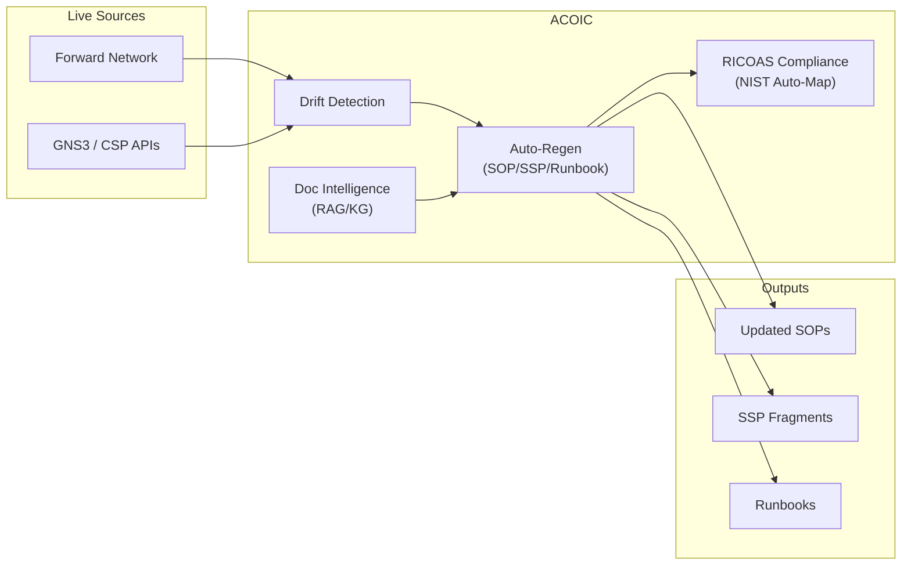

# IRAD: Autonomous Compliance & Ops Intelligence Canvas (ACOIC)

**Submitter:** [Your Name]  
**Sector:** [Your BU] — Defense/IC Cyber Infrastructure

---

## Problem / Opportunity Addressed

DoD/IC docs (SOPs, runbooks, SSPs) live in SharePoint and rot the instant a firewall or subnet changes. Result: 4–6 month ATO re-assessments, stale runbooks during outages, and billable hours for manual updates. Forward Network verifies topology, but **no one auto-updates the paperwork**. ACOIC closes that gap — autonomous document regeneration tied to live infrastructure drift.

---

## Technical Goals

1. Ingest & vectorize docs into RAG-backed knowledge graph.
2. Detect drift from Forward Network / GNS3 / CSP APIs.
3. Auto-regenerate impacted SOPs, runbooks, SSP fragments.
4. Re-map every change to NIST 800-53 via RICOAS crosswalk.
5. Validate runbooks with AI GameDay scenario injection.

---

## Technical Approach

Extend ICDEV FORGE framework with four layers:

1. **Doc Intelligence** — RAG/KG ingestion & chunking.
2. **Drift Detection** — topology diffs → impacted doc scoring.
3. **Auto-Regen** — LLM rewrite + human-in-the-loop approval.
4. **Compliance Bridge** — control re-mapping & SSP fragment auto-gen.

ANVIL TDD (RED→GREEN→REFACTOR) with Playwright E2E gates.

---

## Schedule & TRL

- **Schedule:** 07/2026 → 06/2027 (12 mo)
- **TRL Start:** TRL 4–5 (RAG/KG + crosswalk exist; no integrated canvas)
- **TRL End:** TRL 6–7 (demo w/ simulated Forward Network drift + auto-gen SSP)

---

## Financial Estimates

> **Figures are held in the private overlay, not in this public repository.**
> Labor, non-labor and total cost for this IR&D proposal are real cost data and
> load from `ICDEV_GOVCON_PROMPTS_PATH` (see `tools/govcon/section_prompts.py`)
> at document-generation time. The placeholders below are the contract, not
> the numbers; `tools/ci/domain_leak_gate.py` refuses a dollar figure on these
> lines under `docs/irad/`.

- **Total Cost:** `{{ irad.acoic.total_cost }}`
  - **Labor:** `{{ irad.acoic.labor_cost }}` (`{{ irad.acoic.fte }}` FTEs)
  - **Non-Labor:** `{{ irad.acoic.non_labor_cost }}` (cloud, LLM, testbed)

---

## IP / Patents / Trade Secrets

**Yes.** Trade-secret: topology-drift-to-document-impact inference; compliance-scored auto-regen pipeline. Patent planned for drift-to-doc inference engine.

---

## Major Milestones

| Quarter | Milestone |
|---------|-----------|
| Q1 | Doc RAG/KG + Forward Network seed data loaded |
| Q2 | Drift detection → auto-regen first SOP validated |
| Q3 | RICOAS bridge → NIST auto-map + SSP fragments demo |
| Q4 | GameDay runbook validation + integrated customer demo |

---

## Solution Concept Diagram (OV-1)

---

## Solution Concept Summary

**What:** The first platform that keeps compliance docs alive. It detects infrastructure drift and auto-rewrites the SOPs, runbooks, and SSP fragments that are impacted — with human approval gates.

**How:** Forward Network / GNS3 / CSP diffs feed a drift engine that scores document impact. A RAG-backed pipeline regenerates affected docs and re-maps changes to NIST 800-53 controls. AI GameDay stress-tests the network to validate runbook accuracy.

**Why:** Forward Network proves the topology is correct. ACOIC proves the **paperwork is still correct** when the topology changes. Incumbent vendors sell static storage + manual updates. We sell autonomous compliance intelligence that pays for itself in one ATO cycle.

---

## Target Markets

| Target Adopter | Customer Champion | Value | BD Champion |
|---|---|---|---|
| DoD/IC PMOs (auto-updating SSPs) | [Doc customer PM] | $6–12M follow-on + SaaS licensing | [BD lead] |
| Forward Network users (compliance bridge) | [Network PM] | $4–8M integration; positions us as compliance partner | [BD lead] |
| CSP enclave teams (IL4/IL5) | [CISO] | Recurring support; faster ATO re-assessment | [BD lead] |
