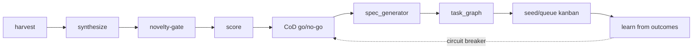

# Autonomous Capability Foundry (ACF) — 0→1 Product Factory

> The autonomous loop that invents, designs, decomposes, and ships brand-new
> ICDEV™ capabilities. Distinct from Oracle/Genesis reflexes (which improve
> EXISTING work incrementally) — ACF creates net-new products.

---

## Goal

Continuously turn the noisy output of the existing discovery engines (Innovation,
Creative, Research, Genesis/Oracle, telemetry) into vetted, buildable canvas
epics on the Kanban board — without a human kicking each cycle. ACF is the bridge
between "we noticed a gap" and "the autonomous builder is shipping it."

- **Canvas:** `/foundry`
- **Tools:** `tools/foundry/`
- **Project prefix:** `acf-`
- **Feature flag:** `ICDEV_FOUNDRY_ENABLED` (`.env`; canvas + reflex are a clean
  no-op when off)
- **Config:** `args/foundry_config.yaml` (FORGE: tune behaviour here, never edit code)
- **Cadence:** every 12h via the `foundry_cycle` Genesis reflex
- **Manifest shard:** `tools/manifest/autonomous-capability-foundry.md`

---

## The Loop



One cycle = `tools.foundry.engine.run_cycle()`. Each stage degrades to a clean
no-op if its module is absent, so partial deployments never crash the cycle.

### 1 — Harvest (`harvester.py`)
Pull raw capability signals from the EXISTING engine stores (no web re-scan)
across 5 sources, each independently toggled and capped in `sources:`:
`innovation`, `creative`, `research`, `genesis` (Oracle predictions + Internal
Awareness gaps), and read-only `telemetry`. Each row is normalized into the
`foundry_signals` shape `(source_engine, source_ref, theme, raw_score, keywords)`
and deduped cross-source by SHA-256 of theme+keywords (highest score wins).
Best-effort: a disabled/empty/unmigrated source yields 0 signals, never an error.

### 2 — Synthesize (`synthesis:`)
Cluster harvested signals into candidate capability concepts. A concept needs at
least `synthesis.min_cluster_size` (default 3) signals — a lone signal is noise,
not a capability. Deterministic clustering by default; `synthesis.llm_assist` can
name/describe clusters but never blocks (default OFF, air-gap safe).

### 3 — Novelty-gate (`novelty_gate.py`) — THE differentiator
Reject concepts that duplicate something ICDEV already has. The catalog is built
from existing assets named in `novelty.catalog_sources`: `canvas_registry`,
tool `manifests`, and `goals`. `score_novelty(concept)` = `1 - max_similarity`
(deterministic token cosine + Jaccard blend; optional embedding re-rank). Below
`novelty.min_novelty` (default 0.6) the concept is rejected as `duplicate` or
`low_novelty`. This is what stops ACF re-inventing canvases that exist.

### 4 — Score (`scoring:`)
Composite rank over surviving concepts using weighted `novelty / market / fit`
(magnitudes) minus the `effort / compliance_risk` cost factors. Concepts below
`scoring.min_composite` (default 0.6) do not advance to the approval gate.

### 5 — CoD go/no-go (`deliberation:`) — approval gate
A Chain-of-Debate decides build / no-build per scored concept. The
`capability_deliberation` function + `cod.per_function` route are already wired in
`args/llm_config.yaml` (cloud-only debaters — do **not** re-add). Approve requires
debate confidence ≥ `deliberation.min_confidence` (0.7). On LLM/cloud
unavailability (air-gap / no key), `defer_to_score_on_fallback: true` falls back
to the deterministic score gate instead of failing the cycle.

### 6 — Spec (`spec_generator.py`)
Turn one approved concept into `{spec_md, canvas_contract}`. The markdown spec
(problem / capability / target users / architecture sketch / DB tables / routes /
success criteria) is template-driven (`spec.llm_assist` enriches but never
blocks). The `canvas_contract` `{slug, title, env_flag, tables[], modules[],
routes[], iqe_collections[], needs_mcp, needs_reflex}` is derived deterministically
and ALWAYS carries ≥1 table + ≥1 route so the skeleton is buildable. Appended
append-only to `foundry_specs`.

### 7 — Task-graph (`task_graph.py`)
Turn one `canvas_contract` into the CANONICAL full-canvas epic skeleton (the SIPA
epic shape, parameterized) as an ordered, single-parent-linear chain of Kanban
tasks across epics: `db → core → engine → dash → mcp → reflex → doc → vv`. Task
IDs are `{slug}-{epic}-{n:02d}`. The `dash` epic embeds the 8-component new-page
gate; every build task embeds the project Guardrails (get_connection/RLS,
constants-derived CHECKs, append-only registration) and carries the
`integrity_gate` marker so the dispatcher self-vets generated code via SIPA.

### 8 — Queue / seed
The engine's seeder emits the task-graph onto the Kanban board (canonical
`task_factory.create_tasks` path, never raw INSERT — see the seeding workflow),
recording provenance in `foundry_tasks_emitted`. From there the autonomous
builder picks up the root task and the canvas ships. `--dry-run` runs the full
pipeline but the seeder writes nothing.

### 9 — Learn (`foundry_outcomes`)
As seeded work ships or fails V&V, the outcome (`shipped` / `vv_pass` / `vv_fail`
/ `abandoned`) is recorded against the concept. These outcomes feed the circuit
breaker (below) and close the loop — repeated V&V failure throttles ACF instead
of letting it flood the board with broken autonomous work.

---

## Guardrails

ACF is autonomous over net-new product creation, so the guardrails are
deliberately conservative. All are configured in `args/foundry_config.yaml`.

| Guardrail | Config | Default | Effect |
|-----------|--------|---------|--------|
| **Novelty gate** | `novelty.min_novelty` | 0.6 | Rejects duplicates / near-dupes of existing canvases, tools, goals. |
| **Score gate** | `scoring.min_composite` | 0.6 | Low-value concepts never reach the approval gate. |
| **CoD approval** | `deliberation.min_confidence` | 0.7 | Human-style debate must agree to build, with confidence. |
| **Concepts/cycle** | `rate_limits.max_concepts_per_cycle` | 5 | Caps how many concepts a single noisy harvest can propose. |
| **Active projects** | `rate_limits.max_active_projects` | 3 | If ≥3 ACF-owned projects have un-done tasks in flight, the cycle skips emit and records `status='rate_limited'`. |
| **SIPA self-vet** | `self_vet.require_integrity_gate` | true | Emitted specs must pass the SIPA integrity gate (`tools/integrity/`) before seeding — no unreviewed autonomous code. |
| **Security gate** | `self_vet.require_security_gate` | true | `security_gates` must pass before tasks are seeded. |
| **Feature flag** | `ICDEV_FOUNDRY_ENABLED` (`.env`) | off | Master kill-switch: canvas + reflex are a zero-cost no-op when off. |
| **Outer breaker** | Genesis daemon | — | `max_consecutive_failures` reflex-level circuit breaker trips `circuit_breaker_open` and stops attempting the reflex. |

Append-only safety: all six `foundry_*` tables are immutable (only
`foundry_concepts` transitions status) and registered in
`.claude/hooks/pre_tool_use.py:APPEND_ONLY_TABLES`. All DB access is RLS-aware
(`get_connection()`, tenant_id/classification stamped) — these are platform
findings tables, NOT canvas tables.

---

## Circuit Breaker — when ACF stops, and how a human clears it

There are **two distinct breakers**, and both must be understood:

1. **Engine-level (ACF) circuit** (`circuit:` in `foundry_config.yaml`) — the
   real "ACF is producing broken work" brake. The engine computes the V&V
   failure rate over the last `circuit.window` (default 10) `foundry_outcomes`.
   If that rate exceeds `circuit.vv_fail_rate` (default 0.5), the breaker **opens**:
   the cycle records `status='circuit_open'` and stops proposing/seeding new work
   while ACF-seeded builds keep failing acceptance.

2. **Daemon-level (outer) circuit** — the standard Genesis per-reflex breaker in
   `tools/daemon/base`. Repeated *reflex* failures (the cycle itself erroring, not
   the seeded builds) trip `circuit_breaker_open` after
   `max_consecutive_failures`, and the daemon stops attempting `foundry_cycle`.

### How a human clears it

A human is the only thing that re-arms the engine-level breaker — by design, ACF
does not silently resume after a string of failures. To clear:

1. **Triage the failing outcomes.** Inspect why ACF-seeded work is failing V&V:
   ```bash
   python tools/foundry/engine.py --status --json        # recent runs + pipeline + rate_limits
   ```
   On the board, open `/foundry` → the rejected/failed lanes, and the per-concept
   detail page (`/foundry/<concept_id>`) for scores, spec, emitted tasks, and
   outcomes. Or ask in plain English via the `/foundry` IQE widget (collections
   `foundry.outcomes` / `foundry.concepts`), or POST `/api/foundry/run` with
   `{"dry_run": true}` to validate a cycle without seeding.
2. **Fix the root cause** — usually a spec/task-graph template defect or an
   over-eager novelty/score threshold. Tune `args/foundry_config.yaml`
   (raise `novelty.min_novelty` / `scoring.min_composite`, tighten
   `rate_limits`) rather than editing code.
3. **Re-arm by changing the window's failure rate.** The engine breaker is
   computed over the trailing `circuit.window` outcomes, so it re-closes once
   enough *successful* outcomes (`vv_pass` / `shipped`) push the failure rate back
   below `circuit.vv_fail_rate`. After fixing the defect, run one supervised
   `--dry-run` cycle, confirm the spec/task-graph is sound, then run a real cycle
   so fresh good outcomes age out the failures:
   ```bash
   python tools/foundry/engine.py --run --dry-run --json   # validate, no seeding
   python tools/foundry/engine.py --run --json             # real cycle once satisfied
   ```
4. **Clear the daemon-level breaker** (if that one tripped) by restarting the
   Genesis daemon after the fix — the per-reflex consecutive-failure counter
   resets on a healthy run. Remember the daemon gotcha: restart the scheduler
   immediately after killing any `python.exe`, and clear stale PG backends.

> Never bypass the breaker by disabling `self_vet` or the gates. The correct
> clear is: triage outcomes → fix the template/thresholds → let good outcomes
> re-close the window. The flag `ICDEV_FOUNDRY_ENABLED=false` is the hard stop if
> ACF must be halted entirely while investigating.

---

## Outputs

- `foundry_runs` — one roll-up row per cycle (harvested / proposed / approved /
  emitted / status).
- `foundry_signals`, `foundry_concepts`, `foundry_specs`,
  `foundry_tasks_emitted`, `foundry_outcomes` — the append-only pipeline trail.
- Seeded `acf-`-prefixed Kanban tasks (a full canvas epic per approved concept).
- `/foundry` dashboard board + per-concept detail pages.
- 4 IQE collections (`foundry.concepts/signals/runs/outcomes`).

## Verification

```bash
# Engine runs a dry cycle end-to-end
python tools/foundry/engine.py --run --dry-run --json

# Reflex no-ops cleanly when the flag is off, runs one cycle when on
python tools/genesis/reflexes/foundry_cycle.py --dry-run

# Status snapshot
python tools/foundry/engine.py --status --json

# Tests
pytest tests/foundry/ -v
pytest tests/test_foundry_cycle_reflex.py tests/test_foundry_mcp.py -v
```
