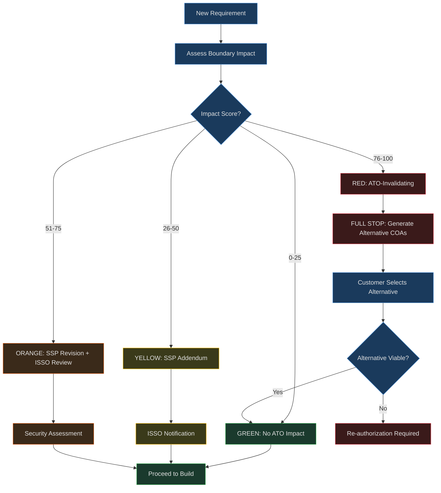
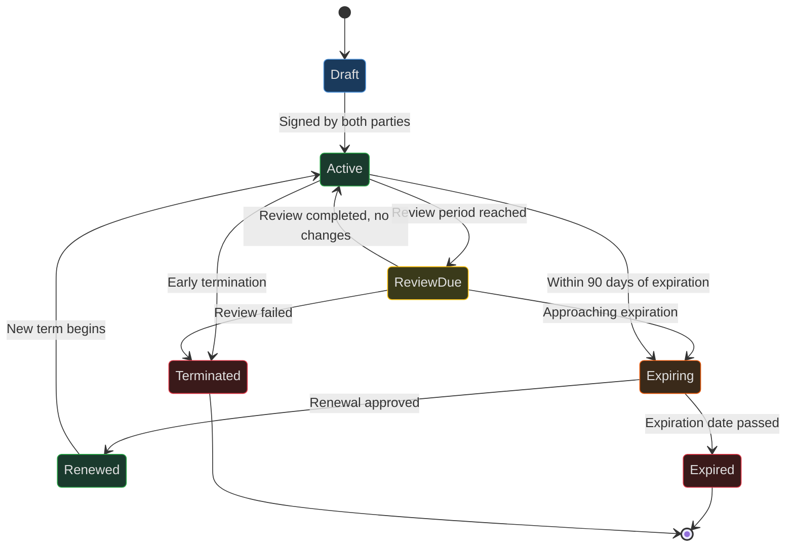

# Goal: ATO Boundary Impact & Supply Chain Intelligence (RICOAS Phase 2)

## Purpose

Assess requirement impact on existing ATO boundaries (4-tier GREEN/YELLOW/ORANGE/RED), manage supply chain risk per NIST 800-161, track ISA/MOU lifecycle, triage CVEs with upstream/downstream blast radius analysis, and generate alternative COAs for ATO-invalidating requirements.

## When to Use

- New requirements need boundary impact assessment against existing ATO systems
- RED-tier requirements need alternative COAs
- Supply chain dependency graph needs building or querying
- CVE triage with blast radius analysis needed
- ISA/MOU lifecycle review (expiring, overdue review)
- NIST 800-161 SCRM vendor assessment needed
- Section 889 prohibited vendor check needed

## Workflow

### ATO Boundary Impact Analysis

1. Register existing ATO systems: `register_ato_system` (MCP) or `boundary_analyzer.py --register-system`
2. Assess each requirement: `assess_boundary_impact` (MCP) — returns GREEN/YELLOW/ORANGE/RED tier
3. For RED-tier: `generate_red_alternative` (MCP) — generates 3-5 alternative approaches within existing ATO
4. List all assessments: filter by tier to find items requiring attention

### Boundary Impact Tiers

| Tier | Score | ATO Impact | Action |
|------|-------|------------|--------|
| GREEN | 0-25 | None | Proceed |
| YELLOW | 26-50 | SSP addendum, possible POAM | ISSO notification |
| ORANGE | 51-75 | SSP revision, ISSO review | Security assessment, ISA review |
| RED | 76-100 | ATO-invalidating | **FULL STOP.** Generate alternative COAs |

### Boundary Impact Decision Flowchart

### ISA Lifecycle State Diagram

### Supply Chain Dependency Tracking

1. Register vendors: `add_vendor` (MCP) — include country, SCRM tier, Section 889 status
2. Add dependencies: via `dependency_graph.py --add-dep`
3. Build graph: `build_dependency_graph` (MCP) — adjacency list with stats
4. Impact analysis: `propagate_impact` (MCP) — trace downstream blast radius with severity decay

### ISA/MOU Lifecycle

1. Create ISA: `manage_isa` with action=create
2. Check expiring: `manage_isa` with action=expiring (default 90 days ahead)
3. Review due: `manage_isa` with action=review_due

### SCRM Assessment (NIST 800-161)

1. Vendor assessment: `assess_scrm` with vendor_id — scores 6 dimensions
2. Project aggregate: `assess_scrm` with aggregate=true — risk distribution across all vendors
3. Prohibited check: `scrm_assessor.py --prohibited` — Section 889 compliance

### CVE Triage

1. Triage new CVE: `triage_cve` (MCP) — auto-computes upstream/downstream blast radius
2. Check SLA compliance: `cve_triager.py --sla-check`
3. Propagate impact: `cve_triager.py --propagate` — trace through dependency graph

---

## Tools Used

| Tool | Purpose |
|------|---------|
| tools/requirements/boundary_analyzer.py | 4-tier ATO boundary impact assessment |
| tools/supply_chain/dependency_graph.py | Dependency graph build/query/impact |
| tools/supply_chain/isa_manager.py | ISA/MOU lifecycle tracking |
| tools/supply_chain/scrm_assessor.py | NIST 800-161 SCRM assessment |
| tools/supply_chain/cve_triager.py | CVE triage with blast radius |
| tools/mcp/supply_chain_server.py | MCP server (9 tools) |

## Args

- `args/supply_chain_config.yaml` — SCRM thresholds, CVE SLAs, ISA cadence, country risk tiers

## Context

- `context/supply_chain/nist_800_161_controls.json` — NIST 800-161 control catalog
- `context/supply_chain/scrm_risk_matrix.json` — Risk scoring matrix
- `context/supply_chain/isa_templates.json` — ISA/MOU templates and lifecycle
- `context/requirements/boundary_impact_rules.json` — 4-tier impact rules
- `context/requirements/red_alternative_patterns.json` — RED alternative COA patterns

## Security Gates

- RED-tier requirement without alternative COA → **blocks**
- Critical SCRM risk unmitigated → **blocks**
- ISA expired with active data flow → **blocks**
- Critical CVE SLA overdue → **blocks**
- Section 889 prohibited vendor detected → **blocks**

---

## Edge Cases

- Multiple systems affected by single requirement → assess each, use worst-case tier
- Vendor country changes (acquisition) → trigger re-assessment
- ISA renewal rejected → flag all dependent data flows
- CVE affects transitive dependency → propagate with decay factor

---

## Success Criteria

- All requirements assessed with boundary impact tier
- Zero RED-tier requirements without alternative COAs
- All vendors assessed per NIST 800-161
- Zero Section 889 prohibited vendors in supply chain
- All ISAs current (no expired agreements with active data flows)
- CVE SLA compliance across all tracked vulnerabilities

---

## GOTCHA Layer Mapping

| Phase | GOTCHA Layer |
|-------|--------------|
| ATO System Registration | Goals (define boundary scope) |
| Boundary Impact Assessment | Orchestration (AI evaluates impact) |
| Supply Chain Tracking | Tools (dependency graph scripts) |
| SCRM Assessment | Context (NIST 800-161 controls, risk matrix) |
| CVE SLA Thresholds | Args (SLA windows, decay factors) |
| Red Alternative Generation | Hard Prompts (COA generation templates) |

---

## Related Files

- **Goal:** `goals/requirements_intake.md` — RICOAS Phase 1 (intake feeds boundary assessment)
- **Goal:** `goals/compliance_workflow.md` — Compliance artifacts (SSP addendum for YELLOW/ORANGE)
- **Goal:** `goals/ato_acceleration.md` — ATO acceleration (boundary changes trigger re-assessment)
- **Goal:** `goals/maintenance_audit.md` — Maintenance (CVE triage feeds maintenance workflow)
- **Skill:** `.claude/skills/icdev-boundary/SKILL.md` — Claude Code slash command

---

## Changelog
