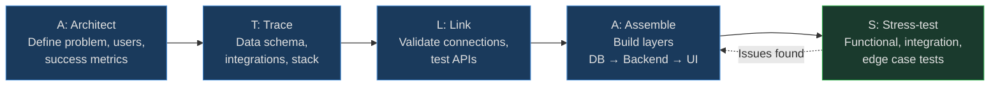
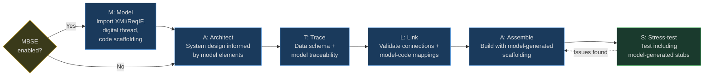

# Build App — ATLAS Workflow

## Goal

Build full-stack applications using AI assistance within the GOTCHA framework. This workflow ensures apps are production-ready, not just demos.

**ATLAS** is a 5-step process:

| Step | Phase | What You Do |
|------|-------|-------------|
| **A** | Architect | Define problem, users, success metrics |
| **T** | Trace | Data schema, integrations map, stack proposal |
| **L** | Link | Validate ALL connections before building |
| **A** | Assemble | Build with layered architecture |
| **S** | Stress-test | Test functionality, error handling |



## For prod builds when asked specifically add:
+ V - Validate (security/input sanitization, edge cases, unit tests)
+ M - Monitor (logging, observability, alerts)

---

## A — Architect

**Purpose:** Know exactly what you're building before touching code.

### Step 0: Agentic Fitness Assessment (Phase 19)

Before answering architecture questions, evaluate the component's fitness for agentic architecture:

```bash
python tools/builder/agentic_fitness.py --spec "<component description>" --project-id "<id>" --json
```

The assessor scores 6 dimensions (data_complexity, decision_complexity, user_interaction, integration_density, compliance_sensitivity, scale_variability) and recommends: **agent**, **hybrid**, or **traditional** architecture. Use the scorecard to guide all downstream decisions (scaffolding, code generation, infrastructure).

See `context/agentic/fitness_rubric.md` for the scoring rubric.

### Questions to Answer

1. **What problem does this solve?**
   - One sentence. If you can't say it simply, you don't understand it.

2. **Who is this for?**
   - Specific user: "Me" / "Sales team" / "YouTube subscribers"
   - Not "everyone"

3. **What does success look like?**
   - Measurable outcome: "I can see my metrics in one dashboard"
   - Not vague: "It works"

4. **What are the constraints?**
   - Budget (API costs)
   - Time (MVP vs full build)
   - Technical (must use Supabase, must integrate with X)

### Output

```markdown
## App Brief
- **Problem:** [One sentence]
- **User:** [Who specifically]
- **Success:** [Measurable outcome]
- **Constraints:** [List]
```

---

## T — Trace

**Purpose:** Design before building. This is where most "vibe coders" fail.

### Data Schema

Define your source of truth BEFORE building:

```
Tables:
- users (id, email, name, created_at)
- saved_items (id, user_id, title, content, source, created_at)
- metrics (id, user_id, platform, value, date)

Relationships:
- users 1:N saved_items
- users 1:N metrics
```

### Integrations Map

List every external connection:

| Service | Purpose | Auth Type | MCP Available? |
|---------|---------|-----------|----------------|
| Supabase | Database | API Key | Yes |
| YouTube API | Metrics | OAuth | Via MCP |
| Notion | Save items | API Key | Yes |

### Technology Stack Proposal

Based on requirements, propose:
- Database (Supabase, Firebase, Postgres, etc.)
- Backend (Supabase Functions, n8n, custom API)
- Frontend (React, Next.js, vanilla, etc.)
- Any other services needed

User approves or overrides before proceeding.

### Edge Cases

Document what could break:

- API rate limits (YouTube: 10,000 quota/day)
- Auth token expiry
- Database connection timeout
- Invalid user input
- MCP server unavailability

### Output

- Data schema diagram or markdown table
- Technology stack (approved by user)
- Integrations checklist
- Edge cases documented

---

## L — Link

**Purpose:** Validate all connections BEFORE building. Nothing worse than building for 2 hours then discovering the API doesn't work.

### Connection Validation Checklist

```
[ ] Database connection tested
[ ] All API keys verified
[ ] MCP servers responding
[ ] OAuth flows working
[ ] Environment variables set
[ ] Rate limits understood
```

### How to Test

**Database:**
```bash
# Test via MCP or direct API call
# Should return empty array or existing data, not error
```

**APIs:**
```bash
# Make a simple GET request
# Verify response format matches expectations
```

**MCPs:**
```
# List available tools
# Test one simple operation
```

### Output

All green checkmarks. If anything fails, fix it before proceeding.

---

## A — Assemble

**Purpose:** Build the actual application with proper architecture.

### Architecture Layers

Follow GOTCHA separation:

1. **Frontend** (what user sees)
   - UI components
   - User interactions
   - Display logic

2. **Backend** (what makes it work)
   - API routes
   - Business logic
   - Data validation

3. **Database** (source of truth)
   - Schema implementation
   - Migrations
   - Indexes

### Build Order

1. Database schema first
2. Backend API routes second
3. Frontend UI last

This order prevents building UI for data structures that don't exist.

### Component Strategy

- Use existing component libraries (don't reinvent buttons)
- Keep components small and focused
- Document any non-obvious logic

### Output

Working application with:
- Functional database
- API endpoints responding
- UI rendering correctly

---

## S — Stress-test

**Purpose:** Test before shipping. This is the step most "vibe coding" tutorials skip entirely.

### Functional Testing

Does it actually work?

```
[ ] All buttons do what they should
[ ] Data saves to database
[ ] Data retrieves correctly
[ ] Navigation works
[ ] Error states handled
```

### Integration Testing

Do the connections hold?

```
[ ] API calls succeed
[ ] MCP operations work
[ ] Auth persists across sessions
[ ] Rate limits not exceeded
```

### Edge Case Testing

What breaks?

```
[ ] Invalid input handled gracefully
[ ] Empty states display correctly
[ ] Network errors show feedback
[ ] Long text doesn't break layout
```

### Acceptance Criteria Validation (V&V)

Validate that what was built matches what was required. This is a **mandatory gate** — not a soft checklist.

```bash
python tools/testing/acceptance_validator.py \
    --plan <plan_file> \
    --test-results .tmp/test_runs/<run_id>/state.json \
    --base-url <app_url if applicable> \
    --pages <list of pages from plan> \
    --json
```

**GATE (per `security_gates.yaml` `acceptance_validation`):**
- 0 failed acceptance criteria
- 0 pages rendering with error patterns (500, tracebacks, JS errors)
- Plan MUST have `## Acceptance Criteria` section

If gate fails: review the plan's acceptance criteria against actual implementation, fix gaps, and re-run.

### Output

Test report with:
- What passed
- What failed
- What needs fixing
- Acceptance criteria verification results

---

## M-ATLAS Variant (MBSE-Enabled Projects)

If the project has `mbse_enabled=1`, use the **M-ATLAS** workflow which adds a **Model** pre-phase:

| Step | Phase | What You Do |
|------|-------|-------------|
| **M** | Model | Import XMI/ReqIF, build digital thread, generate code scaffolding |
| **A** | Architect | System design informed by model elements |
| **T** | Trace | Data schema + integrations (augmented with model traceability) |
| **L** | Link | Validate connections including model-code mappings |
| **A** | Assemble | Build with model-generated scaffolding as starting point |
| **S** | Stress-test | Test including model-generated test stubs |



### M — Model Phase

**Purpose:** Import authoritative system model and establish digital thread before design.

1. Import latest XMI from Cameo: `python tools/mbse/xmi_parser.py --project-id X --file model.xmi`
2. Import latest ReqIF from DOORS NG: `python tools/mbse/reqif_parser.py --project-id X --file reqs.reqif`
3. Build digital thread: `python tools/mbse/digital_thread.py --project-id X auto-link`
4. Generate code scaffolding: `python tools/mbse/model_code_generator.py --project-id X --language python --output ./src`
5. Map model to NIST controls: `python tools/mbse/model_control_mapper.py --project-id X --map-all`

If no model exists, skip this phase — ATLAS starts at Architect (backward compatible).

---

## Note: Deployment

Deployment is **not part of this workflow**. It's a separate, user-initiated action.

When you're ready to deploy, explicitly ask. This keeps deployment decisions in your control, not automated.

---

## Anti-Patterns (What NOT to Do)

These are the mistakes "vibe coders" make:

1. **Building before designing** — You end up rewriting everything
2. **Skipping connection validation** — Hours wasted on broken integrations
3. **No data modeling** — Schema changes cascade into UI rewrites
4. **No testing** — Ship broken code, lose trust
5. **Hardcoding everything** — No flexibility for changes

---

## GOTCHA Layer Mapping

| ATLAS Step | GOTCHA Layer |
|------------|--------------|
| Architect | Goals (define the process) |
| Trace | Context (reference patterns) |
| Link | Args (environment setup) |
| Assemble | Tools (execution) |
| Stress-test | Orchestration (AI validates) |


---

## Related Files

- **Args:** `args/app_defaults.yaml` (if created)
- **Context:** `context/ui_patterns/` (design references)
- **Hard Prompts:** `hardprompts/app_building/` (generation templates)

---

## Mandatory: Child Application Generation Pipeline

When building a **child application** (an application generated by ICDEV), the following rules are **mandatory**:

### 1. Use the Child App Generator Pipeline

All child applications MUST be generated through the `child_app_generator.py` pipeline (`tools/builder/child_app_generator.py`). This pipeline executes 16 steps that ensure every GOTCHA layer is populated:

1. Directory tree creation (all 6 GOTCHA layer directories)
2. Tool generation (deterministic Python scripts)
3. Agent infrastructure (agent cards, A2A protocol)
4. Memory system (MEMORY.md, logs, SQLite)
5. Database initialization (standalone init script)
6. Goals and hard prompts (adapted from ICDEV)
7. Args and context (YAML configs, reference material)
8. A2A callback client (parent-child communication)
9. CI/CD setup (GitHub + GitLab)
10. CSP MCP configuration (cloud provider integration)
11. Dynamic CLAUDE.md generation (Jinja2)
12. Audit trail and child registry registration
13. Production audit (38-check readiness scan)
14. **GOTCHA compliance validation** (6-layer + 4 meta checks)

**Do NOT manually scaffold child applications.** Manual creation bypasses GOTCHA layer population, ATLAS workflow integration, and compliance validation.

### 2. Post-Generation GOTCHA Validation

After generation, `gotcha_validator.py` (`tools/builder/gotcha_validator.py`) MUST pass with `--gate` mode. This validates:

| Check | GOTCHA Layer | Requirement |
|-------|-------------|-------------|
| Goals | G | `goals/manifest.md` exists + at least `build_app.md` + 1 other goal |
| Orchestration | O | Agent cards in `tools/agent/cards/` OR `args/agent_config.yaml` |
| Tools | T | `tools/` has at least 3 subdirectories |
| Args | A | `args/` has at least 1 YAML file |
| Context | C | `context/` has at least 1 subdirectory with content |
| Hard Prompts | H | `hardprompts/` has at least 1 `.md` file |
| CLAUDE.md | meta | Exists and references "GOTCHA" |
| Memory | meta | `memory/MEMORY.md` exists |
| Database | meta | `tools/db/` has an init script |
| ATLAS | meta | `goals/build_app.md` exists |

### 3. BMAD Quality Gates (Recommended)

ICDEV includes BMAD Method tools that SHOULD be used during child app generation:

- **PRD Validator** (`tools/requirements/prd_validator.py`) — Validate requirements quality before building
- **Complexity Scorer** (`tools/requirements/complexity_scorer.py`) — Assess project complexity to select appropriate pipeline
- **Elicitation Techniques** (`tools/requirements/elicitation_techniques.py`) — Use structured reasoning (pre-mortem, first principles) during architecture
- **Adversarial Review** (`.claude/commands/review.md`) — Run adversarial code review with minimum 3 issues per review

### 4. Entry Point

The `/icdev-agentic` command is the standard entry point for generating child applications. It orchestrates:
1. Requirements gathering
2. Fitness assessment (6-dimension scoring)
3. User decision confirmation
4. Blueprint generation
5. Child app generation (16-step pipeline)
6. GOTCHA validation gate
7. Verification and reporting

---

## Changelog