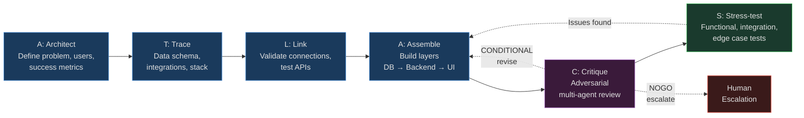

# Build App — ANVIL Workflow

## Goal

Build full-stack applications using AI assistance within the FORGE framework. This workflow ensures apps are production-ready, not just demos.

**ANVIL** is a 5-step process (6 steps with optional Critique phase):

| Step | Phase | What You Do |
|------|-------|-------------|
| **A** | Architect | Define problem, users, success metrics |
| **T** | Trace | Data schema, integrations map, stack proposal |
| **L** | Link | Validate ALL connections before building |
| **A** | Assemble | Build with layered architecture |
| **C** | Critique | *(Optional)* Adversarial multi-agent plan review |
| **S** | Stress-test | Test functionality, error handling |

When the Critique phase is enabled (`anvil_critique.enabled: true` in `args/anvil_critique_config.yaml`), the workflow becomes **ANVIL-CR**:

```
A(rchitect) → T(race) → L(ink) → A(ssemble) → C(ritique) → S(tress-test)
```


```mermaid
flowchart LR
    A["A: Architect\nDefine problem, users,\nsuccess metrics"]
    T["T: Trace\nData schema,\nintegrations, stack"]
    L["L: Link\nValidate connections,\ntest APIs"]
    As["A: Assemble\nBuild layers\nDB → Backend → UI"]
    C["C: Critique\nAdversarial\nmulti-agent review"]
    S["S: Stress-test\nFunctional, integration,\nedge case tests"]
    A --> T --> L --> As --> C --> S
    C -.->|CONDITIONAL\nrevise| As
    C -.->|NOGO\nescalate| Stop["Human\nEscalation"]
    S -.->|Issues found| As
    style A fill:#1a3a5c,stroke:#4a90d9,color:#e0e0e0
    style T fill:#1a3a5c,stroke:#4a90d9,color:#e0e0e0
    style L fill:#1a3a5c,stroke:#4a90d9,color:#e0e0e0
    style As fill:#1a3a5c,stroke:#4a90d9,color:#e0e0e0
    style C fill:#3a1a3a,stroke:#9b59b6,color:#e0e0e0
    style S fill:#1a3a2d,stroke:#28a745,color:#e0e0e0
    style Stop fill:#3a1a1a,stroke:#e74c3c,color:#e0e0e0
```

If the Critique phase is disabled, ANVIL operates as the original 5-step process (backward compatible).

## For prod builds when asked specifically add:
+ V - Validate (security/input sanitization, edge cases, unit tests)
+ M - Monitor (logging, observability, alerts)

---

## A — Architect

**Purpose:** Know exactly what you're building before touching code.

### Step 0: Agentic Fitness Assessment (Phase 19)

Before answering architecture questions, evaluate the component's fitness for agentic architecture:

```bash
python tools/builder/agentic_fitness.py --spec "<component description>" --project-id "<id>" --json
```

The assessor scores 6 dimensions (data_complexity, decision_complexity, user_interaction, integration_density, compliance_sensitivity, scale_variability) and recommends: **agent**, **hybrid**, or **traditional** architecture. Use the scorecard to guide all downstream decisions (scaffolding, code generation, infrastructure).

See `context/agentic/fitness_rubric.md` for the scoring rubric.

### Questions to Answer

1. **What problem does this solve?**
   - One sentence. If you can't say it simply, you don't understand it.

2. **Who is this for?**
   - Specific user: "Me" / "Sales team" / "YouTube subscribers"
   - Not "everyone"

3. **What does success look like?**
   - Measurable outcome: "I can see my metrics in one dashboard"
   - Not vague: "It works"

4. **What are the constraints?**
   - Budget (API costs)
   - Time (MVP vs full build)
   - Technical (must use Supabase, must integrate with X)

### Karpathy Principles Check (Pre-Design Gate)

Before proceeding to Trace, apply `hardprompts/karpathy_principles.md`:

1. **State assumptions** — What are you assuming about the users, data, integrations, and constraints?
2. **Enumerate interpretations** — If the problem statement is ambiguous, list every valid reading and select one explicitly.
3. **Prefer simpler approach** — Compare at least two architecture options; choose the simpler one unless there is a written reason not to.
4. **Bound your edit scope** — List what this architect phase will **not** touch (existing tables, services, auth flows, etc.).
5. **Success criteria** — Rewrite each goal from the App Brief as a testable assertion (e.g., "Given a logged-in user, when they open the dashboard, then HTTP 200 and <10 JS errors in console").

> **Partial:** `` with `task_description` set to the problem statement.

This gate runs **once** at the Architect phase. Do not repeat it at Assemble — the criteria defined here become the Stress-test acceptance criteria.

### Output

```markdown
## App Brief
- **Problem:** [One sentence]
- **User:** [Who specifically]
- **Success:** [Measurable outcome — expressed as testable criteria]
- **Constraints:** [List]
- **Assumptions:** [Explicit list]
- **Interpretation chosen:** [Which reading of the requirement and why]
```

---

## T — Trace

**Purpose:** Design before building. This is where most "vibe coders" fail.

### Data Schema

Define your source of truth BEFORE building:

```
Tables:
- users (id, email, name, created_at)
- saved_items (id, user_id, title, content, source, created_at)
- metrics (id, user_id, platform, value, date)

Relationships:
- users 1:N saved_items
- users 1:N metrics
```

### Integrations Map

List every external connection:

| Service | Purpose | Auth Type | MCP Available? |
|---------|---------|-----------|----------------|
| Supabase | Database | API Key | Yes |
| YouTube API | Metrics | OAuth | Via MCP |
| Notion | Save items | API Key | Yes |

### Technology Stack Proposal

Based on requirements, propose:
- Database (Supabase, Firebase, Postgres, etc.)
- Backend (Supabase Functions, n8n, custom API)
- Frontend (React, Next.js, vanilla, etc.)
- Any other services needed

User approves or overrides before proceeding.

### Edge Cases

Document what could break:

- API rate limits (YouTube: 10,000 quota/day)
- Auth token expiry
- Database connection timeout
- Invalid user input
- MCP server unavailability

### Output

- Data schema diagram or markdown table
- Technology stack (approved by user)
- Integrations checklist
- Edge cases documented

---

## L — Link

**Purpose:** Validate all connections BEFORE building. Nothing worse than building for 2 hours then discovering the API doesn't work.

### Connection Validation Checklist

```
[ ] Database connection tested
[ ] All API keys verified
[ ] MCP servers responding
[ ] OAuth flows working
[ ] Environment variables set
[ ] Rate limits understood
```

### How to Test

**Database:**
```bash
# Test via MCP or direct API call
# Should return empty array or existing data, not error
```

**APIs:**
```bash
# Make a simple GET request
# Verify response format matches expectations
```

**MCPs:**
```
# List available tools
# Test one simple operation
```

### Output

All green checkmarks. If anything fails, fix it before proceeding.

---

## A — Assemble

**Purpose:** Build the actual application with proper architecture.

### Architecture Layers

Follow FORGE separation:

1. **Frontend** (what user sees)
   - UI components
   - User interactions
   - Display logic

2. **Backend** (what makes it work)
   - API routes
   - Business logic
   - Data validation

3. **Database** (source of truth)
   - Schema implementation
   - Migrations
   - Indexes

### Build Order

1. Database schema first
2. Backend API routes second
3. Frontend UI last

This order prevents building UI for data structures that don't exist.

### Component Strategy

- Use existing component libraries (don't reinvent buttons)
- Keep components small and focused
- Document any non-obvious logic

### Reasoned Generation (Optional, opt-in)

When code is generated through the LLM-backed agentic runner
(`tools/anvil/agentic_runner.py`), generation can route through **reasoned
codegen** — Chain-of-Thought / Chain-of-Debate reasoning per turn. This is the
`code_generation` function in `args/llm_config.yaml` → `reasoned_codegen`.

Control it with the `--reasoned` option:

```bash
python tools/anvil/agentic_runner.py --task-id ... --task-desc "..." \
    --reasoned auto    # advisor decides if CoT/CoD pays off (default)
    # --reasoned on    # force enable (advisor picks cot vs cod)
    # --reasoned off   # plain single-shot generation
```

`auto` consults `tools/llm/reasoned_codegen_advisor.py`, which scores the task
(complexity, security/compliance signals, file count, prior failures) and
recommends off / cot / cod with a logged rationale — heuristic-only in air-gap /
no-LLM mode, optionally LLM-refined otherwise. The section-level kill-switch
`reasoned_codegen.enabled: false` always wins, regardless of the option.

Defaults to **OFF** for `code_generation` (per-function config) so cost is opt-in;
translation defaults ON. Final-artifact adversarial review remains the **C —
Critique** phase below (the per-turn loop self-validates with ruff/pytest).

### Output

Working application with:
- Functional database
- API endpoints responding
- UI rendering correctly

---

## C — Critique (Optional, Phase 61)

**Purpose:** Adversarial multi-agent review of the Assemble output before stress-testing. Catches security, compliance, and architectural issues early through independent parallel review.

This phase is **optional** and controlled by `anvil_critique.enabled` in `args/anvil_critique_config.yaml`. When disabled, ANVIL proceeds directly from Assemble to Stress-test (backward compatible).

### How It Works

1. The Assemble-phase output (plan/implementation) is dispatched to **3 critic agents** in parallel:
   - **Security Agent** — Reviews for vulnerabilities, attack surface, OWASP Top 10, STIG compliance
   - **Compliance Agent** — Reviews for NIST 800-53 gaps, FedRAMP requirements, CUI markings, audit trail
   - **Knowledge Agent** — Reviews for architecture flaws, performance risks, maintainability, testing gaps

2. Each agent independently produces findings classified by severity: **critical**, **high**, **medium**, **low**

3. A **consensus vote** determines the outcome:
   - **GO** (0 critical, 0 high) — Proceed to Stress-test
   - **CONDITIONAL** (0 critical, >0 high) — Loop back to Assemble with fix list (max 3 rounds)
   - **NOGO** (>0 critical) — Stop, escalate to human

4. If CONDITIONAL, the architect revises and resubmits. Up to `max_rounds` (default 3) revision cycles.

### The Mandatory Question (D397)

Every critic — whatever its focus area — is also asked one question about every check,
test, gate, or assertion the plan introduces or leans on:

> **Under what condition does this check PASS while the system is BROKEN?**

This is the cheapest thing in the critique phase and the only question in it that the
plan's author structurally cannot ask. Every check in this codebase is written by the
same process that writes the code, in the same session, in the environment where the
author's mental model holds; the three critics exist precisely to be a second,
differently-motivated reader, and this is the question that reader supplies for free.
A check that cannot fail carries zero bits (D396).

- Where a critic can name the condition **concretely**, that answer **is a test case**.
  It is recorded as a `testing_gap` finding with the condition in `evidence` and the
  test to write in `suggested_fix`.
- "No condition constructed" is a legitimate answer and must be said out loud. Silence
  is not an answer — it reads exactly like a question that was never asked.

The question text lives in `args/anvil_critique_config.yaml` under
`anvil_critique.adversarial_question` and is appended to **every** critic prompt by
`tools/agent/anvil_critique.py::_dispatch_critics`, with the module constant
`ADVERSARIAL_QUESTION` as the fallback if the key is removed. It is wired rather than
merely written down because D394/D397 both record what happens to an instruction whose
firing leaves no artifact.

### Running the Critique

```bash
# Run critique on plan text
python tools/agent/anvil_critique.py --project-id "proj-123" \
    --phase-output "plan text here" --json

# Run critique on a file
python tools/agent/anvil_critique.py --project-id "proj-123" \
    --phase-output /path/to/plan.md --json

# Check session status
python tools/agent/anvil_critique.py --project-id "proj-123" \
    --session-id "crit-abc123" --status --json

# View critique history for a project
python tools/agent/anvil_critique.py --project-id "proj-123" \
    --history --json
```

### Finding Types

| Type | Description |
|------|-------------|
| `security_vulnerability` | Security weakness or attack vector |
| `compliance_gap` | Missing or incomplete compliance control |
| `architecture_flaw` | Design pattern violation or structural issue |
| `performance_risk` | Potential performance bottleneck |
| `maintainability_concern` | Code quality or maintainability issue |
| `testing_gap` | Missing or inadequate test coverage |
| `deployment_risk` | Deployment or operational risk |
| `data_handling_issue` | Data classification, encryption, or handling gap |

### Configuration

See `args/anvil_critique_config.yaml` for:
- Critic agent assignments and focus areas
- Consensus rules (GO/NOGO/CONDITIONAL thresholds)
- Revision prompt template
- Max rounds

### Output

Critique result with:
- Consensus decision (GO/NOGO/CONDITIONAL)
- All findings with severity, type, and suggested fixes
- Revision summary (if CONDITIONAL with revisions)
- Round count

---

## S — Stress-test

**Purpose:** Test before shipping. This is the step most "vibe coding" tutorials skip entirely.

### Functional Testing

Does it actually work?

```
[ ] All buttons do what they should
[ ] Data saves to database
[ ] Data retrieves correctly
[ ] Navigation works
[ ] Error states handled
```

### Integration Testing

Do the connections hold?

```
[ ] API calls succeed
[ ] MCP operations work
[ ] Auth persists across sessions
[ ] Rate limits not exceeded
```

### Edge Case Testing

What breaks?

```
[ ] Invalid input handled gracefully
[ ] Empty states display correctly
[ ] Network errors show feedback
[ ] Long text doesn't break layout
```

### Acceptance Criteria Validation (V&V)

Validate that what was built matches what was required. This is a **mandatory gate** — not a soft checklist.

```bash
python tools/testing/acceptance_validator.py \
    --plan <plan_file> \
    --test-results .tmp/test_runs/<run_id>/state.json \
    --base-url <app_url if applicable> \
    --pages <list of pages from plan> \
    --json
```

**GATE (per `security_gates.yaml` `acceptance_validation`):**
- 0 failed acceptance criteria
- 0 pages rendering with error patterns (500, tracebacks, JS errors)
- Plan MUST have `## Acceptance Criteria` section

If gate fails: review the plan's acceptance criteria against actual implementation, fix gaps, and re-run.

### Output

Test report with:
- What passed
- What failed
- What needs fixing
- Acceptance criteria verification results

---

## M-ANVIL Variant (MBSE-Enabled Projects)

If the project has `mbse_enabled=1`, use the **M-ANVIL** workflow which adds a **Model** pre-phase:

| Step | Phase | What You Do |
|------|-------|-------------|
| **M** | Model | Import XMI/ReqIF, build digital thread, generate code scaffolding |
| **A** | Architect | System design informed by model elements |
| **T** | Trace | Data schema + integrations (augmented with model traceability) |
| **L** | Link | Validate connections including model-code mappings |
| **A** | Assemble | Build with model-generated scaffolding as starting point |
| **C** | Critique | *(Optional)* Adversarial multi-agent plan review |
| **S** | Stress-test | Test including model-generated test stubs |


```mermaid
flowchart LR
    Check{"MBSE\nenabled?"}
    M["M: Model\nImport XMI/ReqIF,\ndigital thread,\ncode scaffolding"]
    A["A: Architect\nSystem design informed\nby model elements"]
    T["T: Trace\nData schema +\nmodel traceability"]
    L["L: Link\nValidate connections +\nmodel-code mappings"]
    As["A: Assemble\nBuild with model-generated\nscaffolding"]
    C["C: Critique\nAdversarial\nmulti-agent review"]
    S["S: Stress-test\nTest including\nmodel-generated stubs"]
    Check -->|Yes| M --> A
    Check -->|No| A
    A --> T --> L --> As --> C --> S
    C -.->|CONDITIONAL| As
    S -.->|Issues found| As
    style Check fill:#3a3a1a,stroke:#ffc107,color:#e0e0e0
    style M fill:#1a3a5c,stroke:#4a90d9,color:#e0e0e0
    style A fill:#1a3a5c,stroke:#4a90d9,color:#e0e0e0
    style T fill:#1a3a5c,stroke:#4a90d9,color:#e0e0e0
    style L fill:#1a3a5c,stroke:#4a90d9,color:#e0e0e0
    style As fill:#1a3a5c,stroke:#4a90d9,color:#e0e0e0
    style C fill:#3a1a3a,stroke:#9b59b6,color:#e0e0e0
    style S fill:#1a3a2d,stroke:#28a745,color:#e0e0e0
```

### M — Model Phase

**Purpose:** Import authoritative system model and establish digital thread before design.

1. Import latest XMI from Cameo: `python tools/mbse/xmi_parser.py --project-id X --file model.xmi`
2. Import latest ReqIF from DOORS NG: `python tools/mbse/reqif_parser.py --project-id X --file reqs.reqif`
3. Build digital thread: `python tools/mbse/digital_thread.py --project-id X auto-link`
4. Generate code scaffolding: `python tools/mbse/model_code_generator.py --project-id X --language python --output ./src`
5. Map model to NIST controls: `python tools/mbse/model_control_mapper.py --project-id X --map-all`

If no model exists, skip this phase — ANVIL starts at Architect (backward compatible).

---

## Post-Implementation Checklist (Mandatory)

After Stress-test passes, the following steps are **mandatory** before declaring a phase/feature complete:

### 1. Playwright E2E Verification (if dashboard changes exist)

If the implementation added or modified dashboard pages, routes, or templates:

```
[ ] Start dashboard: python tools/dashboard/app.py
[ ] Login via Playwright MCP
[ ] Navigate to the new/changed page
[ ] Verify page loads (HTTP 200, no server errors)
[ ] Test interactive elements (forms, buttons, dropdowns, modals)
[ ] Verify form validation (submit with missing fields)
[ ] Verify successful form submission (end-to-end: UI → API → DB → table update)
[ ] Take screenshot at desktop viewport (1440x900)
[ ] Take screenshot at tablet viewport (768x1024)
[ ] Take screenshot at mobile viewport (375x812)
[ ] Check browser console for errors (ignore pre-existing SSE polling errors)
[ ] Fix ALL issues found — do not defer
[ ] Create/update E2E test spec in .claude/commands/e2e/<page>.md
```

**Do NOT wait for the user to request this.** Playwright E2E is part of Stress-test, not a separate step.

### 1b. Cross-Platform Compatibility (if new Python tools created)

If the implementation added or modified Python tools:

```
[ ] All file paths use pathlib.Path (no string concatenation with / or \)
[ ] All open() calls specify encoding='utf-8'
[ ] No hardcoded /tmp or C:\ paths (use tempfile.gettempdir())
[ ] No subprocess calls for Ollama (use HTTP /api/tags)
[ ] datetime.now(timezone.utc) used, not datetime.utcnow()
[ ] hashlib.sha256 used, not hashlib.md5 (bandit B324)
[ ] .gitattributes exists with eol=lf rules
[ ] Run: python tools/testing/platform_check.py --json (0 failures)
```

**Do NOT skip this.** Code developed on Windows must deploy to Linux without modification.

### 2. Feature Documentation

Create `docs/features/phase-{N}-{descriptive-slug}.md` following the standard format:

```
[ ] CUI // SP-CTI markings (top and bottom)
[ ] Metadata table (Phase, Title, Status, Priority, Dependencies, Author, Date)
[ ] Problem Statement — what gaps existed
[ ] Goals — numbered list of objectives
[ ] Architecture — pipeline stages, data flow, key components
[ ] Database Schema — new tables with type (CRUD/append-only) and purpose
[ ] Configuration — relevant args/*.yaml sections
[ ] CLI Commands — all new tool commands with examples
[ ] Dashboard — routes, pages, features
[ ] Architecture Decisions — ADR table (D-XXX)
[ ] Testing — test commands and categories
[ ] Security Considerations — CUI, append-only, access control, etc.
```

**Do NOT wait for the user to request this.** Documentation is a mandatory deliverable of every phase.

### 3. Companion Sync (LLM-Agnostic — Mandatory)

ICDEV™ supports 10 AI coding platforms. After every phase:

```
[ ] Run: python tools/dx/companion.py --sync --write --json
[ ] Verify instruction files updated (AGENTS.md, .clinerules, .cursor/, .windsurf/, etc.)
[ ] Verify MCP configs updated for detected platforms
[ ] Verify skills translated for all platforms
```

This ensures Codex, Cursor, Copilot, Windsurf, Gemini, Amazon Q, JetBrains, Cline, and Aider
users all benefit from new capabilities. **Do NOT skip this.**

### 4. CLAUDE.md Updates

If the phase added new capabilities, update CLAUDE.md:
- New DB tables → update table count
- New tools → update tool count
- New ADRs → add to Architecture Decisions section
- New pipeline stages → update relevant section
- New dashboard pages → update page list
- New tests → add test command
- New slash commands → update skills table

---

## Note: Deployment

Deployment is **not part of this workflow**. It's a separate, user-initiated action.

When you're ready to deploy, explicitly ask. This keeps deployment decisions in your control, not automated.

---

## Anti-Patterns (What NOT to Do)

These are the mistakes "vibe coders" make:

1. **Building before designing** — You end up rewriting everything
2. **Skipping connection validation** — Hours wasted on broken integrations
3. **No data modeling** — Schema changes cascade into UI rewrites
4. **No testing** — Ship broken code, lose trust
5. **Hardcoding everything** — No flexibility for changes

---

## FORGE Layer Mapping

| ANVIL Step | FORGE Layer |
|------------|--------------|
| Architect | Goals (define the process) |
| Trace | Context (reference patterns) |
| Link | Args (environment setup) |
| Assemble | Tools (execution) |
| Critique | Orchestration (multi-agent adversarial review) |
| Stress-test | Orchestration (AI validates) |


---

## Related Files

- **Args:** `args/app_defaults.yaml` (if created)
- **Context:** `context/ui_patterns/` (design references)
- **Hard Prompts:** `hardprompts/app_building/` (generation templates), `hardprompts/karpathy_principles.md` (pre-design engineering gate)

---

## Mandatory: Child Application Generation Pipeline

When building a **child application** (an application generated by ICDEV™), the following rules are **mandatory**:

### 1. Use the Child App Generator Pipeline

All child applications MUST be generated through the `child_app_generator.py` pipeline (`tools/builder/child_app_generator.py`). This pipeline executes 16 steps that ensure every FORGE layer is populated:

1. Directory tree creation (all 6 FORGE layer directories)
2. Tool generation (deterministic Python scripts)
3. Agent infrastructure (agent cards, A2A protocol)
4. Memory system (MEMORY.md, logs, SQLite)
5. Database initialization (standalone init script)
6. Goals and hard prompts (adapted from ICDEV™)
7. Args and context (YAML configs, reference material)
8. A2A callback client (parent-child communication)
9. CI/CD setup (GitHub + GitLab)
10. CSP MCP configuration (cloud provider integration)
11. Dynamic CLAUDE.md generation (Jinja2)
12. Audit trail and child registry registration
13. Production audit (38-check readiness scan)
14. **FORGE compliance validation** (6-layer + 4 meta checks)

**Do NOT manually scaffold child applications.** Manual creation bypasses FORGE layer population, ANVIL workflow integration, and compliance validation.

### 2. Post-Generation FORGE Validation

After generation, `forge_validator.py` (`tools/builder/forge_validator.py`) MUST pass with `--gate` mode. This validates:

| Check | FORGE Layer | Requirement |
|-------|-------------|-------------|
| Goals | G | `goals/manifest.md` exists + at least `build_app.md` + 1 other goal |
| Orchestration | O | Agent cards in `tools/agent/cards/` OR `args/agent_config.yaml` |
| Tools | T | `tools/` has at least 3 subdirectories |
| Args | A | `args/` has at least 1 YAML file |
| Context | C | `context/` has at least 1 subdirectory with content |
| Hard Prompts | H | `hardprompts/` has at least 1 `.md` file |
| CLAUDE.md | meta | Exists and references "FORGE" |
| Memory | meta | `memory/MEMORY.md` exists |
| Database | meta | `tools/db/` has an init script |
| ANVIL | meta | `goals/build_app.md` exists |

### 3. BMAD Quality Gates (Recommended)

ICDEV™ includes BMAD Method tools that SHOULD be used during child app generation:

- **PRD Validator** (`tools/requirements/prd_validator.py`) — Validate requirements quality before building
- **Complexity Scorer** (`tools/requirements/complexity_scorer.py`) — Assess project complexity to select appropriate pipeline
- **Elicitation Techniques** (`tools/requirements/elicitation_techniques.py`) — Use structured reasoning (pre-mortem, first principles) during architecture
- **Adversarial Review** (`.claude/commands/review.md`) — Run adversarial code review with minimum 3 issues per review

### 4. Entry Point

The `/icdev-agentic` command is the standard entry point for generating child applications. It orchestrates:
1. Requirements gathering
2. Fitness assessment (6-dimension scoring)
3. User decision confirmation
4. Blueprint generation
5. Child app generation (16-step pipeline)
6. FORGE validation gate
7. Verification and reporting

---

## Changelog