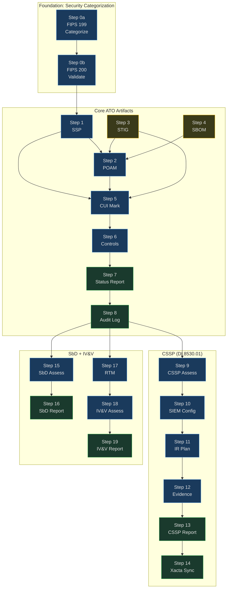
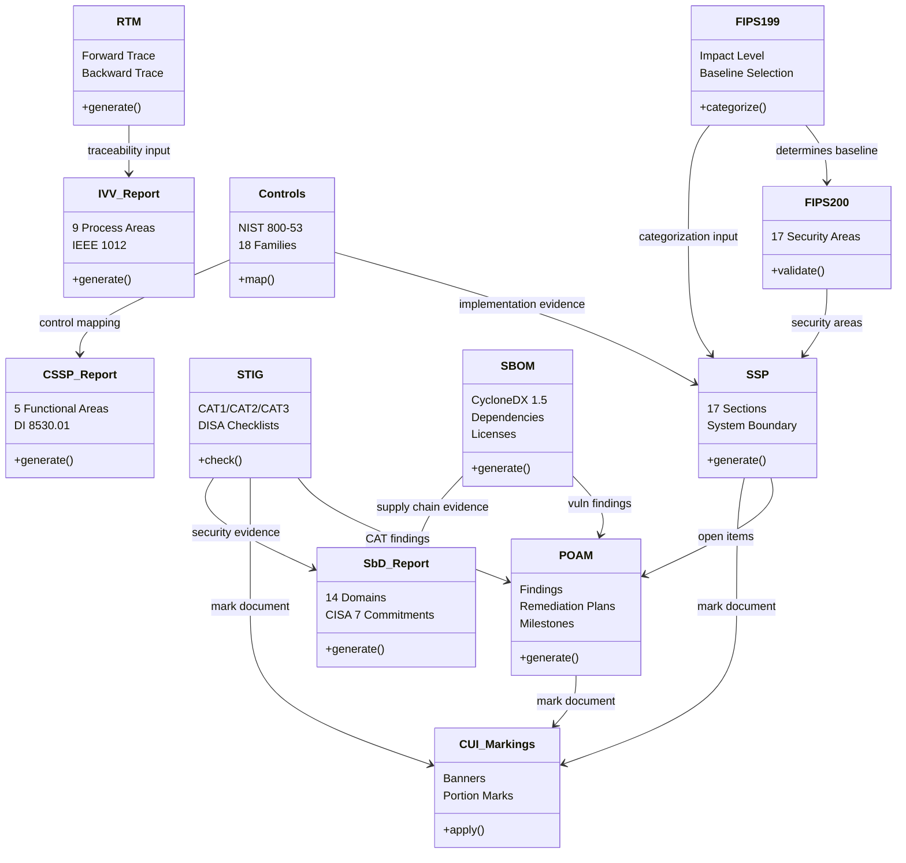

# Goal: Generate ATO Compliance Artifacts

## Description

Generate all artifacts required for an Authority to Operate (ATO) package. This includes the System Security Plan (SSP), Plan of Action & Milestones (POAM), STIG checklists, Software Bill of Materials (SBOM), CUI markings, NIST 800-53 control mappings, and a consolidated compliance status report.

**Why this matters:** No ATO = no deployment. Government systems cannot operate without demonstrated compliance. These artifacts must be accurate, current, and traceable — not boilerplate. Assessors will read them.

### 19-Step Compliance Pipeline



### Artifact Dependencies



---

## Prerequisites

- [ ] Project initialized (`goals/init_project.md` completed)
- [ ] Project has code and/or infrastructure to assess
- [ ] Security scans completed (`goals/security_scan.md`) — findings feed the POAM
- [ ] System boundary defined (what's in scope)
- [ ] Authorizing Official (AO) identified
- [ ] `memory/MEMORY.md` loaded (session context)

---

## Process

### Step 0: Security Categorization (FIPS 199 / FIPS 200)

**Tool:** `python tools/compliance/fips199_categorizer.py --project-id <name> --categorize --json`

Run FIPS 199 categorization first. This determines the NIST 800-53 baseline that all subsequent steps use. See `goals/security_categorization.md` for the full 6-step workflow.

Then validate FIPS 200 minimum security requirements:

**Tool:** `python tools/compliance/fips200_validator.py --project-id <name> --json`

This checks that controls are mapped for all 17 FIPS 200 security areas at the correct baseline.

**Gate:** Categorization must exist before SSP generation. FIPS 200 areas must all be satisfied.

---

### Step 1: Generate System Security Plan (SSP)

**Tool:** `python tools/compliance/ssp_generator.py --project <name> --system-name "<System Name>"`

**Expected output:**
```
SSP generated: projects/<name>/docs/compliance/ssp_<name>.md

Sections completed: 17/17
  1. System Name and Title
  2. System Categorization (FIPS 199)
  3. System Owner / Authorizing Official
  4. System Description and Purpose
  5. System Boundary
  6. System Architecture
  7. Data Flow Diagrams
  8. Ports, Protocols, Services
  9. System Interconnections
  10. Laws, Regulations, Standards
  11. Security Control Implementation
  12. Minimum Security Controls
  13. Contingency Plan Reference
  14. Incident Response Reference
  15. Configuration Management
  16. Continuous Monitoring Strategy
  17. Appendices (Acronyms, References)

Word count: ~<count>
Classification: <CUI|UNCLASSIFIED>
```

**Error handling:**
- Missing project metadata → prompt user for required fields (system owner, AO, FIPS category)
- DB unreachable → cannot generate SSP without project data, fail clearly
- Incomplete sections → mark with `[TODO: <what's needed>]` rather than leaving blank

**Verify:** All 17 sections present. No empty sections. CUI banner on document.

---

### Step 2: Generate POAM from Security Findings

**Tool:** `python tools/compliance/poam_generator.py --project <name> --findings "projects/<name>/security/scan-results/"`

**Expected output:**
```
POAM generated: projects/<name>/docs/compliance/poam_<name>.md

Findings imported:
  - SAST: <count> findings
  - Dependency audit: <count> findings
  - STIG: <count> findings
  - Container scan: <count> findings

POAM entries:
  - CAT1 (Critical): <count> — due in 30 days
  - CAT2 (High): <count> — due in 90 days
  - CAT3 (Medium/Low): <count> — due in 180 days
  Total: <count> entries

Each entry includes:
  - Finding ID, description, severity
  - Affected component
  - Remediation plan
  - Milestone dates
  - Responsible party
  - Status (Open/In Progress/Closed)
```

**Error handling:**
- No findings directory → run `goals/security_scan.md` first
- No findings at all → generate POAM with 0 entries (still required for ATO package)
- Duplicate findings across scanners → deduplicate by CVE/CWE ID

**Verify:** Every finding has a remediation plan and milestone date. CAT1 items have 30-day deadlines.

---

### Step 3: Run STIG Checks

**Tool:** `python tools/compliance/stig_checker.py --project <name> --stig-id "RHEL8" --target-type "os"`

**Additional STIG checks as applicable:**
```
python tools/compliance/stig_checker.py --project <name> --stig-id "Docker" --target-type "container"
python tools/compliance/stig_checker.py --project <name> --stig-id "K8s" --target-type "orchestrator"
python tools/compliance/stig_checker.py --project <name> --stig-id "PostgreSQL" --target-type "database"
```

**Expected output:**
```
STIG check complete: projects/<name>/docs/compliance/stig_<stig-id>.md

Results:
  - Total checks: <count>
  - Open (Not Satisfied): <count>
  - Not a Finding: <count>
  - Not Applicable: <count>
  - Not Reviewed: <count>

Severity breakdown:
  - CAT1 (Critical): <count> open
  - CAT2 (High): <count> open
  - CAT3 (Medium): <count> open
```

**CRITICAL GATE: 0 CAT1 findings allowed.**

If CAT1 findings exist:
1. Document each CAT1 finding
2. Add to POAM with 30-day remediation deadline
3. Flag as blocker for deployment
4. Do NOT proceed to deployment workflow until resolved

**Error handling:**
- Unknown STIG ID → list available STIGs, ask user to select
- Target not accessible → note as "Not Reviewed" (not "Not Applicable")
- STIG database outdated → warn user, proceed with available version

**Verify:** Checklist format matches DISA STIG Viewer export format. CAT1 count is 0.

---

### Step 4: Generate SBOM

**Tool:** `python tools/compliance/sbom_generator.py --project <name> --format cyclonedx`

**Expected output:**
```
SBOM generated: projects/<name>/docs/compliance/sbom_<name>.json

Format: CycloneDX 1.5
Components: <count>
  - Application: <count>
  - Library: <count>
  - Framework: <count>
  - OS: <count>

License summary:
  - MIT: <count>
  - Apache-2.0: <count>
  - GPL-3.0: <count> *** REVIEW REQUIRED ***
  - Unknown: <count> *** REVIEW REQUIRED ***

Known vulnerabilities in dependencies: <count>
```

**Error handling:**
- No requirements.txt/package.json → cannot generate SBOM, fail with instructions
- Dependency resolution failure → try `pip freeze` or `npm list` as fallback
- GPL dependencies in proprietary project → flag for legal review

**Verify:** SBOM includes ALL direct and transitive dependencies. No "unknown" licenses without documentation.

---

### Step 5: Apply CUI Markings to All Artifacts

**Tool:** `python tools/compliance/cui_marker.py --directory "projects/<name>/docs/compliance"`

**Expected output:**
```
CUI markings applied to compliance artifacts:
  - ssp_<name>.md: marked
  - poam_<name>.md: marked
  - stig_<stig-id>.md: marked (per STIG)
  - sbom_<name>.json: marked (metadata field)
  Files marked: <count>
  Classification: CUI
```

**CUI marking format for documents:**
```
// CUI // CONTROLLED UNCLASSIFIED INFORMATION
// Distribution: Authorized personnel only
// Handling: In accordance with DoDI 5200.48
```

**Error handling:**
- Files already marked → skip, do not double-mark
- Binary files → add CUI metadata to file properties where possible, otherwise log as exception

**Verify:** Every compliance document has CUI banners. No unmarked documents in compliance directory.

---

### Step 6: Map NIST 800-53 Controls

**Tool:** `python tools/compliance/control_mapper.py --project <name> --control-families "AC,AT,AU,CA,CM,CP,IA,IR,MA,MP,PE,PL,PM,PS,RA,SA,SC,SI"`

**Expected output:**
```
Control mapping complete: projects/<name>/docs/compliance/control_matrix_<name>.md

Control families mapped: 18
Total controls: <count>

Status summary:
  - Implemented: <count> (<pct>%)
  - Partially Implemented: <count> (<pct>%)
  - Planned: <count> (<pct>%)
  - Not Implemented: <count> (<pct>%)
  - Not Applicable: <count> (<pct>%)

Implementation evidence linked: <count>/<total> controls
```

**Control implementation sources:**
- SSP sections map to specific controls
- STIG checks provide implementation evidence
- Code review records demonstrate CM controls
- Audit trail demonstrates AU controls
- Security scan results feed RA controls

**Error handling:**
- Control family not recognized → check against NIST 800-53 rev5 list
- Missing implementation evidence → mark as "Planned" with TODO, do not mark "Implemented" without evidence

**Verify:** No control marked "Implemented" without linked evidence. Percentage implemented is tracked.

---

### Step 7: Generate Compliance Status Report

**Tool:** `python tools/compliance/compliance_status.py --project <name>`

**Expected output:**
```
=== COMPLIANCE STATUS REPORT ===
Project: <name>
Date: <YYYY-MM-DD>
Classification: CUI

ARTIFACT STATUS:
  [x] System Security Plan (SSP) — generated <date>
  [x] Plan of Action & Milestones (POAM) — <count> items
  [x] STIG Checklists — <count> STIGs checked
  [x] Software Bill of Materials (SBOM) — <count> components
  [x] CUI Markings — applied
  [x] Control Mapping — <count>/<total> implemented

RISK SUMMARY:
  CAT1 (Critical): <count> — MUST be 0 for ATO
  CAT2 (High): <count>
  CAT3 (Medium): <count>
  Open POAM items: <count>

ATO READINESS: <READY | NOT READY — <reason>>
```

**Error handling:**
- Missing artifacts → report shows `[ ]` for missing items with instructions to generate
- Stale artifacts (older than 30 days) → flag as "STALE — regenerate"

**Verify:** Report accurately reflects current state. No false positives on readiness.

---

### Step 8: Log to Audit Trail

**Tool:** `python tools/audit/audit_logger.py --event "compliance_artifacts_generated" --actor "orchestrator" --action "generate" --project <name>`

**Tool:** `python tools/memory/memory_write.py --content "Compliance artifacts generated for <name>. ATO readiness: <status>. CAT1: <count>, POAM items: <count>" --type event --importance 7`

---

## Success Criteria

- [ ] SSP generated with all 17 sections complete
- [ ] POAM generated with all findings documented and remediation plans
- [ ] STIG checks run with 0 CAT1 findings
- [ ] SBOM generated in CycloneDX format with all dependencies
- [ ] CUI markings applied to all compliance documents
- [ ] NIST 800-53 controls mapped with implementation evidence
- [ ] Compliance status report shows current state accurately
- [ ] Audit trail entry logged

---

## Edge Cases & Notes

1. **Inherited controls:** In cloud environments, some controls are inherited from the CSP (Cloud Service Provider). Mark these as "Inherited" with the responsible party noted.
2. **Continuous monitoring:** ATO is not one-and-done. Schedule re-generation of compliance artifacts monthly or after significant changes.
3. **POAM aging:** POAM items past their milestone date must be escalated. Overdue CAT1 items can result in ATO revocation.
4. **Multi-system boundaries:** If the project spans multiple systems, each system needs its own SSP. Shared components should be documented in interconnection agreements.
5. **FedRAMP vs. DoD:** FedRAMP uses the same NIST 800-53 controls but with different baselines (Low, Moderate, High). Ensure the correct baseline is selected.
6. **Artifact versioning:** Each regeneration should increment a version number and note what changed. Assessors track changes between versions.
7. **Evidence collection:** The best compliance programs generate evidence automatically (audit logs, scan results, test reports). Manual evidence is error-prone and stale.

---

## GOTCHA Layer Mapping

| Step | GOTCHA Layer | Component |
|------|-------------|-----------|
| Generate SSP | Tools | ssp_generator.py |
| Generate POAM | Tools | poam_generator.py |
| Run STIG checks | Tools | stig_checker.py |
| Generate SBOM | Tools | sbom_generator.py |
| Apply CUI markings | Tools | cui_marker.py |
| Map controls | Tools | control_mapper.py |
| Status report | Tools | compliance_status.py |
| Sequence decisions | Orchestration | AI (you) |
| Control baselines | Context | NIST 800-53 reference |

---

## Related Files

- **Tools:** `tools/compliance/ssp_generator.py`, `tools/compliance/poam_generator.py`, `tools/compliance/stig_checker.py`, `tools/compliance/sbom_generator.py`, `tools/compliance/cui_marker.py`, `tools/compliance/control_mapper.py`, `tools/compliance/compliance_status.py`
- **Context:** `context/nist_800_53_controls.md`, `context/stig_reference.md`
- **Feeds from:** `goals/security_scan.md` (findings)
- **Feeds into:** `goals/deploy_workflow.md` (ATO gate)

---

---

### Step 9: Run CSSP Assessment (DI 8530.01)

**Tool:** `python tools/compliance/cssp_assessor.py --project-id <project_id> --functional-area all`

**Expected output:**
```
CSSP assessment complete.

Functional Areas Assessed:
  Identify:  5/5 requirements — 4 satisfied, 1 partial
  Protect:   7/7 requirements — 5 satisfied, 1 partial, 1 not_satisfied
  Detect:    6/6 requirements — 5 satisfied, 1 partial
  Respond:   6/6 requirements — 4 satisfied, 2 not_assessed
  Sustain:   6/6 requirements — 5 satisfied, 1 partial

Automated checks: 12/30 (auto), 18/30 (manual review needed)
CSSP score: <pct>%
Gate: <PASS|FAIL>
```

**Error handling:**
- Requirements catalog missing → fail with instructions to verify `context/compliance/dod_cssp_8530.json`
- Project not found → fail with project ID error
- Auto-check failure → mark requirement as "not_assessed" and continue

**Verify:** All 5 functional areas assessed. No critical requirements left "not_satisfied" without a risk acceptance.

---

### Step 10: Generate SIEM Configurations

**Tool:** `python tools/compliance/siem_config_generator.py --project-dir "projects/<name>" --targets splunk elk`

**Expected output:**
```
SIEM configs generated:
  - splunk/outputs.conf
  - splunk/inputs.conf
  - splunk/props.conf
  - filebeat/filebeat.yml

Log sources configured: 7/7 required
  - Application logs ✓
  - Authentication events ✓
  - Security events ✓
  - Audit trail ✓
  - System logs ✓
  - Container logs ✓
  - Network events ✓
```

**Verify:** Both Splunk and Filebeat configs generated. All required log sources present.

---

### Step 11: Generate Incident Response Plan

**Tool:** `python tools/compliance/incident_response_plan.py --project-id <project_id>`

**Expected output:**
```
IR Plan generated: projects/<name>/docs/compliance/ir_plan_<name>.md

Sections:
  - Roles & Responsibilities
  - Escalation Matrix
  - Reporting Timelines (1hr/24hr/72hr)
  - Containment Procedures
  - Evidence Preservation
  - SOC Coordination
  - Communication Plan
```

**Verify:** Reporting timelines match DI 8530.01 requirements. SOC contact info populated.

---

### Step 12: Collect Evidence Package

**Tool:** `python tools/compliance/cssp_evidence_collector.py --project-id <project_id> --project-dir "projects/<name>"`

**Expected output:**
```
Evidence collection complete.

Artifacts found: <count>
  - STIG results: <count>
  - SAST reports: <count>
  - SBOM: 1
  - SSP: 1
  - POAM: 1
  - IR Plan: 1
  - SIEM configs: <count>
  - IaC files: <count>

Evidence index: projects/<name>/compliance/evidence_manifest.json
Coverage: <count>/<total> CSSP requirements have evidence
```

**Verify:** Evidence manifest includes all generated artifacts. Each evidence artifact mapped to CSSP requirements.

---

### Step 13: Generate CSSP Certification Report

**Tool:** `python tools/compliance/cssp_report_generator.py --project-id <project_id>`

**Expected output:**
```
CSSP certification report generated:
  projects/<name>/docs/compliance/cssp_report_<name>.md

Report sections: 10/10 complete
Classification: CUI // SP-CTI
Certification recommendation: <CERTIFY|CONDITIONAL|DENY>
```

**Verify:** All 5 functional areas scored. Evidence summary complete. CUI markings present.

---

### Step 14: Sync to Xacta 360

**Tool:** `python tools/compliance/xacta/xacta_sync.py --project-id <project_id> --mode hybrid`

**Expected output:**
```
Xacta sync complete.

Mode: hybrid (API attempted, export fallback if needed)
Data synced:
  - System registration: updated
  - Control implementations: <count>
  - CSSP assessment results: <count>
  - STIG findings: <count>
  - POA&M items: <count>

Certification status (from Xacta): <status>
Last sync: <timestamp>
```

**Error handling:**
- API unreachable → fall back to export mode
- Export mode → generate OSCAL + CSV files in `compliance/xacta-exports/`
- Auth failure → check PKI cert configuration in `args/project_defaults.yaml`

**Verify:** Sync completed without errors. Audit trail entry logged.

---

### Step 15: Run SbD Assessment (CISA Secure by Design)

**Tool:** `python tools/compliance/sbd_assessor.py --project-id <project_id> --domain all`

**Expected output:**
```
SbD assessment complete.

Domains Assessed (14):
  Authentication:        3/3 — 2 satisfied, 1 partial
  Memory Safety:         2/2 — 2 satisfied
  Vulnerability Mgmt:    3/3 — 2 satisfied, 1 partial
  Intrusion Evidence:    2/2 — 1 satisfied, 1 not_assessed
  Cryptography:          3/3 — 3 satisfied
  Access Control:        2/2 — 2 satisfied
  Input Handling:        3/3 — 2 satisfied, 1 partial
  Error Handling:        2/2 — 1 satisfied, 1 not_satisfied
  Supply Chain:          3/3 — 2 satisfied, 1 partial
  Threat Modeling:       2/2 — 1 satisfied, 1 not_assessed
  Defense in Depth:      2/2 — 2 satisfied
  Secure Defaults:       3/3 — 2 satisfied, 1 not_satisfied
  CUI Compliance:        2/2 — 2 satisfied
  DoD Software Assurance: 3/3 — 2 satisfied, 1 partial

CISA 7 Commitments status: 5/7 satisfied
Auto-checks: 20/35
SbD score: <pct>%
Gate: <PASS|FAIL>
```

**Verify:** All 14 domains assessed. No critical requirements "not_satisfied" without risk acceptance.

---

### Step 16: Generate SbD Report

**Tool:** `python tools/compliance/sbd_report_generator.py --project-id <project_id>`

**Expected output:**
```
SbD report generated:
  projects/<name>/docs/compliance/sbd_report_<name>.md

Report sections: complete
Classification: CUI // SP-CTI
CISA commitment status: 5/7 satisfied
```

**Verify:** All domain scores present. CUI markings applied. CISA commitment table populated.

---

### Step 17: Generate Requirements Traceability Matrix (RTM)

**Tool:** `python tools/compliance/traceability_matrix.py --project-id <project_id> --project-dir "projects/<name>"`

**Expected output:**
```
RTM generated:
  projects/<name>/docs/compliance/rtm_<name>.md
  projects/<name>/docs/compliance/rtm_<name>.json

Requirements discovered: <count>
Design artifacts: <count>
Code modules: <count>
Test files: <count>

Forward trace coverage: <pct>%
Backward trace coverage: <pct>%
Untested requirements: <count>
Orphan tests: <count>
```

**Verify:** Forward and backward trace complete. Gap analysis identifies untested requirements.

---

### Step 18: Run IV&V Assessment (IEEE 1012)

**Tool:** `python tools/compliance/ivv_assessor.py --project-id <project_id> --process-area all`

**Expected output:**
```
IV&V assessment complete.

Process Areas Assessed (9):
  Requirements Verification:  pass (3/3 checks)
  Design Verification:        partial (2/3 checks)
  Code Verification:          pass (4/4 checks)
  Test Verification:          pass (3/3 checks)
  Integration Verification:   partial (2/3 checks)
  Traceability Analysis:      pass (2/2 checks)
  Security Verification:      pass (3/3 checks)
  Build/Deploy Verification:  partial (2/3 checks)
  Process Compliance:         pass (2/2 checks)

Verification score (60%): <pct>%
Validation score (40%): <pct>%
Overall IV&V score: <pct>%
Critical findings: <count>
Gate: <PASS|FAIL>
```

**Verify:** All 9 process areas assessed. No critical findings open. Certification recommendation generated.

---

### Step 19: Generate IV&V Report

**Tool:** `python tools/compliance/ivv_report_generator.py --project-id <project_id>`

**Expected output:**
```
IV&V report generated:
  projects/<name>/docs/compliance/ivv_report_<name>.md

Certification recommendation: <CERTIFY|CONDITIONAL|DENY>
Verification score: <pct>%
Validation score: <pct>%
Independence declaration: included
Classification: CUI // SP-CTI
```

**Verify:** Certification recommendation matches scores. Independence declaration present. CUI markings applied.

---

## Success Criteria (Updated)

- [ ] SSP generated with all 17 sections complete
- [ ] POAM generated with all findings documented and remediation plans
- [ ] STIG checks run with 0 CAT1 findings
- [ ] SBOM generated in CycloneDX format with all dependencies
- [ ] CUI markings applied to all compliance documents
- [ ] NIST 800-53 controls mapped with implementation evidence
- [ ] Compliance status report shows current state accurately
- [ ] Audit trail entry logged
- [ ] CSSP assessment completed across all 5 functional areas
- [ ] SIEM configs generated for Splunk and ELK
- [ ] Incident Response Plan generated with SOC coordination
- [ ] Evidence package collected and indexed
- [ ] CSSP certification report generated
- [ ] Data synced to Xacta 360 (API or export)
- [ ] SbD assessment completed across all 14 domains
- [ ] SbD report generated with CISA commitment status
- [ ] RTM generated with forward and backward trace coverage
- [ ] IV&V assessment completed across all 9 process areas
- [ ] IV&V report generated with certification recommendation

---

## GOTCHA Layer Mapping (Updated)

| Step | GOTCHA Layer | Component |
|------|-------------|-----------|
| Generate SSP | Tools | ssp_generator.py |
| Generate POAM | Tools | poam_generator.py |
| Run STIG checks | Tools | stig_checker.py |
| Generate SBOM | Tools | sbom_generator.py |
| Apply CUI markings | Tools | cui_marker.py |
| Map controls | Tools | control_mapper.py |
| Status report | Tools | compliance_status.py |
| CSSP assessment | Tools | cssp_assessor.py |
| SIEM config | Tools | siem_config_generator.py |
| IR plan | Tools | incident_response_plan.py |
| Evidence collection | Tools | cssp_evidence_collector.py |
| CSSP report | Tools | cssp_report_generator.py |
| Xacta sync | Tools | xacta/xacta_sync.py |
| SbD assessment | Tools | sbd_assessor.py |
| SbD report | Tools | sbd_report_generator.py |
| RTM generation | Tools | traceability_matrix.py |
| IV&V assessment | Tools | ivv_assessor.py |
| IV&V report | Tools | ivv_report_generator.py |
| Sequence decisions | Orchestration | AI (you) |
| Control baselines | Context | NIST 800-53 + DI 8530.01 + CISA SbD + IEEE 1012 |

---

## Related Files (Updated)

- **Tools:** `tools/compliance/ssp_generator.py`, `tools/compliance/poam_generator.py`, `tools/compliance/stig_checker.py`, `tools/compliance/sbom_generator.py`, `tools/compliance/cui_marker.py`, `tools/compliance/control_mapper.py`, `tools/compliance/compliance_status.py`, `tools/compliance/cssp_assessor.py`, `tools/compliance/cssp_report_generator.py`, `tools/compliance/incident_response_plan.py`, `tools/compliance/siem_config_generator.py`, `tools/compliance/cssp_evidence_collector.py`, `tools/compliance/xacta/xacta_sync.py`, `tools/compliance/xacta/xacta_export.py`, `tools/compliance/sbd_assessor.py`, `tools/compliance/sbd_report_generator.py`, `tools/compliance/traceability_matrix.py`, `tools/compliance/ivv_assessor.py`, `tools/compliance/ivv_report_generator.py`
- **Context:** `context/compliance/nist_800_53.json`, `context/compliance/dod_cssp_8530.json`, `context/compliance/cssp_report_template.md`, `context/compliance/incident_response_template.md`, `context/compliance/siem_config_templates/`, `context/compliance/cisa_sbd_requirements.json`, `context/compliance/ivv_requirements.json`, `context/compliance/sbd_report_template.md`, `context/compliance/ivv_report_template.md`, `context/compliance/ivv_checklist_template.md`
- **Feeds from:** `goals/security_scan.md` (findings), `goals/sbd_ivv_workflow.md` (SbD + IV&V)
- **Feeds into:** `goals/deploy_workflow.md` (ATO gate), Xacta 360 (system of record)

---

## Changelog

- 2026-02-15: Added SbD assessment (steps 15-16), RTM (step 17), IV&V assessment (steps 18-19), updated success criteria and GOTCHA mapping
- 2026-02-15: Added CSSP assessment (steps 9-14), Xacta 360 sync, updated success criteria and GOTCHA mapping
- 2026-02-14: Initial creation
