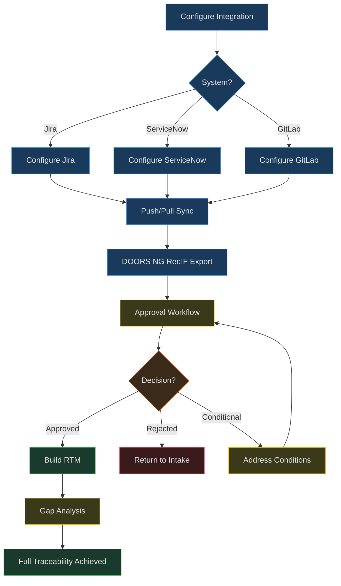
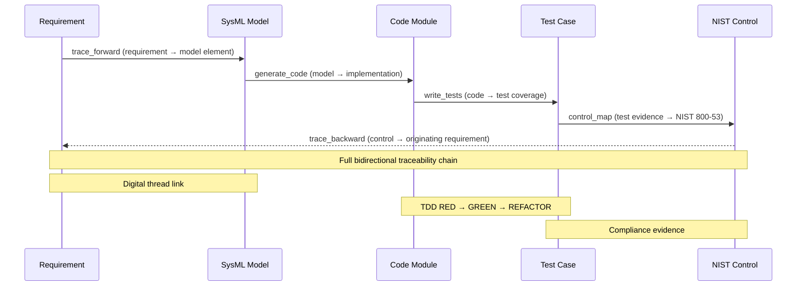

# Goal: External Integration Layer (RICOAS Phase 4)

## Purpose
Bidirectional sync with Jira, ServiceNow, and GitLab. Export to DOORS NG via ReqIF. Approval workflows. Full RTM traceability.

## When to Use
- Push decomposed requirements to Jira/ServiceNow/GitLab
- Pull status updates from external systems
- Export requirements to DOORS NG via ReqIF 1.2
- Submit requirements package for approval
- Build full Requirements Traceability Matrix

## Workflow

### External System Sync
1. Configure integration: `configure_jira`/`configure_servicenow`/`configure_gitlab`
2. Push decomposed items: `sync_jira`/`sync_servicenow`/`sync_gitlab` with direction=push
3. Pull status updates: direction=pull
4. Check sync status: view last sync info and mapping count

### DOORS NG Export
1. Export requirements as ReqIF: `export_reqif` with output_path
2. Validate exported file: `doors_exporter.py --validate`
3. Import into DOORS NG via standard ReqIF import

### Approval Workflow
1. Submit for approval: `submit_approval` with type and reviewers
2. Reviewers decide: `review_approval` with approved/rejected/conditional
3. Track pending: list pending approvals

### Traceability
1. Build RTM: `build_traceability` — links requirement→SysML→code→test→control
2. Gap analysis: identify requirements with missing trace links
3. Coverage metric: percentage of fully traced requirements

## Visual Workflow

### Integration Pipeline Flowchart

### RTM Traceability Sequence

---

## Tools Used
| Tool | Purpose |
|------|---------|
| tools/integration/jira_connector.py | Bidirectional Jira sync |
| tools/integration/servicenow_connector.py | Bidirectional ServiceNow sync |
| tools/integration/gitlab_connector.py | Bidirectional GitLab sync |
| tools/integration/doors_exporter.py | ReqIF 1.2 export for DOORS NG |
| tools/integration/approval_manager.py | Approval workflow management |
| tools/requirements/traceability_builder.py | Full RTM builder |
| tools/mcp/integration_server.py | MCP server (10 tools) |

## Edge Cases
- Jira/ServiceNow/GitLab unreachable → log error, preserve local state
- Conflicting changes (modified in both systems) → flag conflict, don't overwrite
- ReqIF export with no requirements → return empty but valid XML
- Approval timeout → escalate after configurable period
