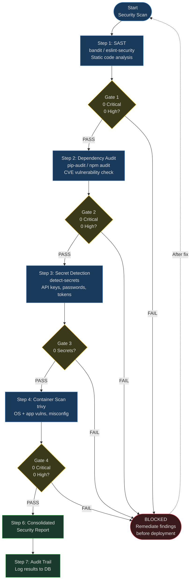

# Goal: Comprehensive Security Scanning

## Description

Run a full security scanning pipeline covering static analysis (SAST), dependency auditing, secret detection, and container scanning. Enforce quality gates that block deployment if critical findings exist. Generate a consolidated security report.

**Why this matters:** A single undetected vulnerability in a government system can be a national security incident. Defense-in-depth means layering multiple scanners — no single tool catches everything. This workflow runs them all and aggregates results.

---

## Prerequisites

- [ ] Project initialized (`goals/init_project.md` completed)
- [ ] Project has source code to scan
- [ ] Scanner tools installed or available: bandit, pip-audit/npm-audit, detect-secrets, trivy
- [ ] Container image built (for container scanning) — optional if no containers
- [ ] `memory/MEMORY.md` loaded (session context)

---

## Quality Gates

These gates MUST pass for the project to proceed to deployment:

| Gate | Threshold | Blocks Deployment? |
|------|-----------|-------------------|
| Critical vulnerabilities | 0 | YES |
| High vulnerabilities (SAST) | 0 | YES |
| Detected secrets | 0 | YES |
| CAT1 STIG findings | 0 | YES |
| High dependency vulns | 0 | YES |
| Medium dependency vulns | <= 5 with documented POAM | NO (with POAM) |
| Low findings | Unlimited | NO |

**No exceptions without Authorizing Official written approval.**

### Security Scanning Pipeline



---

## Process

### Step 1: Run Static Application Security Testing (SAST)

**Tool:** `python tools/security/sast_runner.py --project <name> --report --gate`

**Expected output:**
```
SAST scan complete: projects/<name>/security/scan-results/sast_report.json

Scanner: bandit (Python) / eslint-security (JavaScript)
Files scanned: <count>
Time elapsed: <seconds>s

Findings:
  - CRITICAL: <count>
  - HIGH: <count>
  - MEDIUM: <count>
  - LOW: <count>
  Total: <count>

Top findings:
  1. [HIGH] B608: SQL injection via string formatting (src/db.py:42)
  2. [MEDIUM] B105: Hardcoded password string (src/config.py:15)
  3. [LOW] B101: Use of assert in production code (src/utils.py:88)

Gate status: <PASS | FAIL — <count> critical/high findings>
```

**Error handling:**
- Scanner not installed → provide installation command, fail gracefully
- No source files found → warn, skip SAST (may be infra-only project)
- Scanner timeout → increase timeout, retry once
- False positives → document with `# nosec` comment + justification in POAM

**Verify:** Report file exists and is valid JSON. Gate correctly evaluates critical/high counts.

---

### Step 2: Run Dependency Audit

**Tool:** `python tools/security/dependency_auditor.py --project <name> --report --gate`

**Expected output:**
```
Dependency audit complete: projects/<name>/security/scan-results/dependency_report.json

Scanner: pip-audit (Python) / npm audit (JavaScript)
Dependencies scanned: <count> (direct: <count>, transitive: <count>)

Vulnerabilities found:
  - CRITICAL: <count>
  - HIGH: <count>
  - MEDIUM: <count>
  - LOW: <count>
  Total: <count>

Details:
  1. [CRITICAL] CVE-2024-XXXXX: requests 2.28.0 — SSRF vulnerability
     Fix: upgrade to requests >= 2.31.0
  2. [HIGH] CVE-2024-YYYYY: cryptography 38.0.0 — key extraction
     Fix: upgrade to cryptography >= 41.0.0

Gate status: <PASS | FAIL — <count> critical/high vulnerabilities>
```

**Error handling:**
- No requirements.txt/package.json → cannot audit, fail with instructions
- pip-audit not installed → `pip install pip-audit`
- Network error (needed for CVE database) → use cached DB if available, warn about staleness
- Vulnerability has no fix available → document in POAM with "vendor dependency" status

**Verify:** All direct dependencies scanned. CVE IDs link to valid entries.

---

### Step 3: Run Secret Detection

**Tool:** `python tools/security/secret_detector.py --project <name> --report --gate`

**Expected output:**
```
Secret detection complete: projects/<name>/security/scan-results/secrets_report.json

Scanner: detect-secrets
Files scanned: <count>
Excluded: <count> (binary, generated)

Secrets detected:
  - API keys: <count>
  - Passwords: <count>
  - Private keys: <count>
  - Tokens: <count>
  - Connection strings: <count>
  Total: <count>

Details:
  1. [SECRET] AWS Access Key ID found in src/config.py:23
  2. [SECRET] Database password in .env.example:5
  3. [SECRET] JWT secret in tests/conftest.py:12

Gate status: <PASS | FAIL — <count> secrets detected>
```

**CRITICAL: Gate threshold is ZERO. Any detected secret is a gate failure.**

**Immediate actions if secrets found:**
1. Rotate the compromised credential IMMEDIATELY
2. Remove from source code
3. Add to `.gitignore` / `.secrets.baseline`
4. Verify git history does not contain the secret (use `git filter-branch` or BFG Repo Cleaner)
5. Document the incident in the audit trail

**Error handling:**
- detect-secrets not installed → `pip install detect-secrets`
- Baseline file missing → generate with `detect-secrets scan > .secrets.baseline`
- False positive → add to `.secrets.baseline` with justification comment
- Secret in git history → this is a separate remediation task, flag it

**Verify:** Zero secrets in current codebase. Baseline file documents any allowed patterns.

---

### Step 4: Run Container Scanning

**Tool:** `python tools/security/container_scanner.py --project <name> --image "<image:tag>"`

**Expected output:**
```
Container scan complete: projects/<name>/security/scan-results/container_report.json

Scanner: trivy
Image: <image:tag>
OS: <detected OS>
Packages: <count>

Vulnerabilities:
  - CRITICAL: <count>
  - HIGH: <count>
  - MEDIUM: <count>
  - LOW: <count>
  - UNKNOWN: <count>
  Total: <count>

Misconfigurations:
  - Running as root: <yes/no>
  - Secrets in image: <count>
  - Writable filesystem: <yes/no>

Gate status: <PASS | FAIL — <reason>>
```

**Skip conditions:**
- No Dockerfile in project → skip container scanning, log as "N/A"
- Image not built yet → attempt `docker build`, or skip with warning

**Error handling:**
- Docker not running → warn, skip container scan
- trivy not installed → provide installation instructions
- Image too large (> 2GB) → warn about scan time, proceed
- Network needed for vuln DB → use cached DB if available

**Verify:** Scan covers both OS packages and application dependencies. No root user in production images.

---

### Step 5: Check Quality Gates (Aggregate)

**Action:** Evaluate ALL scan results against the quality gates defined above.

```
=== SECURITY GATE CHECK ===

Gate 1: Critical vulnerabilities = 0     [PASS/FAIL]
Gate 2: High SAST findings = 0           [PASS/FAIL]
Gate 3: Detected secrets = 0             [PASS/FAIL]
Gate 4: High dependency vulns = 0        [PASS/FAIL]
Gate 5: Container critical/high = 0      [PASS/FAIL] (or N/A)

Overall: <ALL GATES PASS | BLOCKED — gates X, Y failed>
```

**If ANY gate fails:**
1. Do NOT proceed to deployment
2. Document all failures
3. Create POAM entries for each finding
4. Notify the user with specific remediation steps
5. Re-run scans after fixes to verify

**If ALL gates pass:**
1. Generate consolidated report (Step 6)
2. Mark security scan as "complete" in project status
3. Proceed to compliance workflow or deployment

---

### Step 6: Generate Consolidated Security Report

**Action:** Combine all scan results into a single report.

**Output format:**
```
=== CONSOLIDATED SECURITY REPORT ===
Project: <name>
Date: <YYYY-MM-DD>
Classification: CUI

SCAN SUMMARY:
  SAST: <count> findings (<count> critical, <count> high)
  Dependencies: <count> vulnerabilities
  Secrets: <count> detected
  Container: <count> vulnerabilities

GATE STATUS: <PASS | FAIL>

FINDINGS BY SEVERITY:
  Critical: <total across all scanners>
  High: <total>
  Medium: <total>
  Low: <total>

TOP RISKS:
  1. <Most critical finding with remediation>
  2. <Second most critical>
  3. <Third most critical>

RECOMMENDATIONS:
  - <Actionable recommendation 1>
  - <Actionable recommendation 2>

NEXT STEPS:
  - [ ] Remediate critical/high findings
  - [ ] Re-run scans after remediation
  - [ ] Update POAM with findings
  - [ ] Schedule next scan: <date + 30 days>
```

---

### Step 7: Log to Audit Trail

**Tool:** `python tools/audit/audit_logger.py --event "security_scan_complete" --actor "orchestrator" --action "scan" --project <name>`

**Tool:** `python tools/memory/memory_write.py --content "Security scan complete for <name>. Gate: <PASS|FAIL>. Critical: <count>, High: <count>, Secrets: <count>" --type event --importance 8`

---

## Success Criteria

- [ ] SAST scan completed with results documented
- [ ] Dependency audit completed with all CVEs identified
- [ ] Secret detection completed with 0 secrets in codebase
- [ ] Container scan completed (or marked N/A if no containers)
- [ ] All quality gates evaluated
- [ ] Gate failures documented with remediation plans
- [ ] Consolidated report generated
- [ ] Audit trail entry logged

---

## Edge Cases & Notes

1. **Scanner disagreements:** Different scanners may classify the same finding at different severities. Use the HIGHEST severity when aggregating.
2. **False positive management:** Maintain a `.security-exceptions.yaml` file documenting accepted false positives with justification and reviewer approval.
3. **Air-gapped environments:** Some scanners need network access for CVE databases. Pre-download and cache vulnerability databases for offline use.
4. **Scan frequency:** Run on every commit (CI/CD), full scan weekly, and before any deployment.
5. **Zero-day response:** If a new CVE affects a dependency, trigger an emergency scan even outside the normal schedule.
6. **License scanning:** SBOM generation (compliance workflow) also checks licenses. GPL in proprietary code is a legal risk, not a security risk — route to legal review.
7. **Scan performance:** Full scans can be slow. For CI/CD, consider incremental scanning (only changed files) for SAST, full scan for dependencies.

---

## GOTCHA Layer Mapping

| Step | GOTCHA Layer | Component |
|------|-------------|-----------|
| Run SAST | Tools | sast_runner.py |
| Dependency audit | Tools | dependency_auditor.py |
| Secret detection | Tools | secret_detector.py |
| Container scan | Tools | container_scanner.py |
| Gate evaluation | Orchestration | AI (you) |
| Scanner config | Args | scanner settings |
| CVE references | Context | vulnerability databases |

---

## Related Files

- **Tools:** `tools/security/sast_runner.py`, `tools/security/dependency_auditor.py`, `tools/security/secret_detector.py`, `tools/security/container_scanner.py`
- **Feeds into:** `goals/compliance_workflow.md` (POAM generation), `goals/deploy_workflow.md` (gate check)
- **Database:** `data/icdev.db` (security_findings table)

---

## Changelog

- 2026-02-14: Initial creation
