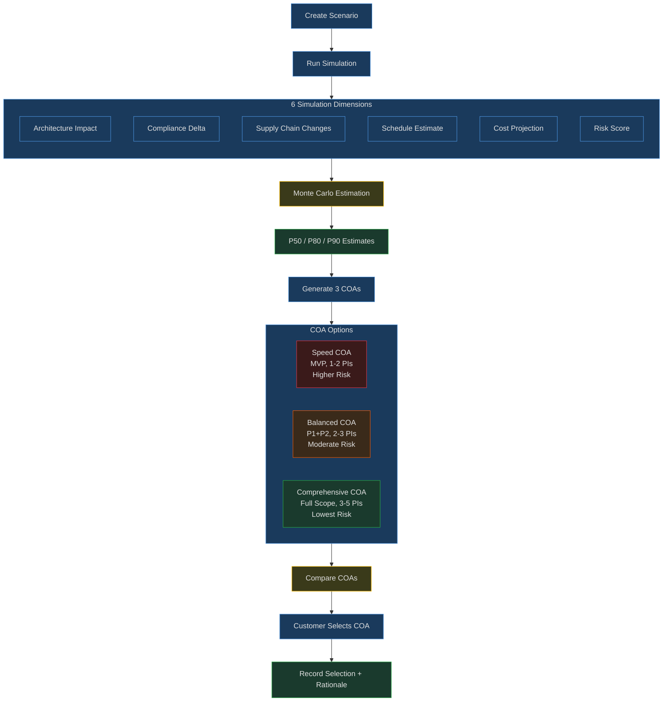

# Goal: Digital Program Twin Simulation (RICOAS Phase 3)

## Purpose
Run 6-dimension what-if simulations to predict impact of requirements on architecture, compliance, supply chain, schedule, cost, and risk. Generate and compare COAs. Use Monte Carlo for probabilistic schedule/cost estimation.

## When to Use
- Before committing to a set of requirements, simulate their impact
- Compare multiple COAs side-by-side across all dimensions
- Need Monte Carlo estimation for schedule or cost confidence levels
- Scenario planning — "what if we add/remove these requirements?"
- RED-tier requirements need alternative COA generation

## Workflow

### What-If Simulation
1. Create scenario: `create_scenario` with modifications (add/remove requirements, change architecture)
2. Run simulation: `run_simulation` — computes baseline vs simulated across 6 dimensions
3. Review results: architecture impact, compliance delta, supply chain changes, schedule estimate, cost projection, risk score
4. Fork scenario for variations: `manage_scenarios` action=fork

### Monte Carlo Estimation
1. Run Monte Carlo: `run_monte_carlo` with dimension (schedule/cost/risk) and iterations
2. Review percentiles: P10 (optimistic), P50 (likely), P80 (management reserve), P90 (conservative)
3. Use histogram and CDF data for inline visualization

### COA Generation & Selection
1. Generate 3 COAs: `generate_coas` — Speed, Balanced, Comprehensive
2. Optionally simulate each COA: `generate_coas` with simulate=true
3. Compare COAs: `compare_coas` — side-by-side across all dimensions
4. For RED items: `generate_alternative_coa` — within-boundary alternatives
5. Present to customer: formatted comparison with recommendation (Balanced by default)
6. Customer selects: `select_coa` — records selection with rationale

### Simulation Pipeline Flowchart

### 6 Simulation Dimensions
| Dimension | Metrics | Data Sources |
|-----------|---------|-------------|
| Architecture | Component count, coupling, API surface, data flow complexity | SysML elements, digital thread |
| Compliance | Control coverage delta, POAM projection, boundary tier | project_controls, crosswalk, SSP |
| Supply Chain | New dependencies, vendor risk, SBOM delta, ISA changes | dependency graph, vendors, ISAs |
| Schedule | PERT estimates, Monte Carlo confidence, critical path | SAFe decomposition, risk events |
| Cost | T-shirt roll-up, vendor licensing, infra delta | ricoas_config cost models |
| Risk | Compound risk score, risk interaction, mitigation effectiveness | risk register, Monte Carlo |

## Tools Used
| Tool | Purpose |
|------|---------|
| tools/simulation/simulation_engine.py | 6-dimension simulation core |
| tools/simulation/monte_carlo.py | PERT/Monte Carlo estimation |
| tools/simulation/coa_generator.py | 3 COAs + RED alternatives |
| tools/simulation/scenario_manager.py | Fork, compare, export scenarios |
| tools/mcp/simulation_server.py | MCP server (8 tools) |

## Edge Cases
- Zero requirements in session → return empty simulation with warning
- Monte Carlo with < 100 iterations → warn about low confidence
- All requirements GREEN → skip boundary dimension
- COA selection without simulation → warn, allow anyway
