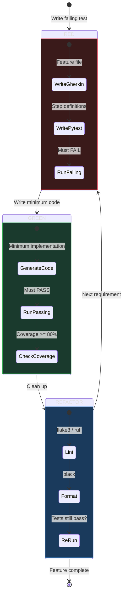

# Goal: TDD Workflow (RED -> GREEN -> REFACTOR)

## Description

Implement features using strict Test-Driven Development: write tests FIRST, watch them fail, write the minimum code to pass, then refactor. This workflow enforces the discipline that separates production-grade code from "vibe coding."

**Why this matters:** Code without tests is a liability. In government/DoD environments, untested code does not ship. TDD catches defects at the cheapest point in the lifecycle — before they exist.

**The iron rule:** No code is written until a failing test demands it.

---

## Prerequisites

- [ ] Project initialized (`goals/init_project.md` completed)
- [ ] Project exists in DB with valid project ID
- [ ] Requirement or user story clearly defined (what, not how)
- [ ] Test framework installed (pytest, behave)
- [ ] `memory/MEMORY.md` loaded (session context)

---

## Process

### Step 1: Write Gherkin Feature File (Specification)

**Tool:** `python tools/builder/test_writer.py --project <name> --requirement "<requirement text>"`

**Expected output:**
```
Feature file created: projects/<name>/tests/features/<feature-name>.feature

Feature: <Feature Name>
  As a <role>
  I want <capability>
  So that <benefit>

  Scenario: <Happy path>
    Given <precondition>
    When <action>
    Then <expected result>

  Scenario: <Error case>
    Given <precondition>
    When <invalid action>
    Then <error handling>

  Scenario: <Edge case>
    Given <boundary condition>
    When <action>
    Then <correct behavior>
```

**Minimum scenarios per feature:** 3 (happy path, error case, edge case)

**Error handling:**
- Ambiguous requirement → ask user for clarification before generating
- Feature file already exists → append new scenarios, do not overwrite
- Generated scenarios too vague → regenerate with more specific requirement

**Verify:** Feature file parses correctly with `behave --dry-run`.

---

### Step 2: Generate pytest Test Cases (Step Definitions)

**Tool:** `python tools/builder/test_writer.py --project <name> --requirement "<requirement text>" --output pytest`

**Expected output:**
```
Test files created:
  projects/<name>/tests/unit/test_<feature>.py
  projects/<name>/tests/integration/test_<feature>_integration.py
  projects/<name>/tests/features/steps/<feature>_steps.py

Tests generated:
  - test_<function>_happy_path
  - test_<function>_invalid_input
  - test_<function>_edge_case
  - test_<function>_boundary_values
  Total: <count> tests
```

**Test structure requirements:**
- Each test follows Arrange-Act-Assert pattern
- Tests are independent (no shared mutable state)
- Test names describe the behavior, not the implementation
- Fixtures defined for common setup/teardown

**Error handling:**
- Cannot determine test structure → generate skeleton tests with TODO markers
- Import errors in generated tests → fix imports before proceeding

**Verify:** Tests are syntactically valid Python (`python -m py_compile <file>`).

---

### Step 3: RED — Run Tests (They Must Fail)

**Tool:** `pytest projects/<name>/tests/ -v --tb=short`

**Expected output:**
```
projects/<name>/tests/unit/test_<feature>.py::test_happy_path FAILED
projects/<name>/tests/unit/test_<feature>.py::test_invalid_input FAILED
projects/<name>/tests/unit/test_<feature>.py::test_edge_case FAILED

========================= X failed in Y.YYs =========================
```

**Critical check: ALL tests MUST fail.**

- If any test passes → the test is not testing new behavior. Investigate:
  - Is the test trivially true? (e.g., `assert True`)
  - Does the implementation already exist?
  - Is the test importing wrong module?
- If tests error (not fail) → fix test syntax/imports, re-run
- ImportError is acceptable at this stage (module doesn't exist yet)

**Error handling:**
- Tests pass unexpectedly → STOP. Do not proceed. Diagnose why.
- Test framework not installed → `pip install pytest behave`
- Syntax errors in tests → fix before proceeding

**This step confirms the tests are actually testing something meaningful.**

---

### Step 4: Generate Implementation Code

**Tool:** `python tools/builder/code_generator.py --project <name> --spec "projects/<name>/tests/features/<feature-name>.feature"`

**Expected output:**
```
Code generated:
  projects/<name>/src/<module>.py

Functions/classes created:
  - <function_name>(): <description>
  - <ClassName>: <description>

Lines of code: <count>
Complexity: <low|medium|high>
```

**Code generation rules:**
- Write the MINIMUM code to make tests pass
- No speculative features (YAGNI — You Ain't Gonna Need It)
- Follow project language conventions
- Include type hints (Python) or JSDoc (JavaScript)
- No hardcoded values — use configuration from args/

**Error handling:**
- Generated code has syntax errors → regenerate with corrections
- Generated code is overly complex → simplify, remember YAGNI
- Missing dependencies → add to requirements.txt, install

**Verify:** Code is syntactically valid (`python -m py_compile <file>`).

---

### Step 5: GREEN — Run Tests (They Must Pass)

**Tool:** `pytest projects/<name>/tests/ -v --tb=short --cov=projects/<name>/src --cov-report=term-missing`

**Expected output:**
```
projects/<name>/tests/unit/test_<feature>.py::test_happy_path PASSED
projects/<name>/tests/unit/test_<feature>.py::test_invalid_input PASSED
projects/<name>/tests/unit/test_<feature>.py::test_edge_case PASSED

---------- coverage: ----------
Name                          Stmts   Miss  Cover   Missing
------------------------------------------------------------
projects/<name>/src/<module>     42      3    93%    67-69
------------------------------------------------------------
TOTAL                            42      3    93%

========================= X passed in Y.YYs =========================
```

**Gates:**
- ALL tests must pass (0 failures)
- Coverage must be >= 80% (target 90%+)
- No warnings that indicate test issues

**If tests fail:**
1. Read the failure output carefully
2. Determine if the bug is in the code or the test
3. Fix the CODE first (tests define the contract)
4. Only fix tests if they contain genuine errors (wrong assertions, not wrong expectations)
5. Re-run until green

**Error handling:**
- Flaky tests (pass sometimes, fail sometimes) → investigate non-determinism, fix root cause
- Coverage below 80% → write additional tests for uncovered lines
- Tests pass but behavior is wrong → tests are incomplete, go back to Step 1

**Do not proceed until ALL tests pass with >= 80% coverage.**

---

### Step 6: REFACTOR — Lint and Format

**Tool (lint):** `python tools/builder/linter.py --project <name> --fix`

**Expected output:**
```
Linting results:
  Files checked: <count>
  Issues found: <count>
  Issues fixed: <count>
  Remaining: <count>

  Rules applied: flake8 (Python) / eslint (JavaScript)
```

**Tool (format):** `python tools/builder/formatter.py --project <name>`

**Expected output:**
```
Formatting results:
  Files formatted: <count>
  Changes made: <count>

  Formatter: black (Python) / prettier (JavaScript)
```

**After refactoring, re-run tests:**
```
pytest projects/<name>/tests/ -v --tb=short
```

**Critical: Tests must still pass after refactoring.** If refactoring breaks tests, the refactoring introduced a bug — revert and try again.

**Refactoring guidelines:**
- Extract repeated code into functions
- Rename variables for clarity
- Reduce complexity (cyclomatic complexity < 10)
- Remove dead code
- Add docstrings to public functions

**Error handling:**
- Linting finds issues that --fix cannot resolve → manual intervention required
- Formatter changes break tests → formatter config may conflict with test expectations, investigate
- Refactoring changes behavior → REVERT. Refactoring must be behavior-preserving.

---

### Step 7: Log to Audit Trail

**Tool:** `python tools/audit/audit_logger.py --event "tdd_cycle_complete" --actor "orchestrator" --action "implement" --project <name>`

**Tool:** `python tools/memory/memory_write.py --content "TDD cycle complete for <feature> in project <name>. Tests: <count> passing, coverage: <pct>%" --type event --importance 5`

**Expected output:** Audit entry and memory entry logged.

---

## Success Criteria

- [ ] Gherkin feature file exists with >= 3 scenarios
- [ ] All pytest tests pass (0 failures)
- [ ] Code coverage >= 80%
- [ ] Linting clean (0 remaining issues)
- [ ] Formatting applied
- [ ] Tests still pass after refactoring
- [ ] Audit trail entry logged

---

## Edge Cases & Notes

1. **Existing code without tests:** If asked to add tests to existing code, still follow TDD — write the test, verify it exercises the existing behavior (it should pass), then write a NEW test for the new behavior (it should fail), then implement.
2. **Test-first resistance:** Users may want to write code first. Explain the workflow but respect their choice. Log which approach was used.
3. **Integration tests:** These follow the same RED-GREEN-REFACTOR cycle but may require mocks for external services. Use `unittest.mock` or `pytest-mock`.
4. **Database tests:** Use an in-memory SQLite database for test isolation. Never test against production data.
5. **Coverage exceptions:** Some lines (e.g., `if __name__ == "__main__"`) can be excluded from coverage. Use `# pragma: no cover` sparingly and only with justification.
6. **Flaky test policy:** A test that fails intermittently is worse than no test. Fix flaky tests immediately or quarantine them with `@pytest.mark.skip(reason="flaky — tracking in issue #X")`.
7. **Large features:** Break into multiple TDD cycles. Each cycle should be completable in < 30 minutes. If a feature takes longer, decompose it.

---

## The TDD Cycle Visualized

```mermaid
sequenceDiagram
    participant O as Orchestrator
    participant TW as test_writer.py
    participant PT as pytest
    participant CG as code_generator.py
    participant LN as linter.py
    participant FM as formatter.py
    participant AL as audit_logger.py

    rect rgb(58, 26, 26)
        Note over O,PT: RED Phase
        O->>TW: Write Gherkin + pytest tests
        TW-->>O: Feature file + test cases
        O->>PT: Run tests (must FAIL)
        PT-->>O: All tests FAILED
    end

    rect rgb(26, 58, 45)
        Note over O,PT: GREEN Phase
        O->>CG: Generate minimum code
        CG-->>O: Implementation module
        O->>PT: Run tests (must PASS)
        PT-->>O: All tests PASSED (coverage >= 80%)
    end

    rect rgb(26, 58, 92)
        Note over O,FM: REFACTOR Phase
        O->>LN: Lint code (flake8 / ruff)
        LN-->>O: Clean (0 issues)
        O->>FM: Format code (black)
        FM-->>O: Formatted
        O->>PT: Re-run tests (still pass?)
        PT-->>O: All tests PASSED
    end

    O->>AL: Log TDD cycle to audit trail
    AL-->>O: Audit entry recorded
```





---

## GOTCHA Layer Mapping

| Step | GOTCHA Layer | Component |
|------|-------------|-----------|
| Define requirement | Goals | This document |
| Write feature file | Tools | test_writer.py |
| Generate tests | Tools | test_writer.py |
| Run tests (RED) | Tools | pytest |
| Generate code | Tools | code_generator.py |
| Run tests (GREEN) | Tools | pytest |
| Lint + format | Tools | linter.py, formatter.py |
| Decide test strategy | Orchestration | AI (you) |
| Code style settings | Args | linter config, formatter config |

---

## Related Files

- **Tools:** `tools/builder/test_writer.py`, `tools/builder/code_generator.py`, `tools/builder/linter.py`, `tools/builder/formatter.py`
- **Context:** `context/coding_standards.md` (if exists)
- **Hard Prompts:** `hardprompts/test_generation.md`, `hardprompts/code_generation.md`

---

## Changelog

- 2026-02-14: Initial creation
