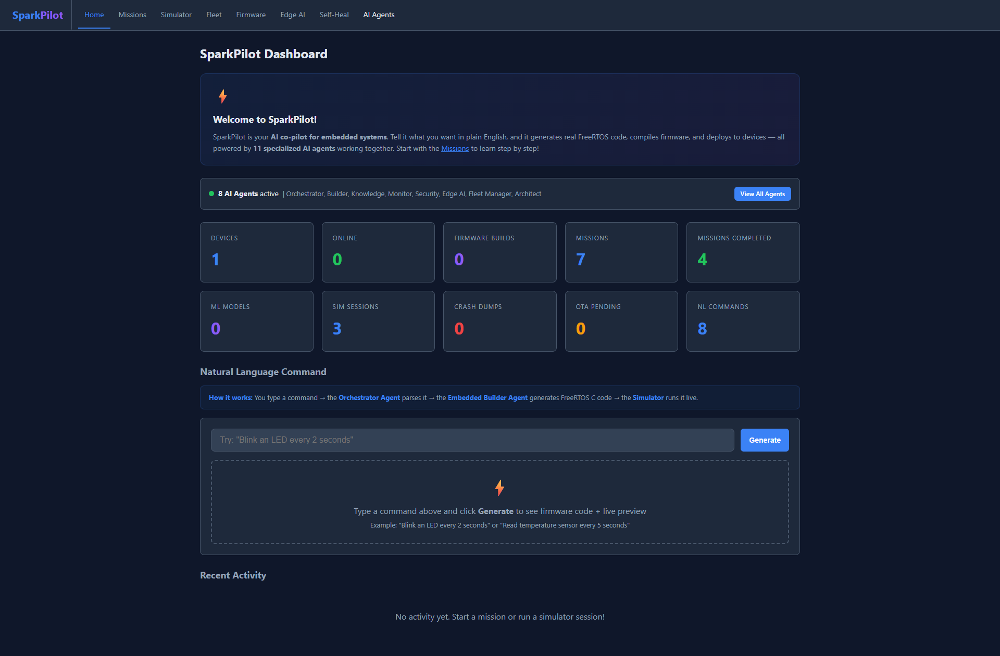
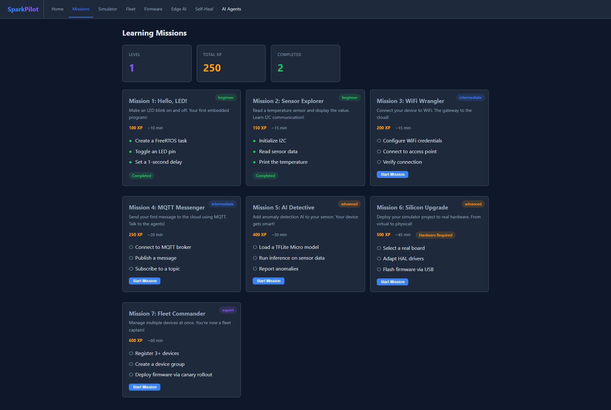
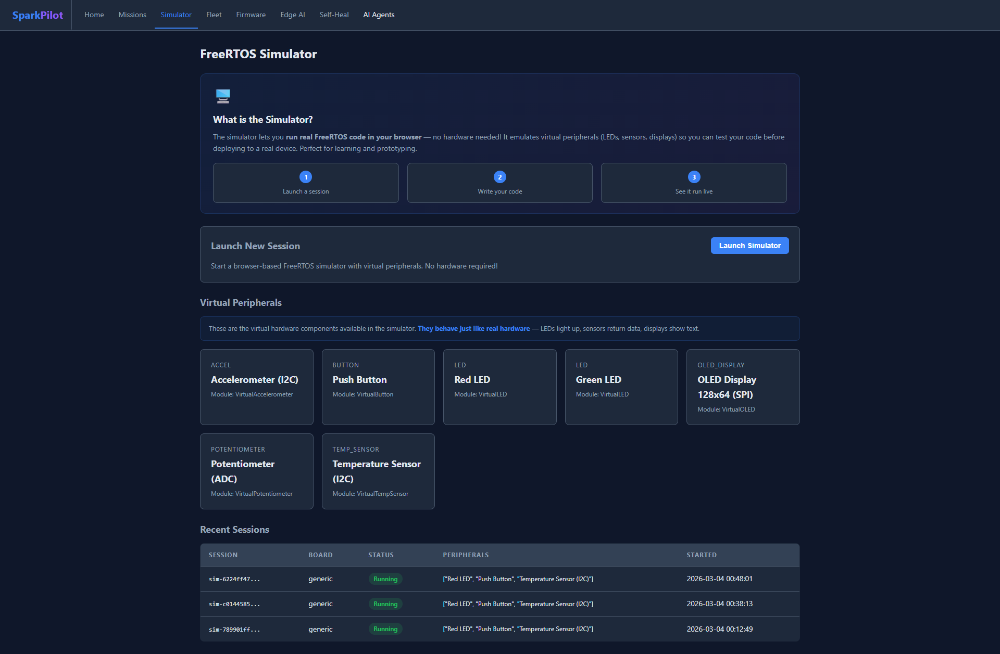
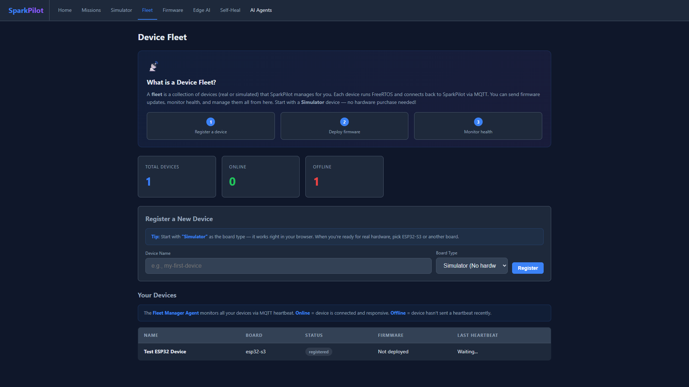
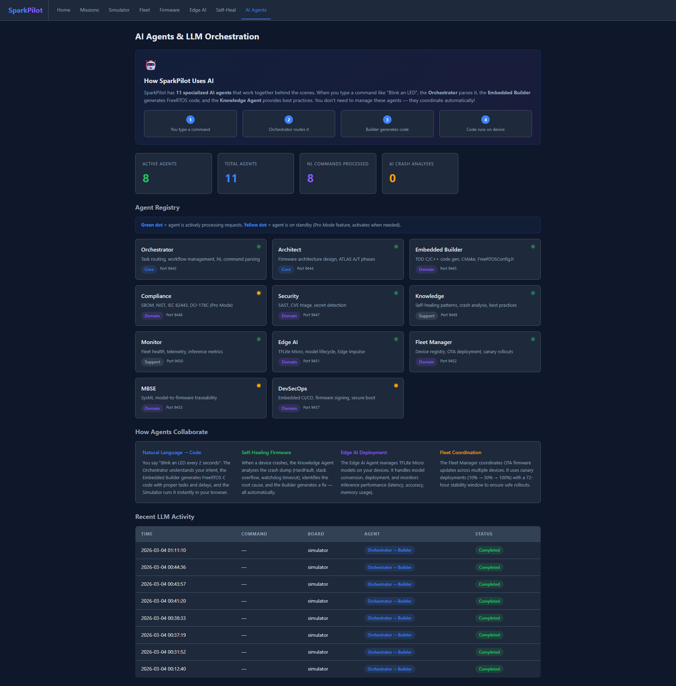
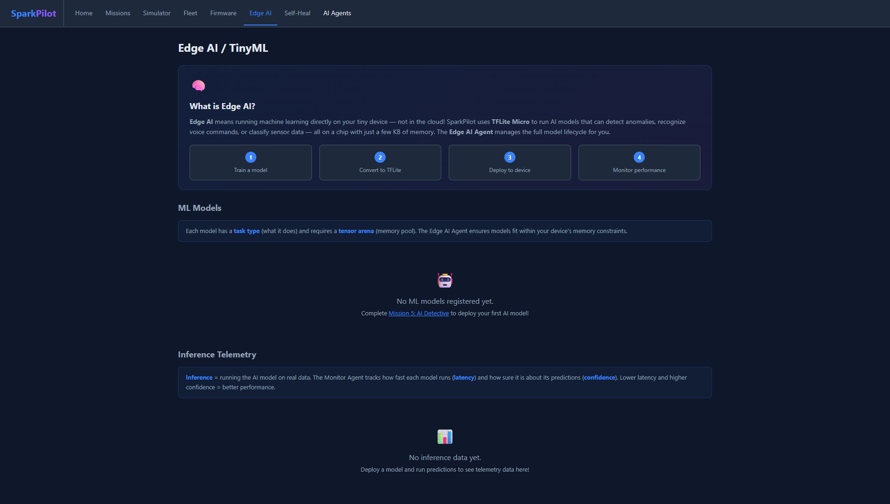
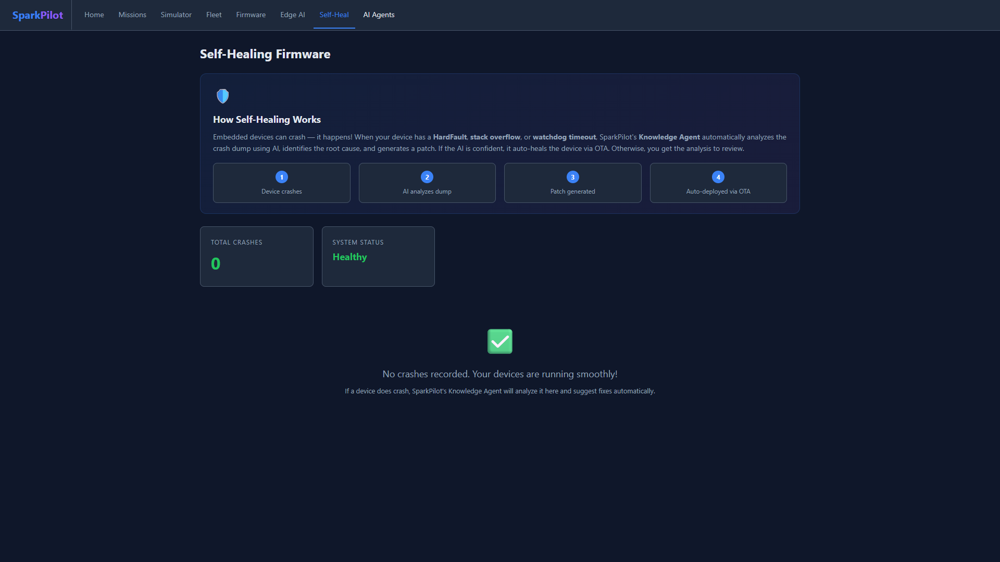

# SparkPilot — AI Co-Pilot for Embedded Systems

**Classification:** `CUI // SP-CTI` | **Impact Level:** `IL4`

---

## Generated by ICDEV

SparkPilot was **autonomously generated** by [ICDEV (Intelligent Certified Development)](https://github.com/icdev-ai/icdev) — a meta-builder platform that creates fully compliant, agentic applications for Government and DoD environments.

ICDEV's `/icdev-agentic` command assessed SparkPilot's fitness for agentic architecture, generated a blueprint, and scaffolded the entire application — including 11 AI agents, 23 goal workflows, 31 database tables, 10 MCP servers, and a full GOTCHA framework — in a single automated pipeline. The dashboard, compliance frameworks, memory system, and CI/CD integration were all produced by ICDEV's child app generator without manual coding.

**What ICDEV generated for SparkPilot:**
- Full 6-layer GOTCHA framework (Goals, Orchestration, Tools, Args, Context, Hard Prompts)
- ATLAS/M-ATLAS workflow for TDD build cycles
- 11 specialized AI agents with A2A protocol communication
- 31-table SQLite database with append-only audit trail
- Flask web dashboard with 8 interactive pages
- 10 compliance frameworks (NIST, FedRAMP, IEC 62443, DO-178C, and more)
- Kubernetes manifests, Terraform IaC, and CI/CD pipeline configs
- Long-term memory system with keyword and semantic search

> To generate your own agentic application with ICDEV, run: `pip install icdev` then use the `/icdev-agentic` command with your application spec.

---

## Overview

SparkPilot makes embedded RTOS development accessible to anyone — from a 10-year-old building their first blinking LED to a DoD engineer deploying AI-enabled firmware with full NIST compliance. Tell it what you want in plain English, and it generates real FreeRTOS code, compiles firmware, and deploys to devices — all powered by **11 specialized AI agents** working together.

---

## Quick Start

```bash
# Initialize database
python tools/db/init_sparkpilot_db.py

# Start the dashboard
python tools/dashboard/app.py --port 5050

# Open in browser
# http://127.0.0.1:5050
```

---

## Dashboard Screenshots

SparkPilot ships with a fully interactive web dashboard that provides a beginner-friendly experience across 8 pages. Every page includes intro panels explaining what the feature does, step-by-step guides, and contextual tips — making embedded systems development approachable for complete beginners while offering Pro Mode depth for experienced engineers.

### Home Dashboard



The **Home Dashboard** is the central command center for SparkPilot. At the top, a welcome panel introduces the platform and its 11 AI agents. The **agent status bar** shows which agents are actively running (green dot = active, yellow = standby). Below that, a **stat grid** provides at-a-glance metrics: registered devices, firmware builds, completed missions, ML models, simulator sessions, and more. The **Natural Language Command** interface lets users type plain-English instructions like *"Blink an LED every 2 seconds"* — the Orchestrator Agent parses the intent, the Embedded Builder Agent generates FreeRTOS C code, and the Simulator runs it live in the browser.

### Gamified Learning Missions



The **Missions** page turns embedded systems education into a game. Seven progressive missions guide learners from blinking an LED (Mission 1, 100 XP) all the way to managing a fleet of devices (Mission 7, 600 XP). Each mission card shows the difficulty level (beginner/intermediate/advanced/expert), estimated time, XP reward, and a checklist of objectives. Completed missions show filled green circles; pending objectives show empty circles. A **player progress panel** at the top tracks your current level, total XP earned, and missions completed. Click **"Start Mission"** to open the interactive workspace with starter code, progressive hints, and a live device preview.

### FreeRTOS Simulator



The **Simulator** page lets you run real FreeRTOS code directly in your browser — no hardware required. The intro panel explains the 3-step process: launch a session, write your code, and see it run live. A **Virtual Peripherals** catalog shows all available hardware components that the simulator emulates: LEDs, temperature sensors, accelerometers, OLED displays, push buttons, and potentiometers. Each peripheral behaves identically to real hardware, making it safe to experiment and learn. The **Recent Sessions** table tracks your simulator history with session IDs, board types, running status, and attached peripherals.

### Device Fleet Management



The **Fleet** page manages all your devices — real or simulated. The intro panel walks beginners through the 3-step lifecycle: register a device, deploy firmware, and monitor health. A **registration form** with a dropdown for board types (Simulator, ESP32-S3, STM32F407, nRF52840, RPi Pico) makes it easy to add new devices. The helpful tip suggests starting with the Simulator board type so beginners can experiment without purchasing hardware. The **device table** shows each device's name, board type, connection status (online/offline), firmware version, and last heartbeat timestamp. The Fleet Manager Agent monitors all devices via MQTT heartbeat.

### AI Agents & LLM Orchestration



The **AI Agents** page reveals the intelligence behind SparkPilot. An intro panel explains how 11 specialized agents collaborate: you type a command, the Orchestrator routes it, the Builder generates code, and the code runs on your device. The **Agent Registry** displays all 11 agents as cards with status indicators (green = active, yellow = standby), port numbers, tier classifications (Core, Domain, Support), and role descriptions. Below the registry, **"How Agents Collaborate"** panels describe four key workflows: Natural Language to Code, Self-Healing Firmware, Edge AI Deployment, and Fleet Coordination. The **Recent LLM Activity** table shows a chronological log of all AI-powered operations with timestamps, commands, boards, agent chains, and completion status.

### Edge AI / TinyML



The **Edge AI** page manages machine learning models that run directly on microcontrollers. The intro panel explains what Edge AI means — running ML inference on tiny devices with just kilobytes of memory — and walks through the 4-step model lifecycle: train, convert to TFLite, deploy to device, and monitor performance. The **ML Models** section lists registered models with their task types and tensor arena sizes. The **Inference Telemetry** section tracks how fast each model runs (latency) and how confident its predictions are. Empty states guide users to complete Mission 5: AI Detective to deploy their first model.

### Self-Healing Firmware



The **Self-Heal** page monitors device crashes and AI-powered automatic recovery. The intro panel explains the 4-step self-healing process: a device crashes, AI analyzes the crash dump, a patch is generated, and it's auto-deployed via OTA. When crashes are recorded, stat cards show totals for crashes, auto-healed devices, patched devices, and those needing human review. A detailed crash table lists each incident with device ID, crash type (HardFault, Stack Overflow, Watchdog), resolution status, root cause analysis, and expandable AI analysis details. When all devices are healthy (as shown), a green checkmark confirms smooth operation.

---

## Four-Tier Architecture

| Tier | What | Example |
|------|------|---------|
| **Tier 0: Browser Simulator** | FreeRTOS POSIX port in browser (WASM/JS), virtual peripherals | No install, no hardware needed |
| **Tier 1: FreeRTOS MCU** | Cortex-M, ESP32, RISC-V with TinyML inference, MQTT telemetry, OTA | SparkPilot Device SDK (~8KB) |
| **Tier 2: Edge Gateway** | Raspberry Pi / Jetson — local LLM, multi-agent coordination | llama.cpp, whisper.cpp |
| **Tier 3: Cloud/ICDEV** | Full LLM orchestration, model training, compliance monitoring | Bedrock, SageMaker |

## Key Features

### Natural Language to Firmware
Type `"Blink an LED every 2 seconds"` and SparkPilot generates FreeRTOS C code, cross-compiles it, and runs it in the browser simulator with a live LED animation — or deploys via OTA to real hardware.

### Browser-Based Device Simulator
Run real FreeRTOS code in your browser with virtual peripherals: LEDs, temperature sensors, accelerometers, OLED displays, buttons, and potentiometers. No hardware purchase required.

### Gamified Learning Missions
7 progressive missions teach embedded concepts step-by-step:

| # | Mission | Difficulty | XP |
|---|---------|-----------|-----|
| 1 | Hello, LED! | Beginner | 100 |
| 2 | Sensor Explorer | Beginner | 150 |
| 3 | WiFi Wrangler | Intermediate | 200 |
| 4 | MQTT Messenger | Intermediate | 250 |
| 5 | AI Detective | Advanced | 400 |
| 6 | Silicon Upgrade | Advanced | 500 |
| 7 | Fleet Commander | Expert | 600 |

Each mission includes: interactive code editor with starter code, progressive hints (3 per mission), live device preview, and XP/badge rewards on completion.

### Edge AI / TinyML
Deploy TFLite Micro models directly on microcontrollers for anomaly detection, keyword spotting, and image classification. The Edge AI Agent manages the full model lifecycle: training, conversion, deployment, and inference telemetry.

### Self-Healing Firmware
When devices crash (HardFault, stack overflow, watchdog timeout), the Knowledge Agent analyzes crash dumps using AI, identifies root causes, and generates patches. High-confidence fixes are deployed automatically via OTA.

### Fleet Management
Manage multiple devices from a single dashboard. OTA firmware updates use canary deployments (10% -> 50% -> 100%) with a 72-hour stability window before permanent acceptance.

### Progressive Compliance
- **Beginner Mode** (default): Clean simple UI, no compliance jargon
- **Pro Mode** (toggle): Unlocks SBOM generation, CVE triage, NIST 800-53, IEC 62443, DO-178C, ISO 26262, FIPS 140-3

## AI Agents (11)

| Agent | Port | Tier | Role |
|-------|------|------|------|
| **Orchestrator** | 9443 | Core | Task routing, workflow management, NL command parsing |
| **Architect** | 9444 | Core | Firmware architecture design, ATLAS A/T phases |
| **Embedded Builder** | 9445 | Domain | TDD C/C++ code gen, CMake, FreeRTOSConfig.h, cross-compilation |
| **Compliance** | 9446 | Domain | SBOM, NIST, IEC 62443, DO-178C, ISO 26262 (Pro Mode only) |
| **Security** | 9447 | Domain | SAST (Cppcheck/MISRA), CVE triage, secret detection |
| **Knowledge** | 9449 | Support | Self-healing patterns, crash analysis, embedded best practices |
| **Monitor** | 9450 | Support | Fleet health, telemetry, inference metrics, anomaly detection |
| **Edge AI** | 9451 | Domain | TFLite Micro integration, model lifecycle, Edge Impulse |
| **Fleet Manager** | 9452 | Domain | Device registry, OTA deployment, canary rollouts |
| **MBSE** | 9453 | Domain | SysML model-to-firmware traceability, digital thread |
| **DevSecOps** | 9457 | Domain | Embedded CI/CD, firmware signing, FIPS, secure boot |

## Dashboard Pages

| Page | URL | Description |
|------|-----|-------------|
| Home | `/` | Stats overview, NL command interface with live device preview, agent status bar |
| Missions | `/missions` | Interactive mission workspace with code editor, hints, and device preview |
| Simulator | `/simulator` | FreeRTOS browser simulator, virtual peripheral catalog, session history |
| Fleet | `/devices` | Device registry, registration form, health monitoring |
| Firmware | `/firmware` | Build history, OTA update log with progress bars |
| Edge AI | `/edge-ai` | ML model registry, inference telemetry with performance badges |
| Self-Heal | `/crashes` | Crash dump analysis, auto-healing status, AI-generated patches |
| AI Agents | `/agents` | 11-agent registry with status, collaboration overview, LLM activity log |

## API Endpoints

| Method | Endpoint | Description |
|--------|----------|-------------|
| POST | `/api/nl-command` | Process natural language command -> generate FreeRTOS code |
| GET | `/api/mission/<num>` | Get mission details (objectives, hints, starter code) |
| POST | `/api/mission/start` | Start a mission |
| POST | `/api/mission/complete` | Submit mission solution for completion |
| POST | `/api/sim/create` | Create a new simulator session |
| POST | `/api/device/register` | Register a new device in the fleet |
| GET | `/health` | Health check |

## Database Schema (31 tables)

Core tables: `missions`, `user_progress`, `mission_completion_log`, `devices`, `device_groups`, `device_telemetry`, `device_commands`, `firmware_builds`, `firmware_deploy_log`, `ota_update_log`, `fleet_canary_log`, `simulator_sessions`, `simulator_session_log`, `virtual_peripherals`, `ml_models`, `inference_telemetry`, `crash_dump_log`, `nl_commands`, `mqtt_messages`, `rtos_tasks`, `cmake_configs`, `board_support_packages`, `embedded_patterns`, `agents`, `agent_tasks`, `audit_trail`, `compliance_controls`, `compliance_evidence`, `sbom_entries`, `memory_entries`, `projects`

## Target Hardware

- **ARM Cortex-M4/M7/M33/M55** — STM32, NXP, Nordic
- **ARM Cortex-R5/R52** — TI, Renesas (safety-critical)
- **ESP32/ESP32-S3** — Espressif (IoT, edge AI)
- **RISC-V** — SiFive, Espressif
- **Simulator** — POSIX port, WASM for browser

## Project Structure

```
sparkpilot/
├── CLAUDE.md                    # AI agent instructions
├── README.md                    # This file
├── .mcp.json                    # MCP server configuration
├── args/                        # YAML behavior settings (19 config files)
├── context/                     # Static reference material (compliance catalogs, templates)
├── data/
│   └── sparkpilot.db            # SQLite database (31 tables)
├── docs/
│   └── screenshots/             # Dashboard screenshots
├── goals/                       # 23 goal workflows (GOTCHA layer 1)
├── hardprompts/                  # Reusable LLM instruction templates
├── k8s/                         # Kubernetes manifests (STIG-hardened)
├── memory/                      # Long-term memory system
└── tools/
    ├── a2a/                     # A2A protocol client
    ├── agent/                   # Agent cards and orchestration
    ├── analysis/                # Code quality analysis
    ├── audit/                   # Append-only audit trail
    ├── ci/                      # CI/CD integration (GitHub + GitLab)
    ├── compliance/              # 30+ compliance frameworks
    ├── dashboard/               # Flask web dashboard (8 pages)
    │   ├── app.py               # Routes and API endpoints
    │   └── templates/           # Jinja2 HTML templates
    ├── db/                      # Database init, migrations, backup
    ├── devsecops/               # DevSecOps + Zero Trust
    ├── edge_ai/                 # TFLite Micro model management
    ├── embedded/                # NL-to-firmware, CMake, crash analyzer
    ├── fleet/                   # Device registry, OTA manager
    ├── infra/                   # Terraform, Ansible, K8s generators
    ├── knowledge/               # Self-healing, pattern detection
    ├── llm/                     # Multi-provider LLM router (11 providers)
    ├── maintenance/             # Dependency scanning, CVE remediation
    ├── mbse/                    # SysML, DOORS NG, digital thread
    ├── mcp/                     # 10 MCP servers
    ├── memory/                  # Memory system (keyword + semantic search)
    ├── missions/                # Mission engine
    ├── monitor/                 # Health checks, heartbeat, auto-resolver
    ├── mosa/                    # DoD MOSA compliance
    ├── observability/           # Distributed tracing, provenance, SHAP
    ├── requirements/            # RICOAS intake, gap detection, decomposition
    ├── security/                # SAST, prompt injection, trust scoring
    ├── simulation/              # Digital twin, Monte Carlo, COA generation
    ├── simulator/               # FreeRTOS simulator runner
    ├── supply_chain/            # Dependency graph, ISA, SCRM, CVE triage
    └── testing/                 # Test orchestrator, E2E, health checks
```

## Compliance Frameworks (Pro Mode)

| Framework | Scope |
|-----------|-------|
| NIST 800-53 Rev 5 | Core federal security controls |
| FedRAMP Moderate/High | Cloud service authorization |
| CMMC Level 2/3 | DoD contractor cybersecurity |
| IEC 62443 | Industrial cybersecurity |
| DO-178C | Avionics software traceability |
| ISO 26262 | Automotive functional safety |
| IEC 62304 | Medical device software |
| MISRA C:2023 | Embedded coding standard |
| FIPS 140-3 | Cryptographic module validation |
| NIST AI RMF | AI risk management |

## GOTCHA Framework

SparkPilot follows the 6-layer GOTCHA architecture:

| Layer | Directory | Role |
|-------|-----------|------|
| **Goals** | `goals/` | 23 process definitions — what to achieve, which tools, expected outputs |
| **Orchestration** | *(AI)* | AI reads goals -> decides tool order -> applies args -> references context |
| **Tools** | `tools/` | Deterministic Python scripts, one job each |
| **Args** | `args/` | 19 YAML behavior settings — change behavior without editing code |
| **Context** | `context/` | Static reference material — compliance catalogs, templates, patterns |
| **Hard Prompts** | `hardprompts/` | Reusable LLM instruction templates for each agent role |

## Development

```bash
# Run tests
pytest tests/ -v

# Run security scan
python tools/security/sast_runner.py --project-dir .

# Generate SBOM
python tools/compliance/sbom_generator.py --project-dir .

# Health check
python tools/testing/health_check.py --json
```

## License

AGPL-3.0 — See [LICENSE](LICENSE) for the full license text.

---

*Generated by [ICDEV (Intelligent Certified Development)](https://github.com/icdev-ai/icdev) on 2026-03-03. SparkPilot v1.0.0.*
